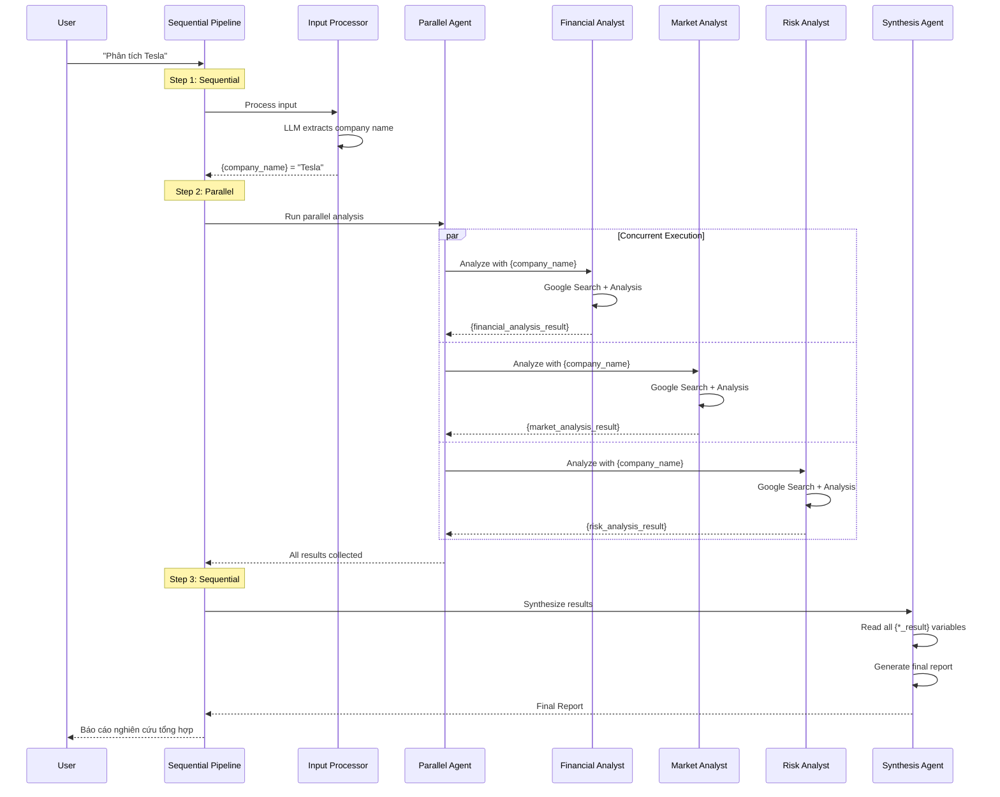

# Hướng dẫn Thực hành: Parallelization Pattern với ADK-Go

## Mục tiêu

Sau khi hoàn thành bài hướng dẫn này, bạn sẽ:
- Hiểu mẫu Parallelization trong thiết kế Agentic
- Phân biệt giữa xử lý tuần tự và xử lý song song
- Triển khai Parallelization với ADK-Go sử dụng Workflow Agents
- Xây dựng hệ thống phân tích đa nguồn với xử lý đồng thời

---

## Phần 1: Giới thiệu Parallelization Pattern

### 1.1 Parallelization là gì?

**Parallelization (Song song hóa)** là kỹ thuật thực thi nhiều tác vụ độc lập **cùng lúc** thay vì tuần tự. Điều này giúp giảm đáng kể thời gian thực thi tổng thể.

### 1.2 So sánh Tuần tự vs Song song

**Cách tiếp cận tuần tự:**
```
Bắt đầu → Tác vụ A (2s) → Tác vụ B (2s) → Tác vụ C (2s) → Tổng hợp → Kết thúc
Tổng thời gian: ~6 giây
```

**Cách tiếp cận song song:**
```
           ┌→ Tác vụ A (2s) ─┐
Bắt đầu ───┼→ Tác vụ B (2s) ─┼→ Tổng hợp → Kết thúc
           └→ Tác vụ C (2s) ─┘
Tổng thời gian: ~2 giây (+ thời gian tổng hợp)
```

### 1.3 Khi nào sử dụng Parallelization?

- Các tác vụ **không phụ thuộc** vào output của nhau
- Cần thu thập thông tin từ **nhiều nguồn** độc lập
- Muốn **giảm độ trễ** khi gọi nhiều API/dịch vụ bên ngoài
- Cần xử lý **nhiều phân đoạn dữ liệu** khác nhau

---

## Phần 2: Kiến trúc Parallelization trong ADK-Go

### 2.1 Workflow Agents trong ADK-Go

ADK-Go cung cấp các **Workflow Agents** để orchestrate multi-agent systems:

| Agent Type | Package | Mục đích |
|------------|---------|----------|
| `parallelagent` | `workflowagents/parallelagent` | Chạy các sub-agents **đồng thời** |
| `sequentialagent` | `workflowagents/sequentialagent` | Chạy các sub-agents **tuần tự** |

### 2.2 Mô hình Sequential + Parallel Pipeline

Kiến trúc kết hợp Sequential và Parallel cho phép xây dựng pipeline phức tạp:

```
┌─────────────────────────────────────────────────────────────────┐
│                    SEQUENTIAL PIPELINE                          │
│                                                                 │
│  ┌─────────────────────────────────────────────────────────┐   │
│  │  1. INPUT PROCESSOR                                      │   │
│  │     Extract company name → OutputKey: {company_name}     │   │
│  └─────────────────────────────────────────────────────────┘   │
│                            ↓                                    │
│  ┌─────────────────────────────────────────────────────────┐   │
│  │  2. PARALLEL ANALYSTS (CONCURRENT)                       │   │
│  │  ┌─────────────┬─────────────┬─────────────┐            │   │
│  │  │  Financial  │   Market    │    Risk     │            │   │
│  │  │   Analyst   │   Analyst   │   Analyst   │            │   │
│  │  │     ↓       │      ↓      │      ↓      │            │   │
│  │  │ {financial_ │ {market_    │ {risk_      │            │   │
│  │  │  analysis_  │  analysis_  │  analysis_  │            │   │
│  │  │  result}    │  result}    │  result}    │            │   │
│  │  └─────────────┴─────────────┴─────────────┘            │   │
│  └─────────────────────────────────────────────────────────┘   │
│                            ↓                                    │
│  ┌─────────────────────────────────────────────────────────┐   │
│  │  3. SYNTHESIS AGENT                                      │   │
│  │     Read all results → Generate final report             │   │
│  └─────────────────────────────────────────────────────────┘   │
└─────────────────────────────────────────────────────────────────┘
```

### 2.3 Data Flow với OutputKey và Template Variables

ADK-Go sử dụng cơ chế **OutputKey** và **Template Variables** để truyền dữ liệu giữa các agents:

```go
// Agent A lưu output với key
llmagent.Config{
    OutputKey: "company_name",  // Output sẽ được lưu với key này
}

// Agent B đọc giá trị từ key
llmagent.Config{
    Instruction: "Phân tích công ty: {company_name}",  // Đọc từ context
}
```

---

## Phần 3: Sequence Diagram - Luồng tương tác giữa các Agents

### 3.1 Sequence Diagram tổng quan

```
┌──────┐     ┌──────────────┐     ┌─────────────────┐     ┌───────────────────────────────────────────────┐     ┌───────────────┐
│ User │     │ Sequential   │     │ Input           │     │           Parallel Analysts Agent             │     │  Synthesis    │
│      │     │ Pipeline     │     │ Processor       │     │  ┌───────────┐ ┌───────────┐ ┌───────────┐   │     │    Agent      │
└──┬───┘     └──────┬───────┘     └────────┬────────┘     │  │ Financial │ │  Market   │ │   Risk    │   │     └───────┬───────┘
   │                │                      │              │  │  Analyst  │ │  Analyst  │ │  Analyst  │   │             │
   │ "Phân tích     │                      │              │  └─────┬─────┘ └─────┬─────┘ └─────┬─────┘   │             │
   │  Tesla"        │                      │              └────────┼─────────────┼─────────────┼─────────┘             │
   │───────────────>│                      │                       │             │             │                       │
   │                │                      │                       │             │             │                       │
   │                │  Step 1: Extract     │                       │             │             │                       │
   │                │  company name        │                       │             │             │                       │
   │                │─────────────────────>│                       │             │             │                       │
   │                │                      │                       │             │             │                       │
   │                │                      │ LLM: Extract          │             │             │                       │
   │                │                      │ "Tesla"               │             │             │                       │
   │                │                      │───────┐               │             │             │                       │
   │                │                      │       │               │             │             │                       │
   │                │                      │<──────┘               │             │             │                       │
   │                │                      │                       │             │             │                       │
   │                │  {company_name}      │                       │             │             │                       │
   │                │  = "Tesla"           │                       │             │             │                       │
   │                │<─────────────────────│                       │             │             │                       │
   │                │                      │                       │             │             │                       │
   │                │  Step 2: Run parallel analysis               │             │             │                       │
   │                │  (all 3 agents start SIMULTANEOUSLY)         │             │             │                       │
   │                │─────────────────────────────────────────────>│             │             │                       │
   │                │─────────────────────────────────────────────────────────────>             │                       │
   │                │──────────────────────────────────────────────────────────────────────────>│                       │
   │                │                      │                       │             │             │                       │
   │                │                      │                       │ Search &    │ Search &    │ Search &              │
   │                │                      │                       │ Analyze     │ Analyze     │ Analyze               │
   │                │                      │                       │ Finance     │ Market      │ Risk                  │
   │                │                      │                       │───────┐     │───────┐     │───────┐               │
   │                │                      │                       │       │     │       │     │       │               │
   │                │                      │                       │<──────┘     │<──────┘     │<──────┘               │
   │                │                      │                       │             │             │                       │
   │                │  {financial_analysis_result}                 │             │             │                       │
   │                │<─────────────────────────────────────────────│             │             │                       │
   │                │  {market_analysis_result}                                  │             │                       │
   │                │<───────────────────────────────────────────────────────────│             │                       │
   │                │  {risk_analysis_result}                                                  │                       │
   │                │<─────────────────────────────────────────────────────────────────────────│                       │
   │                │                      │                       │             │             │                       │
   │                │  Step 3: Synthesize all results                                                                  │
   │                │─────────────────────────────────────────────────────────────────────────────────────────────────>│
   │                │                      │                       │             │             │                       │
   │                │                      │                       │             │             │         Generate      │
   │                │                      │                       │             │             │         Report        │
   │                │                      │                       │             │             │         ───────┐      │
   │                │                      │                       │             │             │                │      │
   │                │                      │                       │             │             │         <──────┘      │
   │                │                      │                       │             │             │                       │
   │                │  Final Report                                                                                    │
   │                │<─────────────────────────────────────────────────────────────────────────────────────────────────│
   │                │                      │                       │             │             │                       │
   │  Báo cáo       │                      │                       │             │             │                       │
   │  tổng hợp      │                      │                       │             │             │                       │
   │<───────────────│                      │                       │             │             │                       │
   │                │                      │                       │             │             │                       │
```

### 3.2 Mermaid Sequence Diagram



### 3.3 Chi tiết Data Flow

```
┌─────────────────────────────────────────────────────────────────────────────┐
│                           DATA FLOW DIAGRAM                                  │
├─────────────────────────────────────────────────────────────────────────────┤
│                                                                             │
│  User Input: "Phân tích công ty Tesla"                                      │
│       │                                                                     │
│       ▼                                                                     │
│  ┌─────────────────────────────────────────────────────────────────────┐   │
│  │ INPUT PROCESSOR                                                      │   │
│  │ ┌─────────────────────────────────────────────────────────────────┐ │   │
│  │ │ Input:  "Phân tích công ty Tesla"                               │ │   │
│  │ │ Action: LLM extracts company name                               │ │   │
│  │ │ Output: "Tesla"                                                 │ │   │
│  │ │ Key:    OutputKey = "company_name"                              │ │   │
│  │ └─────────────────────────────────────────────────────────────────┘ │   │
│  └─────────────────────────────────────────────────────────────────────┘   │
│       │                                                                     │
│       │  Context: { "company_name": "Tesla" }                               │
│       ▼                                                                     │
│  ┌─────────────────────────────────────────────────────────────────────┐   │
│  │ PARALLEL ANALYSTS (runs concurrently)                                │   │
│  │                                                                      │   │
│  │  ┌───────────────────┐ ┌───────────────────┐ ┌───────────────────┐  │   │
│  │  │ FINANCIAL ANALYST │ │  MARKET ANALYST   │ │   RISK ANALYST    │  │   │
│  │  ├───────────────────┤ ├───────────────────┤ ├───────────────────┤  │   │
│  │  │ Read:             │ │ Read:             │ │ Read:             │  │   │
│  │  │ {company_name}    │ │ {company_name}    │ │ {company_name}    │  │   │
│  │  │ = "Tesla"         │ │ = "Tesla"         │ │ = "Tesla"         │  │   │
│  │  ├───────────────────┤ ├───────────────────┤ ├───────────────────┤  │   │
│  │  │ Action:           │ │ Action:           │ │ Action:           │  │   │
│  │  │ Google Search     │ │ Google Search     │ │ Google Search     │  │   │
│  │  │ + Analysis        │ │ + Analysis        │ │ + Analysis        │  │   │
│  │  ├───────────────────┤ ├───────────────────┤ ├───────────────────┤  │   │
│  │  │ Write:            │ │ Write:            │ │ Write:            │  │   │
│  │  │ OutputKey =       │ │ OutputKey =       │ │ OutputKey =       │  │   │
│  │  │ "financial_       │ │ "market_          │ │ "risk_            │  │   │
│  │  │  analysis_result" │ │  analysis_result" │ │  analysis_result" │  │   │
│  │  └───────────────────┘ └───────────────────┘ └───────────────────┘  │   │
│  └─────────────────────────────────────────────────────────────────────┘   │
│       │                                                                     │
│       │  Context: {                                                         │
│       │    "company_name": "Tesla",                                         │
│       │    "financial_analysis_result": "...",                              │
│       │    "market_analysis_result": "...",                                 │
│       │    "risk_analysis_result": "..."                                    │
│       │  }                                                                  │
│       ▼                                                                     │
│  ┌─────────────────────────────────────────────────────────────────────┐   │
│  │ SYNTHESIS AGENT                                                      │   │
│  │ ┌─────────────────────────────────────────────────────────────────┐ │   │
│  │ │ Read:                                                           │ │   │
│  │ │   {financial_analysis_result}                                   │ │   │
│  │ │   {market_analysis_result}                                      │ │   │
│  │ │   {risk_analysis_result}                                        │ │   │
│  │ ├─────────────────────────────────────────────────────────────────┤ │   │
│  │ │ Action: Combine all analyses into final report                  │ │   │
│  │ ├─────────────────────────────────────────────────────────────────┤ │   │
│  │ │ Output: Comprehensive research report                           │ │   │
│  │ └─────────────────────────────────────────────────────────────────┘ │   │
│  └─────────────────────────────────────────────────────────────────────┘   │
│       │                                                                     │
│       ▼                                                                     │
│  Final Output: Báo cáo nghiên cứu tổng hợp về Tesla                        │
│                                                                             │
└─────────────────────────────────────────────────────────────────────────────┘
```

---

## Phần 4: Hướng dẫn từng bước

### Bước 1: Import packages

```go
package main

import (
    "context"
    "fmt"
    "log"
    "os"

    "google.golang.org/adk/agent"
    "google.golang.org/adk/agent/llmagent"
    "google.golang.org/adk/agent/workflowagents/parallelagent"   // Parallel execution
    "google.golang.org/adk/agent/workflowagents/sequentialagent" // Sequential execution
    "google.golang.org/adk/cmd/launcher"
    "google.golang.org/adk/cmd/launcher/full"
    "google.golang.org/adk/model"
    "google.golang.org/adk/model/gemini"
    "google.golang.org/adk/tool"
    "google.golang.org/adk/tool/geminitool"
    "google.golang.org/genai"
)
```

**Lưu ý quan trọng:**
- `parallelagent` - Workflow agent chạy sub-agents **đồng thời**
- `sequentialagent` - Workflow agent chạy sub-agents **tuần tự**
- `geminitool.GoogleSearch{}` - Built-in Google Search tool

### Bước 2: Tạo Input Processor Agent

Agent này extract tên công ty từ input của user:

```go
// createInputProcessor tạo agent xử lý input và extract tên công ty
func createInputProcessor(m model.LLM) (agent.Agent, error) {
    return llmagent.New(llmagent.Config{
        Name:        "InputProcessor",
        Model:       m,
        Description: "Xử lý input từ user và extract tên công ty.",
        Instruction: `Bạn là một processor đơn giản. Nhiệm vụ của bạn là extract tên công ty từ câu hỏi của user.

Ví dụ:
- Input: "tôi muốn biết thông tin về công ty vinamilk" → Output: "Vinamilk"
- Input: "phân tích Tesla" → Output: "Tesla"
- Input: "nghiên cứu VinGroup" → Output: "VinGroup"

CHỈ output tên công ty, không thêm gì khác. Nếu không tìm thấy tên công ty, output "UNKNOWN".`,
        OutputKey: "company_name",  // ← Lưu output với key này
    })
}
```

**Điểm quan trọng:**
- `OutputKey: "company_name"` - Output của agent được lưu vào context với key này
- Các agent khác có thể đọc giá trị bằng `{company_name}` trong instruction

### Bước 3: Tạo các Analyst Agents

Mỗi analyst có Google Search tool và đọc `{company_name}` từ context:

**Financial Analyst:**

```go
// createFinancialAnalyst tạo agent phân tích tài chính
func createFinancialAnalyst(m model.LLM) (agent.Agent, error) {
    return llmagent.New(llmagent.Config{
        Name:        "FinancialAnalyst",
        Model:       m,
        Description: "Chuyên gia phân tích tài chính công ty.",
        Instruction: `Bạn là chuyên gia phân tích tài chính với 20 năm kinh nghiệm.

**CÔNG TY CẦN PHÂN TÍCH: {company_name}**

Sử dụng Google Search để tìm thông tin tài chính MỚI NHẤT về công ty {company_name}.

NHIỆM VỤ:
- Tìm kiếm dữ liệu doanh thu, lợi nhuận, tăng trưởng của {company_name}
- Phân tích biên lợi nhuận và hiệu quả hoạt động
- Đánh giá dòng tiền và cấu trúc nợ

ĐỊNH DẠNG TRẢ VỀ:
📊 PHÂN TÍCH TÀI CHÍNH - {company_name}
• Dữ liệu tìm được: [tóm tắt từ search]
• Điểm mạnh: [liệt kê]
• Điểm yếu: [liệt kê]
• Đánh giá: [1-10]/10
• Khuyến nghị: [Mua/Giữ/Bán]

Output CHỈ phần phân tích, không thêm lời mở đầu hay kết thúc.`,
        Tools: []tool.Tool{
            geminitool.GoogleSearch{},  // ← Google Search tool
        },
        OutputKey: "financial_analysis_result",  // ← Lưu kết quả
    })
}
```

**Market Analyst:**

```go
// createMarketAnalyst tạo agent phân tích thị trường
func createMarketAnalyst(m model.LLM) (agent.Agent, error) {
    return llmagent.New(llmagent.Config{
        Name:        "MarketAnalyst",
        Model:       m,
        Description: "Chuyên gia phân tích thị trường và cạnh tranh.",
        Instruction: `Bạn là chuyên gia phân tích thị trường với kiến thức sâu rộng.

**CÔNG TY CẦN PHÂN TÍCH: {company_name}**

Sử dụng Google Search để tìm thông tin thị trường MỚI NHẤT về công ty {company_name}.

NHIỆM VỤ:
- Tìm kiếm thị phần và vị thế cạnh tranh của {company_name}
- Phân tích đối thủ chính
- Đánh giá xu hướng ngành và tiềm năng tăng trưởng

ĐỊNH DẠNG TRẢ VỀ:
🏆 PHÂN TÍCH THỊ TRƯỜNG - {company_name}
• Dữ liệu tìm được: [tóm tắt từ search]
• Vị thế: [Dẫn đầu/Top 3/Trung bình/Theo sau]
• Đối thủ chính: [danh sách]
• Xu hướng ngành: [Tăng/Ổn định/Giảm]
• Tiềm năng: [Cao/Trung bình/Thấp]

Output CHỈ phần phân tích, không thêm lời mở đầu hay kết thúc.`,
        Tools: []tool.Tool{
            geminitool.GoogleSearch{},
        },
        OutputKey: "market_analysis_result",
    })
}
```

**Risk Analyst:**

```go
// createRiskAnalyst tạo agent đánh giá rủi ro
func createRiskAnalyst(m model.LLM) (agent.Agent, error) {
    return llmagent.New(llmagent.Config{
        Name:        "RiskAnalyst",
        Model:       m,
        Description: "Chuyên gia đánh giá rủi ro doanh nghiệp.",
        Instruction: `Bạn là chuyên gia quản lý rủi ro với kinh nghiệm đánh giá doanh nghiệp.

**CÔNG TY CẦN PHÂN TÍCH: {company_name}**

Sử dụng Google Search để tìm thông tin về rủi ro và tin tức tiêu cực về công ty {company_name}.

NHIỆM VỤ:
- Tìm kiếm tin tức về rủi ro, vấn đề pháp lý, scandal của {company_name}
- Đánh giá rủi ro hoạt động, pháp lý, thị trường
- Đề xuất biện pháp giảm thiểu

ĐỊNH DẠNG TRẢ VỀ:
⚠️ ĐÁNH GIÁ RỦI RO - {company_name}
• Dữ liệu tìm được: [tóm tắt từ search]
• Rủi ro CAO: [liệt kê nếu có]
• Rủi ro TRUNG BÌNH: [liệt kê]
• Rủi ro THẤP: [liệt kê]
• Điểm rủi ro: [1-10]/10
• Biện pháp giảm thiểu: [khuyến nghị]

Output CHỈ phần phân tích, không thêm lời mở đầu hay kết thúc.`,
        Tools: []tool.Tool{
            geminitool.GoogleSearch{},
        },
        OutputKey: "risk_analysis_result",
    })
}
```

### Bước 4: Tạo Synthesis Agent

Agent tổng hợp đọc tất cả kết quả và tạo báo cáo cuối cùng:

```go
// createSynthesisAgent tạo agent tổng hợp báo cáo
func createSynthesisAgent(m model.LLM) (agent.Agent, error) {
    return llmagent.New(llmagent.Config{
        Name:        "SynthesisAgent",
        Model:       m,
        Description: "Tổng hợp kết quả phân tích từ các analysts thành báo cáo hoàn chỉnh.",
        Instruction: `Bạn là trưởng nhóm nghiên cứu đầu tư, chịu trách nhiệm tổng hợp báo cáo cuối cùng.

**QUAN TRỌNG**: Toàn bộ response PHẢI dựa HOÀN TOÀN vào thông tin từ các Input bên dưới.
KHÔNG thêm bất kỳ thông tin nào từ bên ngoài.

**Input từ các Analysts:**

📊 **Phân tích Tài chính:**
{financial_analysis_result}

🏆 **Phân tích Thị trường:**
{market_analysis_result}

⚠️ **Đánh giá Rủi ro:**
{risk_analysis_result}

**Output Format:**

═══════════════════════════════════════════════════════
📋 BÁO CÁO NGHIÊN CỨU TỔNG HỢP
(Dựa trên dữ liệu thực từ internet)
═══════════════════════════════════════════════════════

📌 TÓM TẮT ĐIỀU HÀNH
[3-4 câu tóm tắt điểm quan trọng nhất từ 3 phân tích trên]

📊 PHÂN TÍCH TÀI CHÍNH
[Tổng hợp từ Financial Analyst - CHỈ dựa trên input ở trên]

🏆 PHÂN TÍCH THỊ TRƯỜNG
[Tổng hợp từ Market Analyst - CHỈ dựa trên input ở trên]

⚠️ ĐÁNH GIÁ RỦI RO
[Tổng hợp từ Risk Analyst - CHỈ dựa trên input ở trên]

💡 KHUYẾN NGHỊ ĐẦU TƯ
• Đánh giá tổng hợp: [điểm/10 - trung bình từ 3 analysts]
• Khuyến nghị: [MUA/GIỮ/BÁN]
• Lý do: [dựa trên các phân tích ở trên]

═══════════════════════════════════════════════════════

Output CHỈ báo cáo theo format trên, không thêm gì khác.`,
    })
}
```

### Bước 5: Tạo Workflow Agents (Parallel + Sequential)

**Parallel Agent - Chạy 3 analysts đồng thời:**

```go
// createParallelAnalysts tạo parallel agent chạy các analysts đồng thời
func createParallelAnalysts(analysts ...agent.Agent) (agent.Agent, error) {
    return parallelagent.New(parallelagent.Config{
        AgentConfig: agent.Config{
            Name:        "ParallelAnalystsAgent",
            Description: "Chạy tất cả analysts song song để thu thập thông tin từ nhiều nguồn cùng lúc.",
            SubAgents:   analysts,
        },
    })
}
```

**Sequential Pipeline - Orchestrate toàn bộ workflow:**

```go
// createResearchPipeline tạo sequential pipeline orchestrate toàn bộ workflow
func createResearchPipeline(subAgents ...agent.Agent) (agent.Agent, error) {
    return sequentialagent.New(sequentialagent.Config{
        AgentConfig: agent.Config{
            Name:        "ResearchPipeline",
            Description: "Pipeline nghiên cứu: extract input → chạy parallel analysts → tổng hợp báo cáo.",
            SubAgents:   subAgents,
        },
    })
}
```

### Bước 6: Build Pipeline với Dependency Injection

Sử dụng struct để dễ dàng customize agents:

```go
// PipelineAgents chứa các agent cần thiết để build pipeline
type PipelineAgents struct {
    InputProcessor   agent.Agent
    FinancialAnalyst agent.Agent
    MarketAnalyst    agent.Agent
    RiskAnalyst      agent.Agent
    SynthesisAgent   agent.Agent
}

// buildPipeline assemble các agents thành pipeline hoàn chỉnh
func buildPipeline(agents PipelineAgents) (agent.Agent, error) {
    parallelAnalysts, err := createParallelAnalysts(
        agents.FinancialAnalyst,
        agents.MarketAnalyst,
        agents.RiskAnalyst,
    )
    if err != nil {
        return nil, fmt.Errorf("failed to create parallel agent: %w", err)
    }

    return createResearchPipeline(
        agents.InputProcessor,
        parallelAnalysts,
        agents.SynthesisAgent,
    )
}
```

### Bước 7: Main function

```go
func main() {
    ctx := context.Background()
    apiKey := os.Getenv("GOOGLE_API_KEY")
    if apiKey == "" {
        log.Fatalln("GOOGLE_API_KEY environment variable not set")
    }

    // Tạo model - dễ dàng tuỳ chỉnh config tại đây
    geminiModel, err := gemini.NewModel(ctx, "gemini-2.5-flash", &genai.ClientConfig{
        APIKey: apiKey,
    })
    if err != nil {
        log.Fatalf("Không thể tạo Model: %v", err)
    }

    // Tạo các agents - dễ dàng tuỳ chỉnh từng agent tại đây
    inputProcessor, err := createInputProcessor(geminiModel)
    if err != nil {
        log.Fatalf("Failed to create input processor: %v", err)
    }

    financialAnalyst, err := createFinancialAnalyst(geminiModel)
    if err != nil {
        log.Fatalf("Failed to create financial analyst: %v", err)
    }

    marketAnalyst, err := createMarketAnalyst(geminiModel)
    if err != nil {
        log.Fatalf("Failed to create market analyst: %v", err)
    }

    riskAnalyst, err := createRiskAnalyst(geminiModel)
    if err != nil {
        log.Fatalf("Failed to create risk analyst: %v", err)
    }

    synthesisAgent, err := createSynthesisAgent(geminiModel)
    if err != nil {
        log.Fatalf("Failed to create synthesis agent: %v", err)
    }

    // Assemble pipeline từ các agents
    pipeline, err := buildPipeline(PipelineAgents{
        InputProcessor:   inputProcessor,
        FinancialAnalyst: financialAnalyst,
        MarketAnalyst:    marketAnalyst,
        RiskAnalyst:      riskAnalyst,
        SynthesisAgent:   synthesisAgent,
    })
    if err != nil {
        log.Fatalf("Failed to build pipeline: %v", err)
    }

    cfg := &launcher.Config{
        AgentLoader: agent.NewSingleLoader(pipeline),
    }

    printBanner()

    lch := full.NewLauncher()
    if err := lch.Execute(ctx, cfg, os.Args[1:]); err != nil {
        log.Fatal(err)
    }
}

func printBanner() {
    fmt.Println("═══════════════════════════════════════════════════════")
    fmt.Println("  Company Research Agent - TRUE Parallelization")
    fmt.Println("═══════════════════════════════════════════════════════")
    fmt.Println("  Architecture:")
    fmt.Println("  ┌─────────────────────────────────────────────────┐")
    fmt.Println("  │            Sequential Pipeline                  │")
    fmt.Println("  │                                                 │")
    fmt.Println("  │  ┌─────────────────────────────────────────┐   │")
    fmt.Println("  │  │  1. Input Processor                     │   │")
    fmt.Println("  │  │     Extract company name → {company_name}│   │")
    fmt.Println("  │  └─────────────────────────────────────────┘   │")
    fmt.Println("  │                      ↓                         │")
    fmt.Println("  │  ┌─────────────────────────────────────────┐   │")
    fmt.Println("  │  │  2. Parallel Analysts (CONCURRENT)      │   │")
    fmt.Println("  │  │  ┌───────────┬───────────┬───────────┐  │   │")
    fmt.Println("  │  │  │ Financial │  Market   │   Risk    │  │   │")
    fmt.Println("  │  │  │  Analyst  │  Analyst  │  Analyst  │  │   │")
    fmt.Println("  │  │  └───────────┴───────────┴───────────┘  │   │")
    fmt.Println("  │  └─────────────────────────────────────────┘   │")
    fmt.Println("  │                      ↓                         │")
    fmt.Println("  │  ┌─────────────────────────────────────────┐   │")
    fmt.Println("  │  │  3. Synthesis Agent                     │   │")
    fmt.Println("  │  │     Combines all results into report    │   │")
    fmt.Println("  │  └─────────────────────────────────────────┘   │")
    fmt.Println("  └─────────────────────────────────────────────────┘")
    fmt.Println("")
    fmt.Println("Khởi động server...")
    fmt.Println("Nhập tên công ty để phân tích (ví dụ: 'Tesla', 'VinGroup')")
}
```

---

## Phần 5: So sánh với các cách tiếp cận khác

### 5.1 Workflow Agents vs LLM-orchestrated

| Tiêu chí | Workflow Agents (parallelagent) | LLM-orchestrated |
|----------|--------------------------------|------------------|
| Parallelization | **Đảm bảo chạy song song** | Phụ thuộc LLM quyết định |
| Tốc độ | **Nhanh hơn** | Chậm hơn (nhiều LLM calls) |
| Độ phức tạp code | Trung bình | Đơn giản hơn |
| Linh hoạt runtime | Cố định | LLM có thể thay đổi |
| Chi phí | **Thấp hơn** | Cao hơn |
| Deterministic | **Có** | Không |

### 5.2 Khi nào dùng Workflow Agents?

**Dùng Workflow Agents khi:**
- Cần **đảm bảo** các tác vụ chạy song song
- Muốn **kiểm soát** luồng thực thi
- Cần **tối ưu chi phí** và hiệu suất
- Workflow đã được xác định rõ ràng

**Dùng LLM-orchestrated khi:**
- Cần LLM **quyết định động** gọi agent nào
- Workflow **phức tạp và thay đổi** theo context
- Cần **linh hoạt** cao trong runtime

---

## Phần 6: Xử lý lỗi và Best Practices

### 6.1 Error Handling trong Pipeline

```go
// buildPipeline với proper error handling
func buildPipeline(agents PipelineAgents) (agent.Agent, error) {
    parallelAnalysts, err := createParallelAnalysts(
        agents.FinancialAnalyst,
        agents.MarketAnalyst,
        agents.RiskAnalyst,
    )
    if err != nil {
        return nil, fmt.Errorf("failed to create parallel agent: %w", err)
    }

    pipeline, err := createResearchPipeline(
        agents.InputProcessor,
        parallelAnalysts,
        agents.SynthesisAgent,
    )
    if err != nil {
        return nil, fmt.Errorf("failed to create pipeline: %w", err)
    }

    return pipeline, nil
}
```

### 6.2 Best Practices

1. **Sử dụng OutputKey có ý nghĩa:**
   ```go
   OutputKey: "financial_analysis_result"  // Rõ ràng
   OutputKey: "result1"                    // Không rõ ràng
   ```

2. **Tách biệt agent creation và assembly:**
   ```go
   // Tốt: Tạo agents riêng, assemble sau
   fa, _ := createFinancialAnalyst(model)
   ma, _ := createMarketAnalyst(model)
   pipeline := buildPipeline(PipelineAgents{...})

   // Không tốt: Tạo tất cả trong 1 function lớn
   ```

3. **Sử dụng struct cho configuration:**
   ```go
   type PipelineAgents struct {
       InputProcessor   agent.Agent
       FinancialAnalyst agent.Agent
       // ... dễ mở rộng và test
   }
   ```

4. **Instruction rõ ràng với template variables:**
   ```go
   Instruction: `Phân tích công ty: {company_name}

   Dữ liệu tài chính: {financial_analysis_result}
   ...`
   ```

---

## Phần 7: Chạy thử và kiểm tra

### 7.1 Chuẩn bị

```bash
# Set API key
export GOOGLE_API_KEY="your-api-key"

# Chạy chương trình
go run cmd/parallelization/main.go
```

### 7.2 Test cases

**Test 1: Basic Company Analysis**
```
User: Phân tích Tesla
Expected:
- InputProcessor extract "Tesla"
- 3 analysts chạy song song với Google Search
- Synthesis tổng hợp báo cáo cuối cùng
```

**Test 2: Vietnamese Company**
```
User: Nghiên cứu VinGroup
Expected: Phân tích phù hợp với context Việt Nam
```

**Test 3: Unknown Input**
```
User: xin chào
Expected: InputProcessor output "UNKNOWN", agents handle gracefully
```

---

## Phần 8: Bài tập mở rộng

### Bài tập 1: Thêm Analyst mới

Thêm `TechAnalyst` để phân tích khía cạnh công nghệ của công ty.

### Bài tập 2: Custom Model cho từng Agent

Sử dụng model khác nhau cho từng agent (ví dụ: model nhẹ hơn cho InputProcessor).

### Bài tập 3: Thêm Caching

Implement caching để tránh search lại cho cùng một công ty.

### Bài tập 4: Conditional Parallel

Chỉ chạy các analyst phù hợp dựa trên loại công ty được phát hiện.

---

## Tài liệu tham khảo

1. [ADK-Go Multi-Agent Documentation](https://google.github.io/adk-docs/agents/multi-agents/)
2. [ADK-Go Workflow Agents](https://google.github.io/adk-docs/agents/workflow-agents/)
3. [Go Concurrency Patterns](https://go.dev/blog/pipelines)
4. [Chapter 3: Parallelization - Agentic Design Patterns](../../doc_vi/03_Chapter_3_Parallelization.md)
