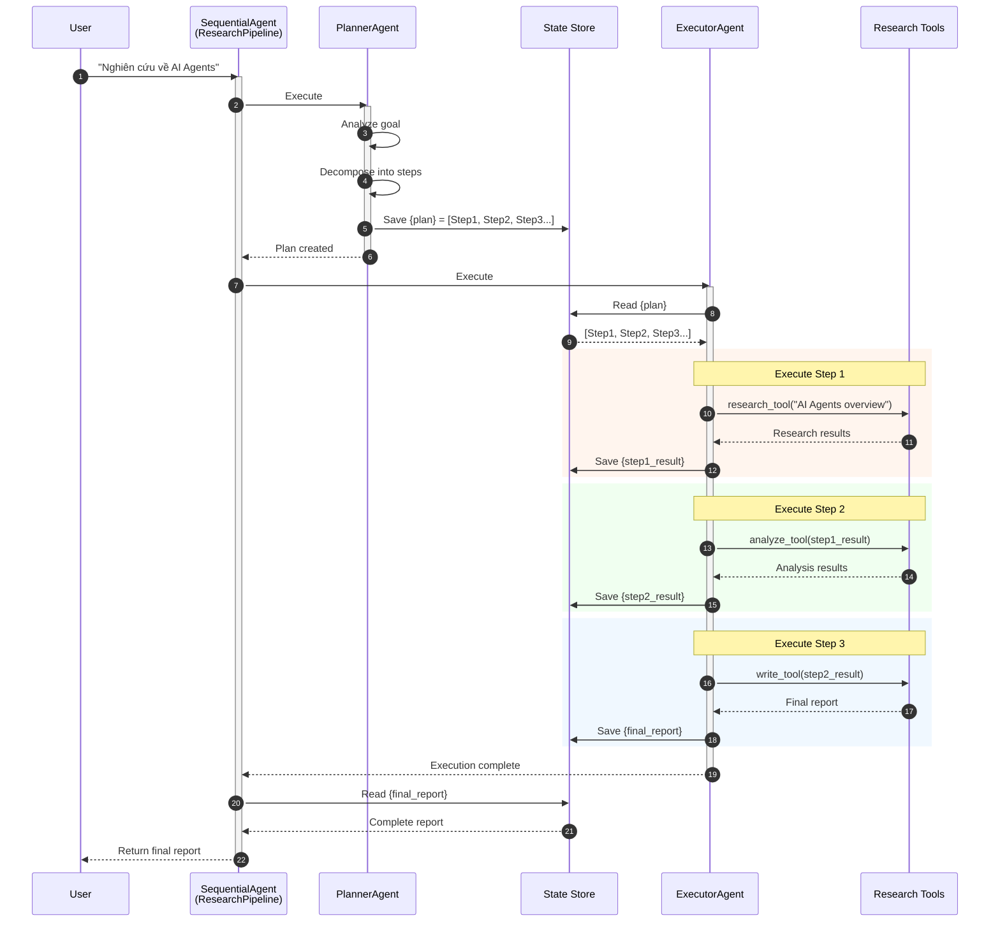

# Hướng dẫn Thực hành: Planning Pattern với ADK-Go

## Mục tiêu

Sau khi hoàn thành bài hướng dẫn này, bạn sẽ:
- Hiểu mẫu Planning (Lập Kế Hoạch) trong thiết kế Agentic
- Phân biệt khi nào dùng Planning động vs workflow cố định
- Triển khai Planning Agent với ADK-Go
- Xây dựng hệ thống có khả năng tạo và thực thi kế hoạch đa bước
- Áp dụng replanning khi gặp trở ngại

---

## Phần 1: Giới thiệu Planning Pattern

### 1.1 Planning là gì?

**Planning (Lập Kế Hoạch)** là khả năng của một agent để xây dựng chuỗi các hành động nhằm chuyển từ trạng thái ban đầu sang trạng thái mục tiêu. Đây là nền tảng cho **hành vi định hướng mục tiêu (goal-oriented behavior)**.

### 1.2 Quy trình Planning

```
┌─────────────────────────────────────────────────────────────────┐
│                      PLANNING WORKFLOW                          │
│                                                                 │
│  ┌──────────┐    ┌──────────────┐    ┌──────────────────────┐  │
│  │  USER    │───▶│   PLANNER    │───▶│      EXECUTOR        │  │
│  │  GOAL    │    │   AGENT      │    │      AGENT(s)        │  │
│  └──────────┘    └──────────────┘    └──────────────────────┘  │
│       │                 │                      │                │
│       ▼                 ▼                      ▼                │
│  "Tổ chức        Phân tích goal        Thực thi từng bước      │
│   workshop"      → Tạo kế hoạch        theo thứ tự              │
│                  → Xác định steps                               │
│                  → Ước lượng                                    │
│                    dependencies                                 │
│                                                                 │
│  ┌────────────────────────────────────────────────────────────┐ │
│  │                    KẾ HOẠCH (PLAN)                         │ │
│  │                                                            │ │
│  │  Step 1: Xác định chủ đề và mục tiêu workshop              │ │
│  │     ↓                                                      │ │
│  │  Step 2: Chọn địa điểm và thời gian                        │ │
│  │     ↓                                                      │ │
│  │  Step 3: Chuẩn bị tài liệu và slides                       │ │
│  │     ↓                                                      │ │
│  │  Step 4: Gửi lời mời cho người tham gia                    │ │
│  │     ↓                                                      │ │
│  │  Step 5: Thực hiện và tổng kết                             │ │
│  └────────────────────────────────────────────────────────────┘ │
└─────────────────────────────────────────────────────────────────┘
```

### 1.3 Các bước trong Planning

1. **Phân tích mục tiêu (Goal Analysis):** Hiểu rõ trạng thái mục tiêu cần đạt
2. **Phân rã (Decomposition):** Chia mục tiêu thành các bước nhỏ hơn
3. **Sắp xếp (Ordering):** Xác định thứ tự và dependencies giữa các bước
4. **Thực thi (Execution):** Thực hiện từng bước theo kế hoạch
5. **Thích ứng (Adaptation):** Điều chỉnh kế hoạch khi gặp trở ngại

### 1.4 Khi nào sử dụng Planning?

| Sử dụng Planning | Sử dụng Workflow Cố định |
|------------------|--------------------------|
| Cách thực hiện **chưa biết trước** | Cách thực hiện **đã biết rõ** |
| Tác vụ **phức tạp, đa bước** | Tác vụ **đơn giản, lặp lại** |
| Cần **linh hoạt, thích ứng** | Cần **nhất quán, dự đoán được** |
| Môi trường **động, thay đổi** | Môi trường **ổn định** |

**Ví dụ sử dụng Planning:**
- Lập kế hoạch nghiên cứu thị trường
- Tổ chức sự kiện với nhiều ràng buộc
- Giải quyết vấn đề kỹ thuật phức tạp
- Tạo nội dung tổng hợp từ nhiều nguồn

**Ví dụ KHÔNG cần Planning:**
- Validate email address
- Convert JSON to CSV
- Xử lý form đăng ký cố định

---

## Phần 2: Kiến trúc Planning với ADK-Go

### 2.1 Hai cách tiếp cận

**Cách 1: Single-Agent Planning (Đơn giản)**
```
┌─────────────────────────────────────────────┐
│           PLANNER + EXECUTOR AGENT          │
│                                             │
│  1. Nhận goal từ user                       │
│  2. Tạo kế hoạch đa bước                    │
│  3. Tự thực thi từng bước                   │
│  4. Output kết quả cuối                     │
│                                             │
│  Tools: [research, write, validate, ...]   │
└─────────────────────────────────────────────┘
```

**Cách 2: Multi-Agent Planning (Linh hoạt)**
```
┌─────────────────────────────────────────────────────────────────┐
│                    PLANNING PIPELINE                            │
│                                                                 │
│  ┌─────────────┐     ┌───────────────────────────────────────┐ │
│  │  PLANNER    │────▶│          EXECUTION LOOP               │ │
│  │  AGENT      │     │  ┌────────────┐  ┌────────────────┐   │ │
│  │             │     │  │  Step      │  │   Executor     │   │ │
│  │ Tạo plan    │     │  │  Selector  │─▶│   Agent(s)     │   │ │
│  │ → {plan}    │     │  │            │  │                │   │ │
│  └─────────────┘     │  └────────────┘  └────────────────┘   │ │
│                      │        ↑                  │            │ │
│                      │        └──────────────────┘            │ │
│                      │          (next step)                   │ │
│                      └───────────────────────────────────────┘ │
└─────────────────────────────────────────────────────────────────┘
```

### 2.2 Kiến trúc đề xuất: Planner + Executor Pipeline

```
┌─────────────────────────────────────────────────────────────────┐
│                   SequentialAgent (Pipeline)                    │
│                                                                 │
│  ┌────────────────────────────────────────────────────────────┐ │
│  │  PLANNER AGENT                                             │ │
│  │                                                            │ │
│  │  Input: User goal + Context                                │ │
│  │  Output: Structured plan (JSON)                            │ │
│  │                                                            │ │
│  │  → state["plan"] = [                                       │ │
│  │      {"step": 1, "action": "...", "expected": "..."},      │ │
│  │      {"step": 2, "action": "...", "expected": "..."},      │ │
│  │      ...                                                   │ │
│  │    ]                                                       │ │
│  └────────────────────────────────────────────────────────────┘ │
│                            ↓                                    │
│  ┌────────────────────────────────────────────────────────────┐ │
│  │  EXECUTOR AGENT                                            │ │
│  │                                                            │ │
│  │  Input: state["plan"]                                      │ │
│  │  Output: Execution results                                 │ │
│  │                                                            │ │
│  │  Tools: [research_tool, write_tool, analyze_tool, ...]    │ │
│  │                                                            │ │
│  │  Thực thi từng step trong plan                             │ │
│  └────────────────────────────────────────────────────────────┘ │
└─────────────────────────────────────────────────────────────────┘
```

### 2.3 Sequence Diagram - Luồng xử lý Planning Pipeline



---

## Phần 3: Bài tập - Research Agent với Planning

### Mô tả bài tập

Xây dựng một **Research Assistant** có khả năng:

1. **Planner Agent** - Phân tích yêu cầu và tạo kế hoạch nghiên cứu
2. **Executor Agent** - Thực thi kế hoạch sử dụng các tools
3. **SequentialAgent** - Điều phối pipeline

### Cấu trúc file

```
cmd/planning/
├── main.go
```

---

## Phần 4: Hướng dẫn từng bước

### Bước 1: Import packages và định nghĩa constants

```go
package main

import (
    "context"
    "encoding/json"
    "fmt"
    "log"
    "os"
    "strings"

    "google.golang.org/adk/agent"
    "google.golang.org/adk/agent/llmagent"
    "google.golang.org/adk/agent/workflowagents/sequentialagent"
    "google.golang.org/adk/cmd/launcher"
    "google.golang.org/adk/cmd/launcher/full"
    "google.golang.org/adk/model"
    "google.golang.org/adk/model/gemini"
    "google.golang.org/adk/tool"
    "google.golang.org/adk/tool/functiontool"
    "google.golang.org/genai"
)

// State keys
const (
    statePlan         = "research_plan"
    stateCurrentStep  = "current_step"
    stateFinalReport  = "final_report"
)
```

### Bước 2: Định nghĩa Data Types cho Plan

```go
// PlanStep đại diện cho một bước trong kế hoạch
type PlanStep struct {
    StepNumber  int    `json:"step_number"`
    Action      string `json:"action"`
    Description string `json:"description"`
    Expected    string `json:"expected_output"`
    ToolToUse   string `json:"tool_to_use,omitempty"`
}

// ResearchPlan đại diện cho kế hoạch nghiên cứu hoàn chỉnh
type ResearchPlan struct {
    Goal        string     `json:"goal"`
    TotalSteps  int        `json:"total_steps"`
    Steps       []PlanStep `json:"steps"`
    EstimatedComplexity string `json:"estimated_complexity"`
}
```

### Bước 3: Tạo Research Tools

```go
// ============================================================================
// RESEARCH TOOLS
// ============================================================================

// SearchKnowledgeArgs - Arguments cho tool tìm kiếm
type SearchKnowledgeArgs struct {
    Query string `json:"query" description:"Truy vấn tìm kiếm thông tin"`
    Topic string `json:"topic" description:"Chủ đề liên quan"`
}

// SearchKnowledgeResult - Kết quả tìm kiếm
type SearchKnowledgeResult struct {
    Findings    string `json:"findings"`
    Sources     string `json:"sources"`
    Confidence  string `json:"confidence"`
}

// SearchKnowledge simulates searching for information
func SearchKnowledge(ctx tool.Context, input SearchKnowledgeArgs) (SearchKnowledgeResult, error) {
    fmt.Printf("[search_knowledge] Query: %s, Topic: %s\n", input.Query, input.Topic)

    // Simulated search results (trong thực tế sẽ gọi API search)
    return SearchKnowledgeResult{
        Findings:   fmt.Sprintf("Kết quả nghiên cứu về '%s': Đây là thông tin tổng hợp từ nhiều nguồn về chủ đề %s...", input.Query, input.Topic),
        Sources:    "Source 1, Source 2, Source 3",
        Confidence: "high",
    }, nil
}

// AnalyzeContentArgs - Arguments cho tool phân tích
type AnalyzeContentArgs struct {
    Content    string `json:"content" description:"Nội dung cần phân tích"`
    Objective  string `json:"objective" description:"Mục tiêu phân tích"`
}

// AnalyzeContentResult - Kết quả phân tích
type AnalyzeContentResult struct {
    KeyPoints   string `json:"key_points"`
    Insights    string `json:"insights"`
    Gaps        string `json:"gaps"`
}

// AnalyzeContent phân tích nội dung và trích xuất insights
func AnalyzeContent(ctx tool.Context, input AnalyzeContentArgs) (AnalyzeContentResult, error) {
    fmt.Printf("[analyze_content] Analyzing content for: %s\n", input.Objective)

    return AnalyzeContentResult{
        KeyPoints: "1. Điểm chính A\n2. Điểm chính B\n3. Điểm chính C",
        Insights:  "Insight quan trọng từ phân tích...",
        Gaps:      "Các khoảng trống cần nghiên cứu thêm...",
    }, nil
}

// WriteReportArgs - Arguments cho tool viết báo cáo
type WriteReportArgs struct {
    Title    string `json:"title" description:"Tiêu đề báo cáo"`
    Sections string `json:"sections" description:"Các phần nội dung cần viết"`
    Data     string `json:"data" description:"Dữ liệu và findings để đưa vào báo cáo"`
}

// WriteReportResult - Kết quả viết báo cáo
type WriteReportResult struct {
    Report string `json:"report"`
    Status string `json:"status"`
}

// WriteReport tạo báo cáo từ dữ liệu nghiên cứu
func WriteReport(ctx tool.Context, input WriteReportArgs) (WriteReportResult, error) {
    fmt.Printf("[write_report] Writing report: %s\n", input.Title)

    report := fmt.Sprintf(`
# %s

## Tóm tắt
Báo cáo này tổng hợp kết quả nghiên cứu về chủ đề được yêu cầu.

## Nội dung chính
%s

## Kết luận
Dựa trên phân tích, chúng tôi đưa ra các khuyến nghị sau...

## Nguồn tham khảo
- Các nguồn đã được trích dẫn trong quá trình nghiên cứu
`, input.Title, input.Data)

    return WriteReportResult{
        Report: report,
        Status: "completed",
    }, nil
}

// createResearchTools tạo tất cả các tools cho research
func createResearchTools() ([]tool.Tool, error) {
    searchTool, err := functiontool.New(
        functiontool.Config{
            Name:        "search_knowledge",
            Description: "Tìm kiếm thông tin và kiến thức về một chủ đề cụ thể",
        },
        SearchKnowledge,
    )
    if err != nil {
        return nil, fmt.Errorf("failed to create search tool: %w", err)
    }

    analyzeTool, err := functiontool.New(
        functiontool.Config{
            Name:        "analyze_content",
            Description: "Phân tích nội dung và trích xuất insights, key points",
        },
        AnalyzeContent,
    )
    if err != nil {
        return nil, fmt.Errorf("failed to create analyze tool: %w", err)
    }

    writeTool, err := functiontool.New(
        functiontool.Config{
            Name:        "write_report",
            Description: "Viết báo cáo tổng hợp từ dữ liệu nghiên cứu",
        },
        WriteReport,
    )
    if err != nil {
        return nil, fmt.Errorf("failed to create write tool: %w", err)
    }

    return []tool.Tool{searchTool, analyzeTool, writeTool}, nil
}
```

### Bước 4: Tạo Planner Agent

```go
// ============================================================================
// PLANNER AGENT
// ============================================================================

func createPlannerAgent(m model.LLM) (agent.Agent, error) {
    return llmagent.New(llmagent.Config{
        Name:        "ResearchPlanner",
        Model:       m,
        Description: "Lập kế hoạch nghiên cứu chi tiết dựa trên mục tiêu của người dùng.",
        Instruction: `Bạn là một Research Strategist chuyên nghiệp.

**VAI TRÒ:**
Phân tích yêu cầu nghiên cứu và tạo kế hoạch chi tiết, có cấu trúc.

**NHIỆM VỤ:**
Khi nhận được yêu cầu nghiên cứu từ người dùng, bạn cần:

1. **Phân tích mục tiêu:** Hiểu rõ người dùng muốn nghiên cứu về điều gì
2. **Xác định phạm vi:** Giới hạn những gì sẽ và không được đề cập
3. **Phân rã thành bước:** Chia thành 3-5 bước cụ thể, có thể thực thi
4. **Xác định dependencies:** Bước nào phụ thuộc bước nào
5. **Chọn tools phù hợp:** Mỗi bước nên dùng tool gì

**TOOLS CÓ SẴN:**
- search_knowledge: Tìm kiếm thông tin về chủ đề
- analyze_content: Phân tích và trích xuất insights
- write_report: Viết báo cáo tổng hợp

**OUTPUT FORMAT:**
Trả về kế hoạch dưới dạng JSON với cấu trúc sau:

{
  "goal": "Mục tiêu nghiên cứu",
  "total_steps": 4,
  "estimated_complexity": "medium",
  "steps": [
    {
      "step_number": 1,
      "action": "Hành động cụ thể",
      "description": "Mô tả chi tiết",
      "expected_output": "Kết quả mong đợi",
      "tool_to_use": "search_knowledge"
    },
    ...
  ]
}

**QUY TẮC:**
- Mỗi bước phải độc lập và có thể đo lường được
- Đặt các bước theo thứ tự logic
- Bước cuối cùng luôn là tổng hợp/viết báo cáo
- Chỉ output JSON, không thêm giải thích`,
        OutputKey: statePlan,
    })
}
```

### Bước 5: Tạo Executor Agent

```go
// ============================================================================
// EXECUTOR AGENT
// ============================================================================

func createExecutorAgent(m model.LLM, tools []tool.Tool) (agent.Agent, error) {
    return llmagent.New(llmagent.Config{
        Name:        "ResearchExecutor",
        Model:       m,
        Description: "Thực thi kế hoạch nghiên cứu theo từng bước.",
        Instruction: fmt.Sprintf(`Bạn là một Research Analyst chuyên nghiệp.

**VAI TRÒ:**
Thực thi kế hoạch nghiên cứu đã được tạo bởi Planner.

**KẾ HOẠCH CẦN THỰC THI:**
{%s}

**NHIỆM VỤ:**
1. Đọc kế hoạch từ context
2. Thực thi TỪNG BƯỚC theo thứ tự
3. Sử dụng tools phù hợp cho mỗi bước
4. Tổng hợp kết quả từ tất cả các bước
5. Output báo cáo cuối cùng

**CÁCH THỰC THI:**
- Bước 1: Gọi tool được chỉ định trong step.tool_to_use
- Lưu kết quả của mỗi bước
- Sử dụng kết quả bước trước làm input cho bước sau
- Bước cuối: Sử dụng write_report để tạo báo cáo tổng hợp

**TOOLS CÓ SẴN:**
- search_knowledge(query, topic): Tìm kiếm thông tin
- analyze_content(content, objective): Phân tích nội dung
- write_report(title, sections, data): Viết báo cáo

**OUTPUT:**
Sau khi thực thi tất cả các bước, output báo cáo nghiên cứu hoàn chỉnh.
Báo cáo phải bao gồm:
- Tiêu đề
- Tóm tắt
- Nội dung chính (từ kết quả các bước)
- Kết luận
- Nguồn tham khảo`, statePlan),
        Tools:     tools,
        OutputKey: stateFinalReport,
    })
}
```

### Bước 6: Tạo Planning Pipeline

```go
// ============================================================================
// PLANNING PIPELINE
// ============================================================================

func createPlanningPipeline(m model.LLM) (agent.Agent, error) {
    // 1. Tạo Planner Agent
    planner, err := createPlannerAgent(m)
    if err != nil {
        return nil, fmt.Errorf("failed to create planner: %w", err)
    }

    // 2. Tạo Research Tools
    tools, err := createResearchTools()
    if err != nil {
        return nil, fmt.Errorf("failed to create tools: %w", err)
    }

    // 3. Tạo Executor Agent với tools
    executor, err := createExecutorAgent(m, tools)
    if err != nil {
        return nil, fmt.Errorf("failed to create executor: %w", err)
    }

    // 4. Tạo Sequential Pipeline: Planner → Executor
    return sequentialagent.New(sequentialagent.Config{
        AgentConfig: agent.Config{
            Name:        "ResearchPipeline",
            Description: "Pipeline nghiên cứu: Lập kế hoạch → Thực thi → Báo cáo",
            SubAgents:   []agent.Agent{planner, executor},
        },
    })
}
```

### Bước 7: Main function

```go
// ============================================================================
// MAIN
// ============================================================================

func printBanner() {
    fmt.Println("═══════════════════════════════════════════════════════")
    fmt.Println("  Research Assistant - Planning Pattern với ADK-Go")
    fmt.Println("═══════════════════════════════════════════════════════")
    fmt.Println("")
    fmt.Println("  Pipeline:")
    fmt.Println("  ┌─────────────────────────────────────────────────┐")
    fmt.Println("  │  1. Planner Agent                               │")
    fmt.Println("  │     - Phân tích yêu cầu                         │")
    fmt.Println("  │     - Tạo kế hoạch nghiên cứu                   │")
    fmt.Println("  │     → {research_plan}                           │")
    fmt.Println("  │                 ↓                               │")
    fmt.Println("  │  2. Executor Agent                              │")
    fmt.Println("  │     - Đọc kế hoạch                              │")
    fmt.Println("  │     - Thực thi từng bước                        │")
    fmt.Println("  │     - Tổng hợp báo cáo                          │")
    fmt.Println("  │     → {final_report}                            │")
    fmt.Println("  └─────────────────────────────────────────────────┘")
    fmt.Println("")
    fmt.Println("Ví dụ: 'Nghiên cứu về xu hướng AI Agents năm 2024'")
    fmt.Println("")
    fmt.Println("Khởi động server...")
}

func main() {
    ctx := context.Background()

    apiKey := os.Getenv("GOOGLE_API_KEY")
    if apiKey == "" {
        log.Fatal("Vui lòng set GOOGLE_API_KEY environment variable")
    }

    geminiModel, err := gemini.NewModel(ctx, "gemini-2.5-flash", &genai.ClientConfig{
        APIKey: apiKey,
    })
    if err != nil {
        log.Fatalf("Không thể tạo model: %v", err)
    }

    // Tạo Pipeline
    pipeline, err := createPlanningPipeline(geminiModel)
    if err != nil {
        log.Fatal(err)
    }

    config := &launcher.Config{
        AgentLoader: agent.NewSingleLoader(pipeline),
    }

    lch := full.NewLauncher()
    printBanner()

    err = lch.Execute(ctx, config, os.Args[1:])
    if err != nil {
        log.Fatal(err)
    }
}
```

---

## Phần 5: Nâng cao - Dynamic Replanning

### 5.1 Vấn đề với Static Planning

Kế hoạch tĩnh có thể thất bại khi:
- Một bước gặp lỗi
- Thông tin mới thay đổi yêu cầu
- Resources không khả dụng

### 5.2 Giải pháp: LoopAgent với Replanning

```
┌─────────────────────────────────────────────────────────────────┐
│                  DYNAMIC PLANNING LOOP                          │
│                                                                 │
│  ┌─────────────┐                                               │
│  │  Planner    │  Tạo/Cập nhật kế hoạch                        │
│  │  Agent      │  → {plan}                                     │
│  └──────┬──────┘                                               │
│         ↓                                                       │
│  ┌────────────────────────────────────────────────────────┐    │
│  │              LoopAgent (max=5)                         │    │
│  │                                                        │    │
│  │  ┌───────────────┐    ┌───────────────────────────┐   │    │
│  │  │  Step         │───▶│   Executor + Evaluator    │   │    │
│  │  │  Executor     │    │                           │   │    │
│  │  │               │    │   IF step_failed:         │   │    │
│  │  │  Thực thi     │    │     → replan tool         │   │    │
│  │  │  bước hiện tại│    │   ELIF all_done:          │   │    │
│  │  │               │    │     → exitLoop            │   │    │
│  │  └───────────────┘    │   ELSE:                   │   │    │
│  │                       │     → continue            │   │    │
│  │                       └───────────────────────────┘   │    │
│  └────────────────────────────────────────────────────────┘    │
└─────────────────────────────────────────────────────────────────┘
```

### 5.3 Replanning Tool

```go
// ReplanArgs - Arguments cho tool replanning
type ReplanArgs struct {
    Reason      string `json:"reason" description:"Lý do cần replan"`
    FailedStep  int    `json:"failed_step" description:"Bước bị thất bại"`
    NewContext  string `json:"new_context" description:"Thông tin mới cần xem xét"`
}

// ReplanResult - Kết quả replanning
type ReplanResult struct {
    NewPlan     string `json:"new_plan"`
    Adjustments string `json:"adjustments"`
}

// Replan cập nhật kế hoạch dựa trên tình huống mới
func Replan(ctx tool.Context, input ReplanArgs) (ReplanResult, error) {
    fmt.Printf("[replan] Replanning due to: %s\n", input.Reason)
    fmt.Printf("[replan] Failed step: %d\n", input.FailedStep)

    // Logic replanning: cập nhật state với kế hoạch mới
    // Trong thực tế, có thể gọi lại Planner Agent

    return ReplanResult{
        NewPlan:     "Updated plan based on new context",
        Adjustments: fmt.Sprintf("Adjusted step %d to handle: %s", input.FailedStep, input.Reason),
    }, nil
}
```

### 5.4 Step Executor với Evaluation

```go
func createStepExecutorAgent(m model.LLM, tools []tool.Tool, exitLoopTool tool.Tool, replanTool tool.Tool) (agent.Agent, error) {
    allTools := append(tools, exitLoopTool, replanTool)

    return llmagent.New(llmagent.Config{
        Name:        "StepExecutor",
        Model:       m,
        Description: "Thực thi một bước và đánh giá kết quả.",
        Instruction: fmt.Sprintf(`Bạn thực thi từng bước trong kế hoạch và đánh giá kết quả.

**KẾ HOẠCH:**
{%s}

**BƯỚC HIỆN TẠI:**
{%s}

**QUY TRÌNH:**
1. Đọc bước hiện tại từ context
2. Thực thi bước sử dụng tool phù hợp
3. Đánh giá kết quả:

   a) NẾU bước THÀNH CÔNG và CÒN bước tiếp theo:
      → Cập nhật current_step
      → Tiếp tục vòng lặp

   b) NẾU bước THÀNH CÔNG và là bước CUỐI CÙNG:
      → Gọi exitLoop() để kết thúc

   c) NẾU bước THẤT BẠI:
      → Gọi replan() với lý do thất bại
      → Tiếp tục với kế hoạch mới

**TOOLS:**
- search_knowledge, analyze_content, write_report: Thực thi
- exitLoop: Kết thúc khi hoàn tất tất cả bước
- replan: Yêu cầu lập kế hoạch lại khi gặp vấn đề`, statePlan, stateCurrentStep),
        Tools:     allTools,
        OutputKey: stateCurrentStep,
    })
}
```

---

## Phần 6: State Management trong Planning

### 6.1 State Keys và Flow

```
User Input: "Nghiên cứu về AI Agents"
    │
    ├─► state["research_plan"] = {
    │       "goal": "Nghiên cứu AI Agents",
    │       "steps": [...]
    │   }
    │
    ├─► state["current_step"] = 1
    │       │
    │       ├─► Executor thực thi step 1
    │       ├─► state["step1_result"] = "..."
    │       └─► state["current_step"] = 2
    │
    ├─► state["current_step"] = 2
    │       │
    │       ├─► Executor thực thi step 2
    │       └─► ...
    │
    └─► state["final_report"] = "Báo cáo hoàn chỉnh..."
```

### 6.2 Reading State trong Instructions

```go
Instruction: fmt.Sprintf(`
**KẾ HOẠCH:**
{%s}

**KẾT QUẢ CÁC BƯỚC TRƯỚC:**
Step 1: {step1_result}
Step 2: {step2_result}

**BƯỚC TIẾP THEO:**
{%s}
`, statePlan, stateCurrentStep)
```

---

## Phần 7: Best Practices

### 7.1 Thiết kế Planner hiệu quả

```go
// ✅ Tốt: Output có cấu trúc rõ ràng
Instruction: `
OUTPUT JSON với cấu trúc:
{
  "goal": "...",
  "steps": [
    {"step_number": 1, "action": "...", "tool_to_use": "..."},
    ...
  ]
}
KHÔNG thêm text ngoài JSON.`

// ❌ Xấu: Output không có cấu trúc
Instruction: `Tạo kế hoạch nghiên cứu với các bước cần thiết.`
```

### 7.2 Giới hạn số bước

```go
// ✅ Tốt: Giới hạn rõ ràng
Instruction: `
Tạo kế hoạch với TỐI ĐA 5 BƯỚC.
Mỗi bước phải:
- Có mục tiêu cụ thể
- Có tool để thực thi
- Có output đo lường được`

// ❌ Xấu: Không giới hạn
Instruction: `Tạo kế hoạch chi tiết nhất có thể.`
```

### 7.3 Xử lý Edge Cases

```go
// Khi plan rỗng hoặc invalid
Instruction: `
NẾU không thể tạo kế hoạch hợp lệ:
→ Output: {"error": "Không thể lập kế hoạch: [lý do]"}

NẾU yêu cầu quá mơ hồ:
→ Output: {"clarification_needed": "[câu hỏi cần làm rõ]"}`
```

### 7.4 Logging cho Debugging

```go
// Trong mỗi tool
func SearchKnowledge(ctx tool.Context, input SearchKnowledgeArgs) (SearchKnowledgeResult, error) {
    log.Printf("═══════════════════════════════════════")
    log.Printf("[search_knowledge] EXECUTING")
    log.Printf("[search_knowledge] Agent: %s", ctx.AgentName())
    log.Printf("[search_knowledge] Query: %s", input.Query)
    log.Printf("[search_knowledge] Topic: %s", input.Topic)
    log.Printf("═══════════════════════════════════════")

    // ... implementation
}
```

---

## Phần 8: Code Mẫu Đầy Đủ (Solution)

```go
// Package main demonstrates Planning pattern using SequentialAgent in Google ADK-Go
//
// Planning cho phép agent phân rã mục tiêu phức tạp thành các bước có thể thực thi.
// Sử dụng SequentialAgent để điều phối: Planner → Executor
// - Planner: Phân tích goal và tạo kế hoạch JSON
// - Executor: Thực thi từng bước trong kế hoạch
package main

import (
	"context"
	"fmt"
	"log"
	"os"

	"google.golang.org/adk/agent"
	"google.golang.org/adk/agent/llmagent"
	"google.golang.org/adk/agent/workflowagents/sequentialagent"
	"google.golang.org/adk/cmd/launcher"
	"google.golang.org/adk/cmd/launcher/full"
	"google.golang.org/adk/model"
	"google.golang.org/adk/model/gemini"
	"google.golang.org/adk/tool"
	"google.golang.org/adk/tool/functiontool"
	"google.golang.org/genai"
)

// State keys
const (
	statePlan        = "research_plan"
	stateFinalReport = "final_report"
)

// ============================================================================
// DATA TYPES
// ============================================================================

// PlanStep đại diện cho một bước trong kế hoạch
type PlanStep struct {
	StepNumber  int    `json:"step_number"`
	Action      string `json:"action"`
	Description string `json:"description"`
	Expected    string `json:"expected_output"`
	ToolToUse   string `json:"tool_to_use,omitempty"`
}

// ResearchPlan đại diện cho kế hoạch nghiên cứu hoàn chỉnh
type ResearchPlan struct {
	Goal               string     `json:"goal"`
	TotalSteps         int        `json:"total_steps"`
	Steps              []PlanStep `json:"steps"`
	EstimatedComplexity string    `json:"estimated_complexity"`
}

// ============================================================================
// RESEARCH TOOLS
// ============================================================================

// SearchKnowledgeArgs - Arguments cho tool tìm kiếm
type SearchKnowledgeArgs struct {
	Query string `json:"query" description:"Truy vấn tìm kiếm thông tin"`
	Topic string `json:"topic" description:"Chủ đề liên quan"`
}

// SearchKnowledgeResult - Kết quả tìm kiếm
type SearchKnowledgeResult struct {
	Findings   string `json:"findings"`
	Sources    string `json:"sources"`
	Confidence string `json:"confidence"`
}

// SearchKnowledge simulates searching for information
func SearchKnowledge(ctx tool.Context, input SearchKnowledgeArgs) (SearchKnowledgeResult, error) {
	fmt.Println("───────────────────────────────────────────────────────")
	fmt.Printf("[search_knowledge] Query: %s\n", input.Query)
	fmt.Printf("[search_knowledge] Topic: %s\n", input.Topic)
	fmt.Println("───────────────────────────────────────────────────────")

	return SearchKnowledgeResult{
		Findings:   fmt.Sprintf("Kết quả nghiên cứu về '%s': Thông tin chi tiết về %s bao gồm các khía cạnh quan trọng, xu hướng hiện tại, và các ứng dụng thực tế.", input.Query, input.Topic),
		Sources:    "Academic papers, Industry reports, Expert interviews",
		Confidence: "high",
	}, nil
}

// AnalyzeContentArgs - Arguments cho tool phân tích
type AnalyzeContentArgs struct {
	Content   string `json:"content" description:"Nội dung cần phân tích"`
	Objective string `json:"objective" description:"Mục tiêu phân tích"`
}

// AnalyzeContentResult - Kết quả phân tích
type AnalyzeContentResult struct {
	KeyPoints string `json:"key_points"`
	Insights  string `json:"insights"`
	Gaps      string `json:"gaps"`
}

// AnalyzeContent phân tích nội dung và trích xuất insights
func AnalyzeContent(ctx tool.Context, input AnalyzeContentArgs) (AnalyzeContentResult, error) {
	fmt.Println("───────────────────────────────────────────────────────")
	fmt.Printf("[analyze_content] Objective: %s\n", input.Objective)
	fmt.Println("───────────────────────────────────────────────────────")

	return AnalyzeContentResult{
		KeyPoints: "1. Điểm quan trọng về kiến trúc\n2. Xu hướng ứng dụng\n3. Thách thức và giải pháp",
		Insights:  "Phân tích cho thấy xu hướng tích hợp AI vào các quy trình nghiệp vụ đang tăng mạnh",
		Gaps:      "Cần nghiên cứu thêm về khả năng mở rộng và bảo mật",
	}, nil
}

// WriteReportArgs - Arguments cho tool viết báo cáo
type WriteReportArgs struct {
	Title    string `json:"title" description:"Tiêu đề báo cáo"`
	Sections string `json:"sections" description:"Các phần nội dung cần viết"`
	Data     string `json:"data" description:"Dữ liệu và findings để đưa vào báo cáo"`
}

// WriteReportResult - Kết quả viết báo cáo
type WriteReportResult struct {
	Report string `json:"report"`
	Status string `json:"status"`
}

// WriteReport tạo báo cáo từ dữ liệu nghiên cứu
func WriteReport(ctx tool.Context, input WriteReportArgs) (WriteReportResult, error) {
	fmt.Println("───────────────────────────────────────────────────────")
	fmt.Printf("[write_report] Title: %s\n", input.Title)
	fmt.Println("───────────────────────────────────────────────────────")

	report := fmt.Sprintf(`
# %s

## Tóm tắt điều hành
Báo cáo này tổng hợp kết quả nghiên cứu dựa trên phân tích đa chiều.

## Các phần chính
%s

## Dữ liệu và Phân tích
%s

## Kết luận và Khuyến nghị
Dựa trên nghiên cứu, chúng tôi khuyến nghị:
1. Tiếp tục theo dõi xu hướng phát triển
2. Đầu tư vào các giải pháp có tính mở rộng
3. Xây dựng năng lực nội bộ

## Nguồn tham khảo
- Các nguồn học thuật và công nghiệp đã được tham chiếu
`, input.Title, input.Sections, input.Data)

	return WriteReportResult{
		Report: report,
		Status: "completed",
	}, nil
}

// createResearchTools tạo tất cả các tools cho research
func createResearchTools() ([]tool.Tool, error) {
	searchTool, err := functiontool.New(
		functiontool.Config{
			Name:        "search_knowledge",
			Description: "Tìm kiếm thông tin và kiến thức về một chủ đề cụ thể. Sử dụng khi cần thu thập dữ liệu ban đầu.",
		},
		SearchKnowledge,
	)
	if err != nil {
		return nil, fmt.Errorf("failed to create search tool: %w", err)
	}

	analyzeTool, err := functiontool.New(
		functiontool.Config{
			Name:        "analyze_content",
			Description: "Phân tích nội dung đã thu thập và trích xuất insights, key points. Sử dụng sau khi có dữ liệu từ search.",
		},
		AnalyzeContent,
	)
	if err != nil {
		return nil, fmt.Errorf("failed to create analyze tool: %w", err)
	}

	writeTool, err := functiontool.New(
		functiontool.Config{
			Name:        "write_report",
			Description: "Viết báo cáo tổng hợp từ dữ liệu và phân tích. Sử dụng ở bước cuối để tạo output.",
		},
		WriteReport,
	)
	if err != nil {
		return nil, fmt.Errorf("failed to create write tool: %w", err)
	}

	return []tool.Tool{searchTool, analyzeTool, writeTool}, nil
}

// ============================================================================
// PLANNER AGENT
// ============================================================================

func createPlannerAgent(m model.LLM) (agent.Agent, error) {
	return llmagent.New(llmagent.Config{
		Name:        "ResearchPlanner",
		Model:       m,
		Description: "Lập kế hoạch nghiên cứu chi tiết dựa trên mục tiêu của người dùng.",
		Instruction: `Bạn là một Research Strategist chuyên nghiệp với 15 năm kinh nghiệm.

**VAI TRÒ:**
Phân tích yêu cầu nghiên cứu và tạo kế hoạch chi tiết, có cấu trúc.

**NHIỆM VỤ:**
Khi nhận được yêu cầu nghiên cứu từ người dùng:

1. **Phân tích mục tiêu:** Hiểu rõ người dùng muốn nghiên cứu gì
2. **Xác định phạm vi:** Giới hạn những gì sẽ và không được đề cập
3. **Phân rã thành 3-4 bước cụ thể**
4. **Xác định tool phù hợp cho mỗi bước**

**TOOLS CÓ SẴN:**
- search_knowledge: Tìm kiếm thông tin về chủ đề
- analyze_content: Phân tích và trích xuất insights
- write_report: Viết báo cáo tổng hợp

**OUTPUT FORMAT:**
Trả về kế hoạch dưới dạng JSON:

{
  "goal": "Mục tiêu nghiên cứu cụ thể",
  "total_steps": 3,
  "estimated_complexity": "low/medium/high",
  "steps": [
    {
      "step_number": 1,
      "action": "Thu thập thông tin",
      "description": "Mô tả chi tiết bước này",
      "expected_output": "Dữ liệu thô về chủ đề",
      "tool_to_use": "search_knowledge"
    },
    {
      "step_number": 2,
      "action": "Phân tích dữ liệu",
      "description": "Phân tích thông tin đã thu thập",
      "expected_output": "Insights và key findings",
      "tool_to_use": "analyze_content"
    },
    {
      "step_number": 3,
      "action": "Tổng hợp báo cáo",
      "description": "Viết báo cáo cuối cùng",
      "expected_output": "Báo cáo nghiên cứu hoàn chỉnh",
      "tool_to_use": "write_report"
    }
  ]
}

**QUY TẮC:**
- Tối đa 4 bước
- Mỗi bước có tool cụ thể
- Bước cuối luôn là write_report
- CHỈ output JSON, không giải thích thêm`,
		OutputKey: statePlan,
	})
}

// ============================================================================
// EXECUTOR AGENT
// ============================================================================

func createExecutorAgent(m model.LLM, tools []tool.Tool) (agent.Agent, error) {
	return llmagent.New(llmagent.Config{
		Name:        "ResearchExecutor",
		Model:       m,
		Description: "Thực thi kế hoạch nghiên cứu theo từng bước.",
		Instruction: fmt.Sprintf(`Bạn là một Research Analyst chuyên nghiệp.

**VAI TRÒ:**
Thực thi kế hoạch nghiên cứu đã được Planner tạo ra.

**KẾ HOẠCH CẦN THỰC THI:**
{%s}

**QUY TRÌNH THỰC THI:**

1. Đọc kế hoạch từ context (JSON ở trên)
2. Với MỖI BƯỚC trong "steps":
   - Gọi tool được chỉ định trong "tool_to_use"
   - Truyền parameters phù hợp
   - Lưu kết quả để dùng cho bước sau

3. Sau khi thực thi TẤT CẢ các bước:
   - Tổng hợp kết quả
   - Gọi write_report để tạo báo cáo cuối cùng

**TOOLS SỬ DỤNG:**
- search_knowledge(query, topic): Thu thập thông tin
- analyze_content(content, objective): Phân tích dữ liệu
- write_report(title, sections, data): Viết báo cáo

**YÊU CẦU:**
- Thực thi ĐÚNG THỨ TỰ các bước
- Sử dụng output bước trước làm input bước sau
- Output cuối cùng là báo cáo hoàn chỉnh từ write_report`, statePlan),
		Tools:     tools,
		OutputKey: stateFinalReport,
	})
}

// ============================================================================
// PLANNING PIPELINE
// ============================================================================

func createPlanningPipeline(m model.LLM) (agent.Agent, error) {
	// 1. Tạo Planner Agent
	planner, err := createPlannerAgent(m)
	if err != nil {
		return nil, fmt.Errorf("failed to create planner: %w", err)
	}

	// 2. Tạo Research Tools
	tools, err := createResearchTools()
	if err != nil {
		return nil, fmt.Errorf("failed to create tools: %w", err)
	}

	// 3. Tạo Executor Agent với tools
	executor, err := createExecutorAgent(m, tools)
	if err != nil {
		return nil, fmt.Errorf("failed to create executor: %w", err)
	}

	// 4. Tạo Sequential Pipeline: Planner → Executor
	return sequentialagent.New(sequentialagent.Config{
		AgentConfig: agent.Config{
			Name:        "ResearchPipeline",
			Description: "Pipeline nghiên cứu: Lập kế hoạch → Thực thi → Báo cáo",
			SubAgents:   []agent.Agent{planner, executor},
		},
	})
}

// ============================================================================
// MAIN
// ============================================================================

func printBanner() {
	fmt.Println("═══════════════════════════════════════════════════════")
	fmt.Println("  Research Assistant - Planning Pattern với ADK-Go")
	fmt.Println("═══════════════════════════════════════════════════════")
	fmt.Println("")
	fmt.Println("  Pipeline:")
	fmt.Println("  ┌─────────────────────────────────────────────────┐")
	fmt.Println("  │  1. Planner Agent                               │")
	fmt.Println("  │     - Phân tích yêu cầu nghiên cứu              │")
	fmt.Println("  │     - Tạo kế hoạch JSON với các bước            │")
	fmt.Println("  │     → {research_plan}                           │")
	fmt.Println("  │                 ↓                               │")
	fmt.Println("  │  2. Executor Agent                              │")
	fmt.Println("  │     - Đọc kế hoạch từ state                     │")
	fmt.Println("  │     - Thực thi từng bước với tools              │")
	fmt.Println("  │     - Tổng hợp báo cáo cuối cùng                │")
	fmt.Println("  │     → {final_report}                            │")
	fmt.Println("  └─────────────────────────────────────────────────┘")
	fmt.Println("")
	fmt.Println("Ví dụ prompts:")
	fmt.Println("  • 'Nghiên cứu về xu hướng AI Agents năm 2024'")
	fmt.Println("  • 'Phân tích thị trường xe điện tại Việt Nam'")
	fmt.Println("  • 'Tìm hiểu về kiến trúc Microservices'")
	fmt.Println("")
	fmt.Println("Khởi động server...")
}

func main() {
	ctx := context.Background()

	apiKey := os.Getenv("GOOGLE_API_KEY")
	if apiKey == "" {
		log.Fatal("Vui lòng set GOOGLE_API_KEY environment variable")
	}

	geminiModel, err := gemini.NewModel(ctx, "gemini-2.5-flash", &genai.ClientConfig{
		APIKey: apiKey,
	})
	if err != nil {
		log.Fatalf("Không thể tạo model: %v", err)
	}

	// Tạo Pipeline
	pipeline, err := createPlanningPipeline(geminiModel)
	if err != nil {
		log.Fatal(err)
	}

	config := &launcher.Config{
		AgentLoader: agent.NewSingleLoader(pipeline),
	}

	lch := full.NewLauncher()
	printBanner()

	err = lch.Execute(ctx, config, os.Args[1:])
	if err != nil {
		log.Fatal(err)
	}
}
```

---

## Phần 9: Chạy thử và Kiểm tra

### 9.1 Chuẩn bị

```bash
# Set API key
export GOOGLE_API_KEY="your-api-key"

# Chạy chương trình
go run cmd/planning/main.go
```

### 9.2 Test cases

**Test 1: Simple Research**
```
User: Nghiên cứu về AI Agents
Expected:
- Planner tạo kế hoạch 3 bước
- Executor thực thi từng bước
- Output: Báo cáo nghiên cứu hoàn chỉnh
```

**Test 2: Complex Research**
```
User: Phân tích chiến lược marketing cho startup công nghệ
Expected:
- Planner tạo kế hoạch 4 bước với complexity = high
- Executor gọi search → analyze → analyze → write
- Output: Báo cáo chi tiết với nhiều khía cạnh
```

### 9.3 Sample Output

```
═══════════════════════════════════════════════════════
  Research Assistant - Planning Pattern với ADK-Go
═══════════════════════════════════════════════════════

[Planner] Creating research plan...
{
  "goal": "Nghiên cứu về AI Agents",
  "total_steps": 3,
  "steps": [
    {"step_number": 1, "action": "Thu thập thông tin", "tool_to_use": "search_knowledge"},
    {"step_number": 2, "action": "Phân tích", "tool_to_use": "analyze_content"},
    {"step_number": 3, "action": "Viết báo cáo", "tool_to_use": "write_report"}
  ]
}

[Executor] Executing plan...
───────────────────────────────────────────────────────
[search_knowledge] Query: AI Agents overview
[search_knowledge] Topic: Artificial Intelligence
───────────────────────────────────────────────────────
[analyze_content] Objective: Extract key insights
───────────────────────────────────────────────────────
[write_report] Title: Nghiên cứu AI Agents
───────────────────────────────────────────────────────

# Nghiên cứu AI Agents

## Tóm tắt điều hành
...

## Kết luận và Khuyến nghị
...
```

---

## Phần 10: So sánh với các Pattern khác

| Pattern | Khi nào dùng | Planning khác gì |
|---------|--------------|------------------|
| **Prompt Chaining** | Các bước cố định, biết trước | Planning tạo bước động |
| **Reflection** | Cải thiện chất lượng output | Planning tổ chức luồng công việc |
| **Routing** | Chọn 1 trong nhiều path | Planning thực thi nhiều bước tuần tự |
| **Parallelization** | Các task độc lập | Planning xử lý dependencies |

---

## Tài liệu tham khảo

1. [ADK-Go Multi-Agent Documentation](https://google.github.io/adk-docs/agents/multi-agents/)
2. [Sequential Agent Documentation](https://google.github.io/adk-docs/agents/multi-agents/#sequentialagent)
3. [Function Tools Documentation](https://google.github.io/adk-docs/tools/)
4. [Google Deep Research](https://gemini.google.com/) - Ví dụ thực tế của Planning
5. [Chapter 6: Planning - Agentic Design Patterns](../../doc_vi/06_Chapter_6_Planning.md)
