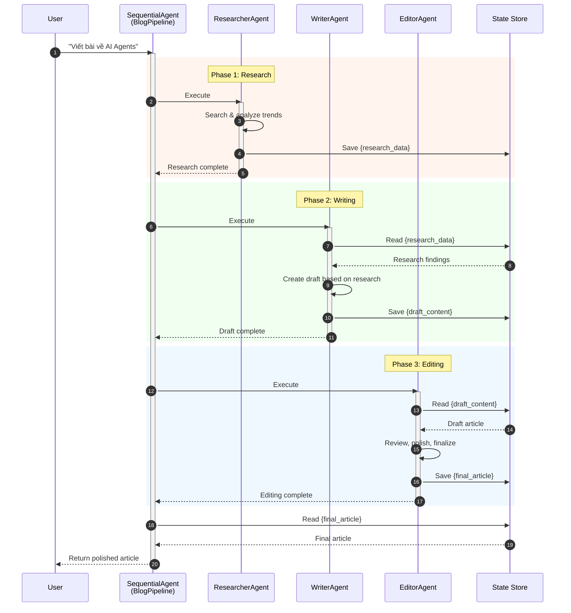

# Hướng dẫn Thực hành: Multi-Agent Collaboration với ADK-Go

## Mục tiêu

Sau khi hoàn thành bài hướng dẫn này, bạn sẽ:
- Hiểu mẫu Multi-Agent Collaboration (Hợp tác Đa Tác nhân)
- Phân biệt các mô hình hợp tác: Sequential, Parallel, Supervisor, Hierarchical
- Triển khai hệ thống đa agent với ADK-Go
- Xây dựng các agent chuyên biệt làm việc cùng nhau
- Áp dụng pattern phù hợp cho từng bài toán

---

## Phần 1: Giới thiệu Multi-Agent Collaboration

### 1.1 Multi-Agent Collaboration là gì?

**Multi-Agent Collaboration** là mẫu thiết kế trong đó nhiều agent độc lập hoặc bán độc lập làm việc cùng nhau để đạt được mục tiêu chung. Mỗi agent có vai trò chuyên biệt, công cụ riêng và có thể giao tiếp với các agent khác.

### 1.2 Tại sao cần Multi-Agent?

| Single Agent | Multi-Agent |
|--------------|-------------|
| Xử lý tất cả tasks | Mỗi agent chuyên một việc |
| Prompt phức tạp, dài | Prompt đơn giản, tập trung |
| Khó mở rộng | Dễ thêm agent mới |
| Một lỗi → toàn bộ fail | Cô lập lỗi, resilient |
| Tool overload | Mỗi agent có tools phù hợp |

### 1.3 Các Mô hình Hợp tác

```
┌─────────────────────────────────────────────────────────────────────────────┐
│                     CÁC MÔ HÌNH HỢP TÁC ĐA AGENT                           │
├─────────────────────────────────────────────────────────────────────────────┤
│                                                                             │
│  1. SEQUENTIAL (Tuần tự)          2. PARALLEL (Song song)                  │
│  ┌───┐   ┌───┐   ┌───┐           ┌───┐                                     │
│  │ A │──▶│ B │──▶│ C │           │ A │──┐                                  │
│  └───┘   └───┘   └───┘           └───┘  │   ┌───┐                          │
│                                  ┌───┐  ├──▶│ D │                          │
│  Output A → Input B → Output B   │ B │──┤   └───┘                          │
│                                  └───┘  │  Aggregator                      │
│                                  ┌───┐  │                                   │
│                                  │ C │──┘                                   │
│                                  └───┘                                      │
│                                                                             │
│  3. SUPERVISOR (Giám sát)         4. HIERARCHICAL (Phân cấp)               │
│       ┌─────────┐                     ┌─────────┐                          │
│       │SUPERVISOR│                    │  BOSS   │                          │
│       └────┬────┘                     └────┬────┘                          │
│       ┌────┼────┐                     ┌────┼────┐                          │
│       ▼    ▼    ▼                     ▼    ▼    ▼                          │
│     ┌───┐┌───┐┌───┐              ┌────┐┌────┐┌────┐                        │
│     │ A ││ B ││ C │              │MGR1││MGR2││MGR3│                        │
│     └───┘└───┘└───┘              └──┬─┘└──┬─┘└──┬─┘                        │
│                                     ▼     ▼     ▼                          │
│  Supervisor phân công            ┌─┴─┐ ┌─┴─┐ ┌─┴─┐                         │
│  và tổng hợp kết quả            │W1W2│ │W3 │ │W4W5│                        │
│                                  └───┘ └───┘ └───┘                         │
│                                                                             │
│  5. DEBATE (Tranh luận)           6. EXPERT TEAM (Nhóm chuyên gia)         │
│     ┌───┐     ┌───┐                  ┌──────────────────┐                  │
│     │ A │◄───▶│ B │                  │   COORDINATOR    │                  │
│     └───┘     └───┘                  └────────┬─────────┘                  │
│       │         │                        ┌────┼────┐                        │
│       └────┬────┘                        ▼    ▼    ▼                        │
│            ▼                          ┌────┐┌────┐┌────┐                    │
│       ┌─────────┐                     │DEV ││QA  ││DOC │                    │
│       │CONSENSUS│                     └────┘└────┘└────┘                    │
│       └─────────┘                                                           │
│                                                                             │
└─────────────────────────────────────────────────────────────────────────────┘
```

### 1.4 ADK-Go Workflow Agents

ADK-Go cung cấp các workflow agents để triển khai các mô hình trên:

| Workflow Agent | Mô hình | Mô tả |
|----------------|---------|-------|
| `sequentialagent` | Sequential | Thực thi agents theo thứ tự |
| `parallelagent` | Parallel | Thực thi agents đồng thời |
| `loopagent` | Iterative | Lặp cho đến điều kiện dừng |
| LLM Agent + SubAgents | Supervisor | Agent điều phối các agent con |

---

## Phần 2: Kiến trúc Multi-Agent với ADK-Go

### 2.1 Mô hình Sequential - Blog Creation Team

```
┌─────────────────────────────────────────────────────────────────┐
│              SequentialAgent (BlogCreationPipeline)             │
│                                                                 │
│  ┌──────────────┐    ┌──────────────┐    ┌──────────────┐      │
│  │  RESEARCHER  │───▶│   WRITER     │───▶│   EDITOR     │      │
│  │    Agent     │    │   Agent      │    │   Agent      │      │
│  └──────────────┘    └──────────────┘    └──────────────┘      │
│        │                   │                   │                │
│        ▼                   ▼                   ▼                │
│   {research_data}    {draft_content}    {final_article}        │
│                                                                 │
│  Tools:              Tools:             Tools:                  │
│  - search_web        - write_section    - check_grammar         │
│  - analyze_trend     - format_text      - improve_style         │
└─────────────────────────────────────────────────────────────────┘
```

### 2.2 Mô hình Parallel - Analysis Team

```
┌─────────────────────────────────────────────────────────────────┐
│              ParallelAgent (MarketAnalysisPipeline)             │
│                                                                 │
│              ┌─────────────────────────────┐                   │
│              │     INPUT: Market Query     │                   │
│              └─────────────┬───────────────┘                   │
│                            │                                    │
│         ┌──────────────────┼──────────────────┐                │
│         ▼                  ▼                  ▼                │
│  ┌────────────┐    ┌────────────┐    ┌────────────┐           │
│  │  TECHNICAL │    │ SENTIMENT  │    │ FINANCIAL  │           │
│  │  Analyst   │    │  Analyst   │    │  Analyst   │           │
│  └─────┬──────┘    └─────┬──────┘    └─────┬──────┘           │
│        │                 │                 │                   │
│        ▼                 ▼                 ▼                   │
│  {tech_analysis}  {sentiment_data}  {financial_metrics}       │
│        │                 │                 │                   │
│        └─────────────────┼─────────────────┘                   │
│                          ▼                                      │
│              ┌─────────────────────────────┐                   │
│              │     AGGREGATOR Agent        │                   │
│              │  Tổng hợp tất cả phân tích  │                   │
│              └─────────────────────────────┘                   │
└─────────────────────────────────────────────────────────────────┘
```

### 2.3 Mô hình Supervisor - Customer Support

```
┌─────────────────────────────────────────────────────────────────┐
│                    SUPERVISOR PATTERN                           │
│                                                                 │
│              ┌─────────────────────────────┐                   │
│              │      SUPPORT MANAGER        │                   │
│              │   (Supervisor Agent)        │                   │
│              │                             │                   │
│              │   Phân tích yêu cầu         │                   │
│              │   → Delegate to specialist  │                   │
│              │   → Tổng hợp response       │                   │
│              └─────────────┬───────────────┘                   │
│                            │                                    │
│       ┌────────────────────┼────────────────────┐              │
│       │                    │                    │              │
│       ▼                    ▼                    ▼              │
│ ┌───────────┐      ┌───────────┐      ┌───────────┐           │
│ │ TECHNICAL │      │  BILLING  │      │  GENERAL  │           │
│ │  Support  │      │  Support  │      │  Support  │           │
│ │           │      │           │      │           │           │
│ │ Tools:    │      │ Tools:    │      │ Tools:    │           │
│ │ -diagnose │      │ -invoice  │      │ -faq      │           │
│ │ -fix_issue│      │ -payment  │      │ -escalate │           │
│ └───────────┘      └───────────┘      └───────────┘           │
└─────────────────────────────────────────────────────────────────┘
```

### 2.4 Sequence Diagram - Sequential Collaboration



---

## Phần 3: Bài tập 1 - Blog Creation Team (Sequential)

### Mô tả bài tập

Xây dựng một **Blog Creation Team** với 3 agents:

1. **Researcher Agent** - Tìm kiếm và phân tích thông tin
2. **Writer Agent** - Viết nội dung dựa trên research
3. **Editor Agent** - Chỉnh sửa và hoàn thiện bài viết

### Cấu trúc file

```
cmd/multi_agent/
├── main.go
```

---

## Phần 4: Hướng dẫn từng bước - Sequential Collaboration

### Bước 1: Import packages và constants

```go
package main

import (
    "context"
    "fmt"
    "log"
    "os"

    "google.golang.org/adk/agent"
    "google.golang.org/adk/agent/llmagent"
    "google.golang.org/adk/agent/workflowagents/parallelagent"
    "google.golang.org/adk/agent/workflowagents/sequentialagent"
    "google.golang.org/adk/cmd/launcher"
    "google.golang.org/adk/cmd/launcher/full"
    "google.golang.org/adk/model"
    "google.golang.org/adk/model/gemini"
    "google.golang.org/adk/tool"
    "google.golang.org/adk/tool/functiontool"
    "google.golang.org/genai"
)

// State keys cho Blog Creation Team
const (
    stateResearchData  = "research_data"
    stateDraftContent  = "draft_content"
    stateFinalArticle  = "final_article"
)
```

### Bước 2: Tạo Tools cho các Agents

```go
// ============================================================================
// RESEARCHER TOOLS
// ============================================================================

type SearchTopicArgs struct {
    Topic    string `json:"topic" description:"Chủ đề cần tìm kiếm"`
    Keywords string `json:"keywords" description:"Từ khóa bổ sung"`
}

type SearchTopicResult struct {
    Findings    string `json:"findings"`
    Trends      string `json:"trends"`
    KeyPoints   string `json:"key_points"`
    Sources     string `json:"sources"`
}

func SearchTopic(ctx tool.Context, input SearchTopicArgs) (SearchTopicResult, error) {
    fmt.Println("───────────────────────────────────────────────────────")
    fmt.Printf("[search_topic] Topic: %s\n", input.Topic)
    fmt.Printf("[search_topic] Keywords: %s\n", input.Keywords)
    fmt.Println("───────────────────────────────────────────────────────")

    return SearchTopicResult{
        Findings: fmt.Sprintf("Nghiên cứu về '%s' cho thấy nhiều phát triển quan trọng trong lĩnh vực này. Các chuyên gia nhận định đây là xu hướng đáng chú ý.", input.Topic),
        Trends:   "1. Xu hướng tăng trưởng mạnh\n2. Ứng dụng thực tế ngày càng nhiều\n3. Đầu tư R&D gia tăng",
        KeyPoints: "- Điểm chính 1: Tầm quan trọng trong công nghiệp\n- Điểm chính 2: Ảnh hưởng đến người dùng\n- Điểm chính 3: Triển vọng tương lai",
        Sources:  "TechCrunch, Wired, MIT Technology Review",
    }, nil
}

// ============================================================================
// WRITER TOOLS
// ============================================================================

type WriteSectionArgs struct {
    SectionTitle string `json:"section_title" description:"Tiêu đề phần"`
    Content      string `json:"content" description:"Nội dung cần viết"`
    Tone         string `json:"tone" description:"Giọng văn: formal, casual, technical"`
}

type WriteSectionResult struct {
    Section string `json:"section"`
    WordCount int  `json:"word_count"`
}

func WriteSection(ctx tool.Context, input WriteSectionArgs) (WriteSectionResult, error) {
    fmt.Println("───────────────────────────────────────────────────────")
    fmt.Printf("[write_section] Section: %s\n", input.SectionTitle)
    fmt.Printf("[write_section] Tone: %s\n", input.Tone)
    fmt.Println("───────────────────────────────────────────────────────")

    section := fmt.Sprintf("## %s\n\n%s\n", input.SectionTitle, input.Content)
    return WriteSectionResult{
        Section:   section,
        WordCount: len(input.Content) / 5, // Ước tính
    }, nil
}

// ============================================================================
// EDITOR TOOLS
// ============================================================================

type EditContentArgs struct {
    Content    string `json:"content" description:"Nội dung cần chỉnh sửa"`
    EditType   string `json:"edit_type" description:"Loại chỉnh sửa: grammar, style, structure"`
}

type EditContentResult struct {
    EditedContent string `json:"edited_content"`
    Changes       string `json:"changes"`
    Quality       string `json:"quality"`
}

func EditContent(ctx tool.Context, input EditContentArgs) (EditContentResult, error) {
    fmt.Println("───────────────────────────────────────────────────────")
    fmt.Printf("[edit_content] Type: %s\n", input.EditType)
    fmt.Println("───────────────────────────────────────────────────────")

    return EditContentResult{
        EditedContent: input.Content + "\n\n[Đã chỉnh sửa và tối ưu hóa]",
        Changes:       "- Cải thiện cấu trúc câu\n- Thêm transitions\n- Tối ưu SEO",
        Quality:       "high",
    }, nil
}

// createAllTools tạo tools cho tất cả agents
func createAllTools() (researchTools, writerTools, editorTools []tool.Tool, err error) {
    // Research tools
    searchTool, err := functiontool.New(
        functiontool.Config{
            Name:        "search_topic",
            Description: "Tìm kiếm và phân tích thông tin về một chủ đề",
        },
        SearchTopic,
    )
    if err != nil {
        return nil, nil, nil, err
    }
    researchTools = []tool.Tool{searchTool}

    // Writer tools
    writeTool, err := functiontool.New(
        functiontool.Config{
            Name:        "write_section",
            Description: "Viết một phần nội dung bài viết",
        },
        WriteSection,
    )
    if err != nil {
        return nil, nil, nil, err
    }
    writerTools = []tool.Tool{writeTool}

    // Editor tools
    editTool, err := functiontool.New(
        functiontool.Config{
            Name:        "edit_content",
            Description: "Chỉnh sửa và cải thiện nội dung",
        },
        EditContent,
    )
    if err != nil {
        return nil, nil, nil, err
    }
    editorTools = []tool.Tool{editTool}

    return researchTools, writerTools, editorTools, nil
}
```

### Bước 3: Tạo Researcher Agent

```go
// ============================================================================
// RESEARCHER AGENT
// ============================================================================

func createResearcherAgent(m model.LLM, tools []tool.Tool) (agent.Agent, error) {
    return llmagent.New(llmagent.Config{
        Name:        "ResearcherAgent",
        Model:       m,
        Description: "Chuyên gia nghiên cứu và phân tích thông tin về chủ đề.",
        Instruction: `Bạn là một Senior Research Analyst với 10 năm kinh nghiệm.

**VAI TRÒ:**
Nghiên cứu và thu thập thông tin về chủ đề được yêu cầu.

**NHIỆM VỤ:**
1. Nhận yêu cầu về chủ đề cần viết bài
2. Sử dụng tool search_topic để tìm kiếm thông tin
3. Phân tích và tổng hợp findings
4. Output research data có cấu trúc

**OUTPUT FORMAT:**
Trả về research data với cấu trúc:
- Tổng quan chủ đề
- Xu hướng chính (3-5 điểm)
- Key insights
- Nguồn tham khảo

**QUY TẮC:**
- Tập trung vào thông tin chính xác, có nguồn
- Highlight các điểm quan trọng nhất
- Chuẩn bị data để Writer có thể sử dụng ngay`,
        Tools:     tools,
        OutputKey: stateResearchData,
    })
}
```

### Bước 4: Tạo Writer Agent

```go
// ============================================================================
// WRITER AGENT
// ============================================================================

func createWriterAgent(m model.LLM, tools []tool.Tool) (agent.Agent, error) {
    return llmagent.New(llmagent.Config{
        Name:        "WriterAgent",
        Model:       m,
        Description: "Chuyên gia viết nội dung dựa trên research data.",
        Instruction: fmt.Sprintf(`Bạn là một Technical Content Writer chuyên nghiệp.

**VAI TRÒ:**
Viết bài blog dựa trên research data đã được chuẩn bị.

**RESEARCH DATA:**
{%s}

**NHIỆM VỤ:**
1. Đọc và hiểu research data từ Researcher
2. Tạo outline cho bài viết
3. Sử dụng tool write_section để viết từng phần:
   - Introduction (giới thiệu hấp dẫn)
   - Main content (2-3 sections chính)
   - Conclusion (kết luận và call-to-action)
4. Kết hợp thành bài viết hoàn chỉnh

**YÊU CẦU:**
- Giọng văn engaging, dễ đọc
- Sử dụng ví dụ cụ thể từ research
- Độ dài: 300-500 từ
- Format: Markdown với headers

**OUTPUT:**
Draft bài viết hoàn chỉnh, sẵn sàng cho Editor review.`, stateResearchData),
        Tools:     tools,
        OutputKey: stateDraftContent,
    })
}
```

### Bước 5: Tạo Editor Agent

```go
// ============================================================================
// EDITOR AGENT
// ============================================================================

func createEditorAgent(m model.LLM, tools []tool.Tool) (agent.Agent, error) {
    return llmagent.New(llmagent.Config{
        Name:        "EditorAgent",
        Model:       m,
        Description: "Chuyên gia chỉnh sửa và hoàn thiện bài viết.",
        Instruction: fmt.Sprintf(`Bạn là một Chief Editor với tiêu chuẩn cao.

**VAI TRÒ:**
Review và polish bài viết để đạt chất lượng xuất bản.

**DRAFT CONTENT:**
{%s}

**NHIỆM VỤ:**
1. Đọc draft từ Writer
2. Sử dụng tool edit_content để chỉnh sửa:
   - Grammar check
   - Style improvement
   - Structure optimization
3. Đảm bảo:
   - Không có lỗi chính tả/ngữ pháp
   - Flow mạch lạc giữa các phần
   - Tone nhất quán
   - SEO-friendly (nếu cần)

**CHECKLIST:**
- [ ] Tiêu đề hấp dẫn
- [ ] Introduction hook người đọc
- [ ] Nội dung có giá trị
- [ ] Kết luận có call-to-action
- [ ] Format đúng Markdown

**OUTPUT:**
Bài viết final, sẵn sàng publish.`, stateDraftContent),
        Tools:     tools,
        OutputKey: stateFinalArticle,
    })
}
```

### Bước 6: Tạo Sequential Pipeline

```go
// ============================================================================
// SEQUENTIAL PIPELINE - BLOG CREATION TEAM
// ============================================================================

func createBlogCreationTeam(m model.LLM) (agent.Agent, error) {
    // Tạo tools cho các agents
    researchTools, writerTools, editorTools, err := createAllTools()
    if err != nil {
        return nil, fmt.Errorf("failed to create tools: %w", err)
    }

    // Tạo các agents
    researcher, err := createResearcherAgent(m, researchTools)
    if err != nil {
        return nil, fmt.Errorf("failed to create researcher: %w", err)
    }

    writer, err := createWriterAgent(m, writerTools)
    if err != nil {
        return nil, fmt.Errorf("failed to create writer: %w", err)
    }

    editor, err := createEditorAgent(m, editorTools)
    if err != nil {
        return nil, fmt.Errorf("failed to create editor: %w", err)
    }

    // Tạo Sequential Pipeline
    return sequentialagent.New(sequentialagent.Config{
        AgentConfig: agent.Config{
            Name:        "BlogCreationTeam",
            Description: "Team tạo blog: Researcher → Writer → Editor",
            SubAgents:   []agent.Agent{researcher, writer, editor},
        },
    })
}
```

---

## Phần 5: Bài tập 2 - Market Analysis Team (Parallel)

### Mô tả

Xây dựng **Market Analysis Team** với các agents chạy song song:

1. **Technical Analyst** - Phân tích kỹ thuật
2. **Sentiment Analyst** - Phân tích cảm xúc thị trường
3. **Financial Analyst** - Phân tích tài chính
4. **Aggregator** - Tổng hợp tất cả phân tích

### Kiến trúc Parallel + Sequential

```
┌─────────────────────────────────────────────────────────────────┐
│                  SequentialAgent (Pipeline)                     │
│                                                                 │
│  ┌───────────────────────────────────────────────────────────┐ │
│  │              ParallelAgent (AnalysisPhase)                │ │
│  │                                                           │ │
│  │  ┌────────────┐ ┌────────────┐ ┌────────────┐            │ │
│  │  │ Technical  │ │ Sentiment  │ │ Financial  │            │ │
│  │  │  Analyst   │ │  Analyst   │ │  Analyst   │            │ │
│  │  └─────┬──────┘ └─────┬──────┘ └─────┬──────┘            │ │
│  │        │              │              │                    │ │
│  │        ▼              ▼              ▼                    │ │
│  │  {tech_analysis} {sentiment}   {financial}                │ │
│  └───────────────────────────────────────────────────────────┘ │
│                            ↓                                    │
│  ┌───────────────────────────────────────────────────────────┐ │
│  │                   Aggregator Agent                        │ │
│  │           Tổng hợp và tạo báo cáo cuối cùng               │ │
│  └───────────────────────────────────────────────────────────┘ │
└─────────────────────────────────────────────────────────────────┘
```

### Code Implementation

```go
// ============================================================================
// PARALLEL ANALYSIS AGENTS
// ============================================================================

// State keys cho Market Analysis
const (
    stateTechAnalysis  = "tech_analysis"
    stateSentiment     = "sentiment_analysis"
    stateFinancial     = "financial_analysis"
    stateMarketReport  = "market_report"
)

func createTechnicalAnalyst(m model.LLM) (agent.Agent, error) {
    return llmagent.New(llmagent.Config{
        Name:        "TechnicalAnalyst",
        Model:       m,
        Description: "Phân tích kỹ thuật thị trường.",
        Instruction: `Bạn là Technical Analyst chuyên về chart patterns và indicators.

**NHIỆM VỤ:**
Phân tích kỹ thuật dựa trên:
- Trend analysis (xu hướng)
- Support/Resistance levels
- Volume patterns
- Key indicators (RSI, MACD, Moving Averages)

**OUTPUT:**
- Trend hiện tại: Bullish/Bearish/Sideways
- Key levels: Support và Resistance
- Signal: Buy/Sell/Hold
- Confidence: High/Medium/Low`,
        OutputKey: stateTechAnalysis,
    })
}

func createSentimentAnalyst(m model.LLM) (agent.Agent, error) {
    return llmagent.New(llmagent.Config{
        Name:        "SentimentAnalyst",
        Model:       m,
        Description: "Phân tích cảm xúc và tin tức thị trường.",
        Instruction: `Bạn là Sentiment Analyst chuyên về market psychology.

**NHIỆM VỤ:**
Phân tích cảm xúc thị trường dựa trên:
- News sentiment
- Social media trends
- Market fear/greed index
- Institutional behavior

**OUTPUT:**
- Overall sentiment: Positive/Negative/Neutral
- Key news impacts
- Crowd behavior
- Contrarian signals (nếu có)`,
        OutputKey: stateSentiment,
    })
}

func createFinancialAnalyst(m model.LLM) (agent.Agent, error) {
    return llmagent.New(llmagent.Config{
        Name:        "FinancialAnalyst",
        Model:       m,
        Description: "Phân tích tài chính và fundamentals.",
        Instruction: `Bạn là Financial Analyst chuyên về fundamental analysis.

**NHIỆM VỤ:**
Phân tích tài chính dựa trên:
- Revenue và profit trends
- Valuation metrics (P/E, P/B, etc.)
- Cash flow analysis
- Competitive position

**OUTPUT:**
- Valuation: Overvalued/Undervalued/Fair
- Key financial metrics
- Growth prospects
- Risk factors`,
        OutputKey: stateFinancial,
    })
}

func createAggregatorAgent(m model.LLM) (agent.Agent, error) {
    return llmagent.New(llmagent.Config{
        Name:        "AggregatorAgent",
        Model:       m,
        Description: "Tổng hợp phân tích từ các chuyên gia.",
        Instruction: fmt.Sprintf(`Bạn là Chief Investment Officer tổng hợp phân tích.

**PHÂN TÍCH TỪ CÁC CHUYÊN GIA:**

**Technical Analysis:**
{%s}

**Sentiment Analysis:**
{%s}

**Financial Analysis:**
{%s}

**NHIỆM VỤ:**
1. Review tất cả phân tích từ các analyst
2. Xác định consensus và divergence
3. Weighing các yếu tố
4. Đưa ra recommendation cuối cùng

**OUTPUT FORMAT:**
# Báo Cáo Thị Trường Tổng Hợp

## Executive Summary
[Tóm tắt ngắn gọn]

## Phân Tích Chi Tiết
- Technical: [Summary]
- Sentiment: [Summary]
- Financial: [Summary]

## Recommendation
- Action: BUY/SELL/HOLD
- Confidence: High/Medium/Low
- Risk Level: High/Medium/Low

## Key Risks & Opportunities
[Liệt kê]`, stateTechAnalysis, stateSentiment, stateFinancial),
        OutputKey: stateMarketReport,
    })
}

// ============================================================================
// PARALLEL + SEQUENTIAL PIPELINE
// ============================================================================

func createMarketAnalysisTeam(m model.LLM) (agent.Agent, error) {
    // Tạo các analyst agents
    techAnalyst, err := createTechnicalAnalyst(m)
    if err != nil {
        return nil, err
    }

    sentimentAnalyst, err := createSentimentAnalyst(m)
    if err != nil {
        return nil, err
    }

    financialAnalyst, err := createFinancialAnalyst(m)
    if err != nil {
        return nil, err
    }

    aggregator, err := createAggregatorAgent(m)
    if err != nil {
        return nil, err
    }

    // Tạo Parallel Agent cho phase phân tích
    parallelAnalysis, err := parallelagent.New(parallelagent.Config{
        AgentConfig: agent.Config{
            Name:        "ParallelAnalysis",
            Description: "Chạy các phân tích song song",
            SubAgents:   []agent.Agent{techAnalyst, sentimentAnalyst, financialAnalyst},
        },
    })
    if err != nil {
        return nil, err
    }

    // Tạo Sequential Pipeline: Parallel Analysis → Aggregator
    return sequentialagent.New(sequentialagent.Config{
        AgentConfig: agent.Config{
            Name:        "MarketAnalysisTeam",
            Description: "Team phân tích thị trường: Parallel Analysis → Aggregation",
            SubAgents:   []agent.Agent{parallelAnalysis, aggregator},
        },
    })
}
```

---

## Phần 6: Bài tập 3 - Customer Support Team (Supervisor Pattern)

### Mô tả

Xây dựng **Customer Support Team** với Supervisor pattern:

1. **Support Manager** - Phân loại và điều phối
2. **Technical Support** - Xử lý vấn đề kỹ thuật
3. **Billing Support** - Xử lý vấn đề thanh toán
4. **General Support** - Xử lý câu hỏi chung

### Sử dụng Agent Transfer

ADK-Go hỗ trợ **agent transfer** để chuyển control giữa các agents:

```go
// ============================================================================
// SUPERVISOR PATTERN với AGENT TRANSFER
// ============================================================================

const (
    stateTicketType = "ticket_type"
    stateResponse   = "support_response"
)

// createSupportManager tạo Supervisor agent
func createSupportManager(m model.LLM, specialists []agent.Agent) (agent.Agent, error) {
    return llmagent.New(llmagent.Config{
        Name:        "SupportManager",
        Model:       m,
        Description: "Phân loại tickets và điều phối đến specialists.",
        Instruction: `Bạn là Support Manager, người điều phối tickets.

**NHIỆM VỤ:**
1. Đọc yêu cầu của khách hàng
2. Phân loại loại vấn đề:
   - TECHNICAL: Lỗi kỹ thuật, bugs, không hoạt động
   - BILLING: Hóa đơn, thanh toán, hoàn tiền
   - GENERAL: Câu hỏi chung, thông tin, feedback

3. Chuyển tiếp đến specialist phù hợp:
   - Technical issues → TechnicalSupport
   - Billing issues → BillingSupport
   - General queries → GeneralSupport

**OUTPUT:**
Chuyển tiếp request đến agent phù hợp bằng cách mention tên agent.
Ví dụ: "Tôi sẽ chuyển vấn đề này đến TechnicalSupport để hỗ trợ bạn."`,
        SubAgents: specialists,
    })
}

func createTechnicalSupport(m model.LLM) (agent.Agent, error) {
    return llmagent.New(llmagent.Config{
        Name:        "TechnicalSupport",
        Model:       m,
        Description: "Xử lý vấn đề kỹ thuật.",
        Instruction: `Bạn là Technical Support Specialist.

**CHUYÊN MÔN:**
- Troubleshooting lỗi kỹ thuật
- Hướng dẫn cài đặt, cấu hình
- Debug và fix issues
- Escalate nếu cần

**CÁCH XỬ LÝ:**
1. Xác định rõ vấn đề
2. Hỏi thông tin cần thiết (version, OS, error message)
3. Đưa ra giải pháp step-by-step
4. Confirm vấn đề đã được giải quyết

**TONE:**
Professional, patient, technical nhưng dễ hiểu.`,
        OutputKey: stateResponse,
    })
}

func createBillingSupport(m model.LLM) (agent.Agent, error) {
    return llmagent.New(llmagent.Config{
        Name:        "BillingSupport",
        Model:       m,
        Description: "Xử lý vấn đề thanh toán.",
        Instruction: `Bạn là Billing Support Specialist.

**CHUYÊN MÔN:**
- Xử lý vấn đề hóa đơn
- Hỗ trợ thanh toán
- Xử lý refund requests
- Giải thích pricing

**CÁCH XỬ LÝ:**
1. Xác minh thông tin tài khoản
2. Review transaction history
3. Giải thích charges
4. Process refund nếu eligible

**TONE:**
Professional, empathetic, clear about policies.`,
        OutputKey: stateResponse,
    })
}

func createGeneralSupport(m model.LLM) (agent.Agent, error) {
    return llmagent.New(llmagent.Config{
        Name:        "GeneralSupport",
        Model:       m,
        Description: "Xử lý câu hỏi chung.",
        Instruction: `Bạn là General Support Representative.

**CHUYÊN MÔN:**
- Trả lời câu hỏi về sản phẩm/dịch vụ
- Cung cấp thông tin chung
- Thu thập feedback
- Hướng dẫn sử dụng cơ bản

**CÁCH XỬ LÝ:**
1. Lắng nghe và hiểu nhu cầu
2. Cung cấp thông tin chính xác
3. Đề xuất resources hữu ích
4. Escalate nếu vượt quá scope

**TONE:**
Friendly, helpful, informative.`,
        OutputKey: stateResponse,
    })
}

// createSupportTeam tạo Customer Support Team
func createSupportTeam(m model.LLM) (agent.Agent, error) {
    // Tạo specialists
    techSupport, err := createTechnicalSupport(m)
    if err != nil {
        return nil, err
    }

    billingSupport, err := createBillingSupport(m)
    if err != nil {
        return nil, err
    }

    generalSupport, err := createGeneralSupport(m)
    if err != nil {
        return nil, err
    }

    specialists := []agent.Agent{techSupport, billingSupport, generalSupport}

    // Tạo Manager với specialists là sub-agents
    return createSupportManager(m, specialists)
}
```

---

## Phần 7: State Management trong Multi-Agent

### 7.1 State Flow giữa các Agents

```
User Input: "Viết bài về AI Agents"
    │
    ├─► Researcher Agent
    │   └─► state["research_data"] = "..."
    │
    ├─► Writer Agent
    │   ├─► Đọc state["research_data"]
    │   └─► state["draft_content"] = "..."
    │
    └─► Editor Agent
        ├─► Đọc state["draft_content"]
        └─► state["final_article"] = "..."
```

### 7.2 Parallel State Updates

```
                    ┌─► TechAnalyst → state["tech_analysis"]
                    │
ParallelAgent ──────┼─► SentimentAnalyst → state["sentiment"]
                    │
                    └─► FinancialAnalyst → state["financial"]

                              │
                              ▼

Aggregator ────────────► Đọc tất cả states
                         └─► state["final_report"]
```

### 7.3 Best Practices

```go
// ✅ Tốt: State keys rõ ràng, có prefix
const (
    stateResearchData  = "research_data"
    stateDraftContent  = "draft_content"
    stateFinalArticle  = "final_article"
)

// ❌ Xấu: State keys mơ hồ
const (
    stateData    = "data"
    stateContent = "content"
    stateResult  = "result"
)

// ✅ Tốt: Instruction đọc state rõ ràng
Instruction: fmt.Sprintf(`
**DỮ LIỆU TỪ BƯỚC TRƯỚC:**
{%s}

Dựa trên dữ liệu trên, thực hiện...`, stateResearchData)

// ❌ Xấu: Không chỉ rõ nguồn data
Instruction: `Dựa trên thông tin có sẵn, thực hiện...`
```

---

## Phần 8: Code Mẫu Đầy Đủ (Solution)

```go
// Package main demonstrates Multi-Agent Collaboration pattern using ADK-Go
//
// Multi-Agent Collaboration cho phép nhiều agent chuyên biệt làm việc cùng nhau.
// Ví dụ này demo 2 patterns:
// 1. Sequential: Blog Creation Team (Researcher → Writer → Editor)
// 2. Parallel + Sequential: Market Analysis Team (3 analysts song song → Aggregator)
package main

import (
	"context"
	"fmt"
	"log"
	"os"

	"google.golang.org/adk/agent"
	"google.golang.org/adk/agent/llmagent"
	"google.golang.org/adk/agent/workflowagents/parallelagent"
	"google.golang.org/adk/agent/workflowagents/sequentialagent"
	"google.golang.org/adk/cmd/launcher"
	"google.golang.org/adk/cmd/launcher/full"
	"google.golang.org/adk/model"
	"google.golang.org/adk/model/gemini"
	"google.golang.org/adk/tool"
	"google.golang.org/adk/tool/functiontool"
	"google.golang.org/genai"
)

// ============================================================================
// STATE KEYS
// ============================================================================

// Blog Creation Team
const (
	stateResearchData = "research_data"
	stateDraftContent = "draft_content"
	stateFinalArticle = "final_article"
)

// Market Analysis Team
const (
	stateTechAnalysis = "tech_analysis"
	stateSentiment    = "sentiment_analysis"
	stateFinancial    = "financial_analysis"
	stateMarketReport = "market_report"
)

// ============================================================================
// TOOLS
// ============================================================================

type SearchTopicArgs struct {
	Topic    string `json:"topic" description:"Chủ đề cần tìm kiếm"`
	Keywords string `json:"keywords" description:"Từ khóa bổ sung"`
}

type SearchTopicResult struct {
	Findings  string `json:"findings"`
	Trends    string `json:"trends"`
	KeyPoints string `json:"key_points"`
}

func SearchTopic(ctx tool.Context, input SearchTopicArgs) (SearchTopicResult, error) {
	fmt.Println("───────────────────────────────────────────────────────")
	fmt.Printf("[search_topic] Topic: %s, Keywords: %s\n", input.Topic, input.Keywords)
	fmt.Println("───────────────────────────────────────────────────────")

	return SearchTopicResult{
		Findings:  fmt.Sprintf("Nghiên cứu về '%s' cho thấy nhiều phát triển quan trọng.", input.Topic),
		Trends:    "1. Xu hướng tăng trưởng\n2. Ứng dụng thực tế tăng\n3. Đầu tư R&D mạnh",
		KeyPoints: "- Tầm quan trọng công nghiệp\n- Ảnh hưởng người dùng\n- Triển vọng tương lai",
	}, nil
}

type WriteSectionArgs struct {
	SectionTitle string `json:"section_title"`
	Content      string `json:"content"`
}

type WriteSectionResult struct {
	Section string `json:"section"`
}

func WriteSection(ctx tool.Context, input WriteSectionArgs) (WriteSectionResult, error) {
	fmt.Printf("[write_section] Writing: %s\n", input.SectionTitle)
	return WriteSectionResult{
		Section: fmt.Sprintf("## %s\n\n%s\n", input.SectionTitle, input.Content),
	}, nil
}

type EditContentArgs struct {
	Content  string `json:"content"`
	EditType string `json:"edit_type"`
}

type EditContentResult struct {
	EditedContent string `json:"edited_content"`
}

func EditContent(ctx tool.Context, input EditContentArgs) (EditContentResult, error) {
	fmt.Printf("[edit_content] Editing: %s\n", input.EditType)
	return EditContentResult{
		EditedContent: input.Content + "\n\n---\n*Đã review và chỉnh sửa bởi Editor*",
	}, nil
}

func createTools() (research, writer, editor []tool.Tool, err error) {
	searchTool, err := functiontool.New(
		functiontool.Config{Name: "search_topic", Description: "Tìm kiếm thông tin về chủ đề"},
		SearchTopic,
	)
	if err != nil {
		return nil, nil, nil, err
	}

	writeTool, err := functiontool.New(
		functiontool.Config{Name: "write_section", Description: "Viết một phần bài viết"},
		WriteSection,
	)
	if err != nil {
		return nil, nil, nil, err
	}

	editTool, err := functiontool.New(
		functiontool.Config{Name: "edit_content", Description: "Chỉnh sửa nội dung"},
		EditContent,
	)
	if err != nil {
		return nil, nil, nil, err
	}

	return []tool.Tool{searchTool}, []tool.Tool{writeTool}, []tool.Tool{editTool}, nil
}

// ============================================================================
// BLOG CREATION TEAM (SEQUENTIAL)
// ============================================================================

func createResearcher(m model.LLM, tools []tool.Tool) (agent.Agent, error) {
	return llmagent.New(llmagent.Config{
		Name:        "Researcher",
		Model:       m,
		Description: "Nghiên cứu và thu thập thông tin",
		Instruction: `Bạn là Research Analyst. Sử dụng search_topic để tìm thông tin về chủ đề.
Output: Tổng hợp research data có cấu trúc với trends và key points.`,
		Tools:     tools,
		OutputKey: stateResearchData,
	})
}

func createWriter(m model.LLM, tools []tool.Tool) (agent.Agent, error) {
	return llmagent.New(llmagent.Config{
		Name:        "Writer",
		Model:       m,
		Description: "Viết nội dung dựa trên research",
		Instruction: fmt.Sprintf(`Bạn là Content Writer.

**RESEARCH DATA:**
{%s}

Dựa trên research, viết bài blog với:
- Introduction hấp dẫn
- 2-3 sections chính
- Conclusion

Sử dụng write_section tool cho mỗi phần.`, stateResearchData),
		Tools:     tools,
		OutputKey: stateDraftContent,
	})
}

func createEditor(m model.LLM, tools []tool.Tool) (agent.Agent, error) {
	return llmagent.New(llmagent.Config{
		Name:        "Editor",
		Model:       m,
		Description: "Chỉnh sửa và hoàn thiện",
		Instruction: fmt.Sprintf(`Bạn là Chief Editor.

**DRAFT:**
{%s}

Review và polish bài viết:
- Check grammar
- Improve style
- Ensure flow

Sử dụng edit_content tool để chỉnh sửa.`, stateDraftContent),
		Tools:     tools,
		OutputKey: stateFinalArticle,
	})
}

func createBlogTeam(m model.LLM) (agent.Agent, error) {
	researchTools, writerTools, editorTools, err := createTools()
	if err != nil {
		return nil, err
	}

	researcher, _ := createResearcher(m, researchTools)
	writer, _ := createWriter(m, writerTools)
	editor, _ := createEditor(m, editorTools)

	return sequentialagent.New(sequentialagent.Config{
		AgentConfig: agent.Config{
			Name:        "BlogCreationTeam",
			Description: "Team tạo blog: Researcher → Writer → Editor",
			SubAgents:   []agent.Agent{researcher, writer, editor},
		},
	})
}

// ============================================================================
// MARKET ANALYSIS TEAM (PARALLEL + SEQUENTIAL)
// ============================================================================

func createTechAnalyst(m model.LLM) (agent.Agent, error) {
	return llmagent.New(llmagent.Config{
		Name:        "TechnicalAnalyst",
		Model:       m,
		Description: "Phân tích kỹ thuật",
		Instruction: `Bạn là Technical Analyst. Phân tích:
- Trend: Bullish/Bearish/Sideways
- Support/Resistance levels
- Key indicators
Output ngắn gọn, có structure.`,
		OutputKey: stateTechAnalysis,
	})
}

func createSentimentAnalyst(m model.LLM) (agent.Agent, error) {
	return llmagent.New(llmagent.Config{
		Name:        "SentimentAnalyst",
		Model:       m,
		Description: "Phân tích cảm xúc thị trường",
		Instruction: `Bạn là Sentiment Analyst. Phân tích:
- Market sentiment: Positive/Negative/Neutral
- News impact
- Social trends
Output ngắn gọn, có structure.`,
		OutputKey: stateSentiment,
	})
}

func createFinancialAnalyst(m model.LLM) (agent.Agent, error) {
	return llmagent.New(llmagent.Config{
		Name:        "FinancialAnalyst",
		Model:       m,
		Description: "Phân tích tài chính",
		Instruction: `Bạn là Financial Analyst. Phân tích:
- Valuation: Over/Under/Fair
- Key metrics
- Growth prospects
Output ngắn gọn, có structure.`,
		OutputKey: stateFinancial,
	})
}

func createAggregator(m model.LLM) (agent.Agent, error) {
	return llmagent.New(llmagent.Config{
		Name:        "Aggregator",
		Model:       m,
		Description: "Tổng hợp phân tích",
		Instruction: fmt.Sprintf(`Bạn là Chief Investment Officer.

**TECHNICAL:**
{%s}

**SENTIMENT:**
{%s}

**FINANCIAL:**
{%s}

Tổng hợp và đưa ra:
1. Executive Summary
2. Recommendation: BUY/SELL/HOLD
3. Confidence level
4. Key risks`, stateTechAnalysis, stateSentiment, stateFinancial),
		OutputKey: stateMarketReport,
	})
}

func createMarketTeam(m model.LLM) (agent.Agent, error) {
	tech, _ := createTechAnalyst(m)
	sentiment, _ := createSentimentAnalyst(m)
	financial, _ := createFinancialAnalyst(m)
	aggregator, _ := createAggregator(m)

	// Parallel analysis phase
	parallel, err := parallelagent.New(parallelagent.Config{
		AgentConfig: agent.Config{
			Name:        "ParallelAnalysis",
			Description: "3 analysts chạy song song",
			SubAgents:   []agent.Agent{tech, sentiment, financial},
		},
	})
	if err != nil {
		return nil, err
	}

	// Sequential: Parallel → Aggregator
	return sequentialagent.New(sequentialagent.Config{
		AgentConfig: agent.Config{
			Name:        "MarketAnalysisTeam",
			Description: "Team phân tích: Parallel Analysis → Aggregation",
			SubAgents:   []agent.Agent{parallel, aggregator},
		},
	})
}

// ============================================================================
// MAIN - Chọn Team để chạy
// ============================================================================

func printBanner() {
	fmt.Println("═══════════════════════════════════════════════════════════")
	fmt.Println("  Multi-Agent Collaboration Demo - ADK-Go")
	fmt.Println("═══════════════════════════════════════════════════════════")
	fmt.Println("")
	fmt.Println("  Available Teams:")
	fmt.Println("  ┌─────────────────────────────────────────────────────┐")
	fmt.Println("  │  1. Blog Creation Team (Sequential)                 │")
	fmt.Println("  │     Researcher → Writer → Editor                    │")
	fmt.Println("  │                                                     │")
	fmt.Println("  │  2. Market Analysis Team (Parallel + Sequential)    │")
	fmt.Println("  │     [Tech, Sentiment, Financial] → Aggregator       │")
	fmt.Println("  └─────────────────────────────────────────────────────┘")
	fmt.Println("")
	fmt.Println("  Prompts mẫu:")
	fmt.Println("  • 'Viết bài về xu hướng AI năm 2024'")
	fmt.Println("  • 'Phân tích thị trường crypto hiện tại'")
	fmt.Println("")
}

func main() {
	ctx := context.Background()

	apiKey := os.Getenv("GOOGLE_API_KEY")
	if apiKey == "" {
		log.Fatal("Vui lòng set GOOGLE_API_KEY")
	}

	geminiModel, err := gemini.NewModel(ctx, "gemini-2.5-flash", &genai.ClientConfig{
		APIKey: apiKey,
	})
	if err != nil {
		log.Fatalf("Không thể tạo model: %v", err)
	}

	// Chọn team để demo - có thể thay đổi
	// Option 1: Blog Creation Team
	team, err := createBlogTeam(geminiModel)

	// Option 2: Market Analysis Team
	// team, err := createMarketTeam(geminiModel)

	if err != nil {
		log.Fatal(err)
	}

	config := &launcher.Config{
		AgentLoader: agent.NewSingleLoader(team),
	}

	lch := full.NewLauncher()
	printBanner()

	err = lch.Execute(ctx, config, os.Args[1:])
	if err != nil {
		log.Fatal(err)
	}
}
```

---

## Phần 9: Chạy thử và Kiểm tra

### 9.1 Chuẩn bị

```bash
export GOOGLE_API_KEY="your-api-key"
go run cmd/multi_agent/main.go
```

### 9.2 Test Blog Creation Team

```
User: Viết bài về xu hướng AI Agents năm 2024

Expected flow:
1. Researcher → search_topic → {research_data}
2. Writer → write_section × 3 → {draft_content}
3. Editor → edit_content → {final_article}
```

### 9.3 Test Market Analysis Team

```
User: Phân tích thị trường Bitcoin

Expected flow:
1. [Parallel] TechAnalyst, SentimentAnalyst, FinancialAnalyst
2. [Sequential] Aggregator tổng hợp
3. Output: Market report với recommendation
```

---

## Phần 10: So sánh các Mô hình

| Mô hình | Use Case | Ưu điểm | Nhược điểm |
|---------|----------|---------|------------|
| **Sequential** | Pipeline có thứ tự | Đơn giản, dễ debug | Chậm (tuần tự) |
| **Parallel** | Tasks độc lập | Nhanh, concurrent | Không có dependencies |
| **Supervisor** | Routing động | Linh hoạt | Supervisor là bottleneck |
| **Hierarchical** | Hệ thống lớn | Scalable | Phức tạp |

---

## Phần 11: Best Practices

### 11.1 Thiết kế Agent

```go
// ✅ Tốt: Role và responsibility rõ ràng
Description: "Phân tích kỹ thuật thị trường dựa trên chart patterns"

// ❌ Xấu: Quá chung chung
Description: "Phân tích thị trường"

// ✅ Tốt: Output format cụ thể
Instruction: `Output format:
- Trend: Bullish/Bearish/Sideways
- Confidence: High/Medium/Low`

// ❌ Xấu: Không định nghĩa output
Instruction: `Phân tích và đưa ra kết quả.`
```

### 11.2 State Management

```go
// ✅ Tốt: State keys có namespace
const (
    blogStateResearch = "blog_research_data"
    blogStateDraft    = "blog_draft_content"
)

// ✅ Tốt: Agent đọc state được chỉ định rõ
Instruction: fmt.Sprintf(`
**INPUT DATA:**
{%s}

Dựa trên data trên...`, blogStateResearch)
```

### 11.3 Error Handling

```go
// Trong production, wrap errors
researcher, err := createResearcher(m, tools)
if err != nil {
    return nil, fmt.Errorf("failed to create researcher in BlogTeam: %w", err)
}
```

---

## Tài liệu tham khảo

1. [ADK-Go Multi-Agent Documentation](https://google.github.io/adk-docs/agents/multi-agents/)
2. [Sequential Agent](https://google.github.io/adk-docs/agents/multi-agents/#sequentialagent)
3. [Parallel Agent](https://google.github.io/adk-docs/agents/multi-agents/#parallelagent)
4. [Multi-Agent Collaboration Mechanisms Survey](https://arxiv.org/abs/2501.06322)
5. [Chapter 7: Multi-Agent Collaboration](../../doc_vi/07_Chapter_7_Multi_Agent_Collaboration.md)
