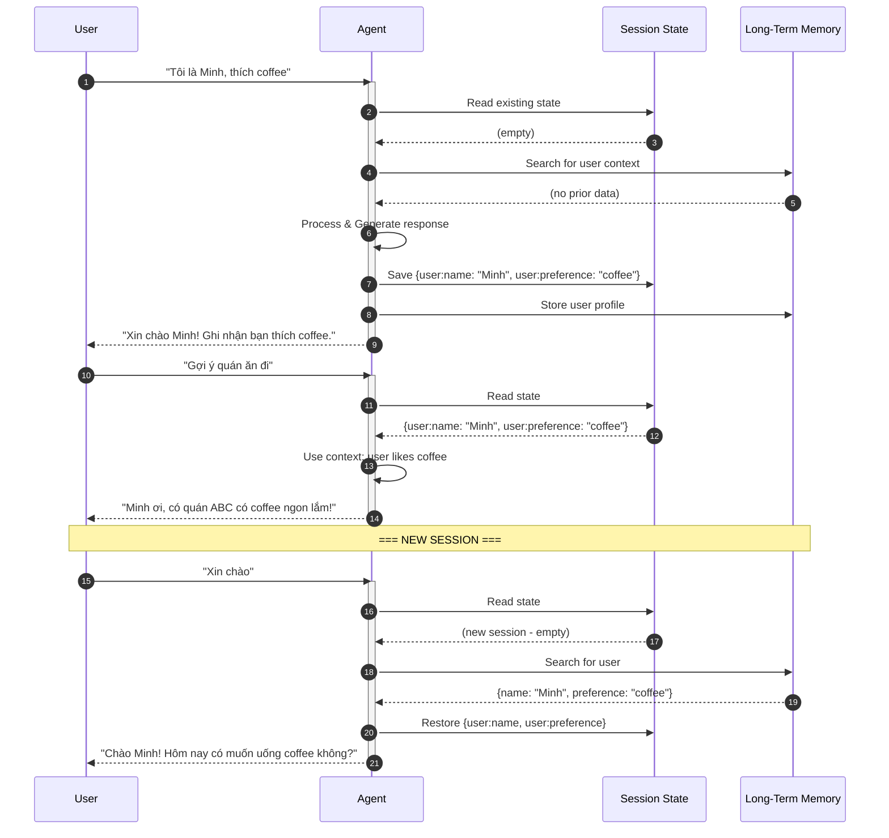

# Hướng dẫn Thực hành: Memory Management với ADK-Go

## Mục tiêu

Sau khi hoàn thành bài hướng dẫn này, bạn sẽ:
- Hiểu các loại bộ nhớ trong hệ thống Agent: Short-Term và Long-Term
- Sử dụng Session và State trong ADK-Go
- Triển khai Memory Patterns cho các use cases khác nhau
- Quản lý state với prefixes (user:, app:, temp:)
- Xây dựng agent có khả năng ghi nhớ context qua các tương tác

---

## Phần 1: Giới thiệu Memory Management

### 1.1 Memory là gì trong Agent?

**Memory** là khả năng của agent lưu giữ và sử dụng thông tin từ các tương tác, quan sát và trải nghiệm trong quá khứ. Memory cho phép agent:

- Duy trì ngữ cảnh hội thoại
- Cá nhân hóa responses
- Học hỏi từ kinh nghiệm
- Theo dõi tiến trình tác vụ

### 1.2 Hai loại Memory

```
┌─────────────────────────────────────────────────────────────────────────────┐
│                         MEMORY ARCHITECTURE                                 │
├─────────────────────────────────────────────────────────────────────────────┤
│                                                                             │
│  SHORT-TERM MEMORY                    LONG-TERM MEMORY                      │
│  (Bộ nhớ Ngắn hạn)                   (Bộ nhớ Dài hạn)                       │
│  ┌─────────────────────────┐         ┌─────────────────────────┐            │
│  │                         │         │                         │            │
│  │  ┌───────────────────┐  │         │  ┌───────────────────┐  │            │
│  │  │  Context Window   │  │         │  │   Vector Store    │  │            │
│  │  │                   │  │         │  │                   │  │            │
│  │  │ • Recent messages │  │         │  │ • Past sessions   │  │            │
│  │  │ • Current state   │  │         │  │ • User profiles   │  │            │
│  │  │ • Tool results    │  │         │  │ • Knowledge base  │  │            │
│  │  │ • Task progress   │  │         │  │ • Learned facts   │  │            │
│  │  │                   │  │         │  │                   │  │            │
│  │  └───────────────────┘  │         │  └───────────────────┘  │            │
│  │                         │         │                         │            │
│  │  Tạm thời, trong        │         │  Bền vững, qua          │            │
│  │  session hiện tại       │         │  nhiều sessions         │            │
│  │                         │         │                         │            │
│  │  ADK: session.state     │         │  ADK: MemoryService     │            │
│  │                         │         │  External: Database,    │            │
│  │                         │         │  Vector DB, RAG         │            │
│  └─────────────────────────┘         └─────────────────────────┘            │
│                                                                             │
│  ════════════════════════════════════════════════════════════════════════   │
│                                                                             │
│  INFORMATION FLOW:                                                          │
│                                                                             │
│  User Query ──▶ Load Long-Term Memory ──▶ Add to Context ──▶ Process       │
│                                                      │                      │
│                                                      ▼                      │
│  Store Important ◀── Update Short-Term ◀── Generate Response               │
│  Info to Long-Term        Memory                                            │
│                                                                             │
└─────────────────────────────────────────────────────────────────────────────┘
```

### 1.3 ADK-Go Memory Concepts

| Concept | Mô tả | Scope |
|---------|-------|-------|
| **Session** | Luồng hội thoại đơn lẻ | Single conversation |
| **State** | Dữ liệu trong session | Within session |
| **Events** | Lịch sử messages/actions | Within session |
| **Memory** | Kiến thức dài hạn | Across sessions |

### 1.4 State Prefixes trong ADK

```
┌─────────────────────────────────────────────────────────────────┐
│                    STATE KEY PREFIXES                           │
├─────────────────────────────────────────────────────────────────┤
│                                                                 │
│  PREFIX        SCOPE                 EXAMPLE                    │
│  ──────────────────────────────────────────────────────────────│
│  (none)        Session-specific      "task_status"              │
│                Chỉ trong session     "current_step"             │
│                hiện tại                                         │
│                                                                 │
│  user:         User-specific         "user:preferences"         │
│                Liên kết với user     "user:name"                │
│                qua tất cả sessions   "user:login_count"         │
│                                                                 │
│  app:          Application-wide      "app:config"               │
│                Chia sẻ giữa tất      "app:version"              │
│                cả users              "app:announcement"         │
│                                                                 │
│  temp:         Temporary             "temp:validation_needed"   │
│                Chỉ cho lượt xử       "temp:intermediate_calc"   │
│                lý hiện tại           "temp:debug_info"          │
│                                                                 │
└─────────────────────────────────────────────────────────────────┘
```

---

## Phần 2: Kiến trúc Memory trong ADK-Go

### 2.1 Session và State Flow

```
┌─────────────────────────────────────────────────────────────────┐
│                    SESSION LIFECYCLE                            │
│                                                                 │
│  ┌────────────────────────────────────────────────────────────┐│
│  │                   SESSION SERVICE                          ││
│  │  • InMemorySessionService (dev/test)                       ││
│  │  • DatabaseSessionService (production)                     ││
│  │  • VertexAiSessionService (cloud)                          ││
│  └────────────────────────────────────────────────────────────┘│
│                            │                                    │
│                            ▼                                    │
│  ┌────────────────────────────────────────────────────────────┐│
│  │                      SESSION                               ││
│  │                                                            ││
│  │  session_id: "abc123"                                      ││
│  │  user_id: "user_001"                                       ││
│  │  app_name: "my_agent"                                      ││
│  │                                                            ││
│  │  ┌──────────────────┐  ┌──────────────────┐               ││
│  │  │      STATE       │  │      EVENTS      │               ││
│  │  │                  │  │                  │               ││
│  │  │ task_status: ... │  │ [msg1, msg2,     │               ││
│  │  │ user:name: ...   │  │  action1, ...]   │               ││
│  │  │ temp:calc: ...   │  │                  │               ││
│  │  └──────────────────┘  └──────────────────┘               ││
│  └────────────────────────────────────────────────────────────┘│
└─────────────────────────────────────────────────────────────────┘
```

### 2.2 State Management trong Agent

```
┌─────────────────────────────────────────────────────────────────┐
│                STATE UPDATE METHODS                             │
│                                                                 │
│  METHOD 1: OutputKey (Simple - Text Response)                   │
│  ─────────────────────────────────────────────                  │
│  llmagent.Config{                                               │
│      OutputKey: "last_response",  // Auto-save response         │
│  }                                                              │
│                                                                 │
│  Agent response → Automatically saved to state["last_response"] │
│                                                                 │
│  ═══════════════════════════════════════════════════════════    │
│                                                                 │
│  METHOD 2: Tool Context (Complex Updates)                       │
│  ─────────────────────────────────────────                      │
│  func MyTool(ctx tool.Context, input Args) (Result, error) {    │
│      // Access and modify state through context                 │
│      ctx.Actions().StateDelta["key"] = value                    │
│      return Result{}, nil                                       │
│  }                                                              │
│                                                                 │
│  Tool execution → State updated via StateDelta                  │
│                                                                 │
│  ═══════════════════════════════════════════════════════════    │
│                                                                 │
│  METHOD 3: Reading State in Instruction                         │
│  ─────────────────────────────────────────                      │
│  Instruction: "Current task: {task_status}"                     │
│                                                                 │
│  {state_key} syntax → Replaced with state value at runtime      │
│                                                                 │
└─────────────────────────────────────────────────────────────────┘
```

### 2.3 Sequence Diagram - Memory-Enabled Agent



---

## Phần 3: Memory Patterns

### Pattern 1: Conversation Context Memory

Lưu trữ context của cuộc hội thoại hiện tại.

```
┌─────────────────────────────────────────────────────────────────┐
│              CONVERSATION CONTEXT PATTERN                       │
│                                                                 │
│  State Keys:                                                    │
│  ├── conversation_topic: "Đặt vé máy bay"                       │
│  ├── mentioned_entities: ["Hà Nội", "Sài Gòn", "15/1"]         │
│  ├── user_intent: "booking"                                     │
│  └── clarification_needed: false                                │
│                                                                 │
│  Agent Instruction:                                             │
│  """                                                            │
│  Context hiện tại:                                              │
│  - Chủ đề: {conversation_topic}                                 │
│  - Các thực thể: {mentioned_entities}                           │
│  - Ý định: {user_intent}                                        │
│                                                                 │
│  Dựa trên context này để trả lời phù hợp...                     │
│  """                                                            │
└─────────────────────────────────────────────────────────────────┘
```

### Pattern 2: User Profile Memory

Lưu trữ thông tin user qua các sessions.

```
┌─────────────────────────────────────────────────────────────────┐
│                  USER PROFILE PATTERN                           │
│                                                                 │
│  State Keys (user: prefix):                                     │
│  ├── user:name: "Nguyễn Văn A"                                  │
│  ├── user:preferences: {                                        │
│  │       "language": "vi",                                      │
│  │       "response_style": "concise",                           │
│  │       "topics_of_interest": ["tech", "travel"]               │
│  │   }                                                          │
│  ├── user:interaction_count: 15                                 │
│  └── user:last_session: "2024-01-15"                            │
│                                                                 │
│  Agent Instruction:                                             │
│  """                                                            │
│  Thông tin user:                                                │
│  - Tên: {user:name}                                             │
│  - Sở thích: {user:preferences}                                 │
│  - Đã tương tác: {user:interaction_count} lần                   │
│                                                                 │
│  Cá nhân hóa response dựa trên profile này...                   │
│  """                                                            │
└─────────────────────────────────────────────────────────────────┘
```

### Pattern 3: Task Progress Memory

Theo dõi tiến trình task đa bước.

```
┌─────────────────────────────────────────────────────────────────┐
│                 TASK PROGRESS PATTERN                           │
│                                                                 │
│  State Keys:                                                    │
│  ├── task_id: "booking_001"                                     │
│  ├── task_type: "flight_booking"                                │
│  ├── total_steps: 5                                             │
│  ├── current_step: 3                                            │
│  ├── completed_steps: [                                         │
│  │       {"step": 1, "action": "select_departure", "done": true}│
│  │       {"step": 2, "action": "select_return", "done": true}   │
│  │   ]                                                          │
│  ├── collected_data: {                                          │
│  │       "from": "HAN",                                         │
│  │       "to": "SGN",                                           │
│  │       "date": "2024-01-20"                                   │
│  │   }                                                          │
│  └── pending_info: ["passenger_count", "class"]                 │
│                                                                 │
│  Agent Instruction:                                             │
│  """                                                            │
│  Tiến trình task: {current_step}/{total_steps}                  │
│  Đã thu thập: {collected_data}                                  │
│  Cần thu thập: {pending_info}                                   │
│                                                                 │
│  Tiếp tục thu thập thông tin còn thiếu...                       │
│  """                                                            │
└─────────────────────────────────────────────────────────────────┘
```

### Pattern 4: Learning Memory

Ghi nhớ các bài học và patterns.

```
┌─────────────────────────────────────────────────────────────────┐
│                  LEARNING MEMORY PATTERN                        │
│                                                                 │
│  State Keys:                                                    │
│  ├── user:feedback_history: [                                   │
│  │       {"response": "...", "rating": 5, "lesson": "..."},     │
│  │       {"response": "...", "rating": 2, "lesson": "..."}      │
│  │   ]                                                          │
│  ├── user:learned_preferences: [                                │
│  │       "Prefers short responses",                             │
│  │       "Likes bullet points",                                 │
│  │       "Dislikes technical jargon"                            │
│  │   ]                                                          │
│  └── user:successful_patterns: [                                │
│          "Start with greeting",                                 │
│          "End with action items"                                │
│      ]                                                          │
│                                                                 │
│  Agent Instruction:                                             │
│  """                                                            │
│  Learned preferences: {user:learned_preferences}                │
│  Successful patterns: {user:successful_patterns}                │
│                                                                 │
│  Áp dụng những bài học này vào response...                      │
│  """                                                            │
└─────────────────────────────────────────────────────────────────┘
```

---

## Phần 4: Triển khai Memory Agent

### 4.1 Cấu trúc Memory-Enabled Agent

```
┌─────────────────────────────────────────────────────────────────┐
│                MEMORY-ENABLED AGENT PIPELINE                    │
│                                                                 │
│  ┌──────────────────────────────────────────────────────────┐  │
│  │  1. MEMORY LOADER                                         │  │
│  │     - Load user profile from long-term memory             │  │
│  │     - Restore relevant context                            │  │
│  │     → state["user:profile"], state["context"]             │  │
│  └──────────────────────────────────────────────────────────┘  │
│                            │                                    │
│                            ▼                                    │
│  ┌──────────────────────────────────────────────────────────┐  │
│  │  2. CONTEXT ANALYZER                                      │  │
│  │     - Analyze current query                               │  │
│  │     - Extract entities, intent                            │  │
│  │     → state["current_intent"], state["entities"]          │  │
│  └──────────────────────────────────────────────────────────┘  │
│                            │                                    │
│                            ▼                                    │
│  ┌──────────────────────────────────────────────────────────┐  │
│  │  3. RESPONSE GENERATOR                                    │  │
│  │     - Use all context from state                          │  │
│  │     - Generate personalized response                      │  │
│  │     → state["response"]                                   │  │
│  └──────────────────────────────────────────────────────────┘  │
│                            │                                    │
│                            ▼                                    │
│  ┌──────────────────────────────────────────────────────────┐  │
│  │  4. MEMORY SAVER                                          │  │
│  │     - Update user profile if needed                       │  │
│  │     - Save important facts to long-term                   │  │
│  │     - Update conversation context                         │  │
│  └──────────────────────────────────────────────────────────┘  │
└─────────────────────────────────────────────────────────────────┘
```

### 4.2 Memory Tools

```go
// ============================================================================
// MEMORY TOOLS - Conceptual Implementation
// ============================================================================

// Tool 1: Load User Profile
// Loads user information from long-term storage into session state
type LoadProfileArgs struct {
    UserID string `json:"user_id"`
}

type LoadProfileResult struct {
    Found   bool   `json:"found"`
    Profile string `json:"profile"`
}

// Tool 2: Save to Memory
// Persists important information to long-term storage
type SaveMemoryArgs struct {
    Key      string `json:"key"`
    Value    string `json:"value"`
    Category string `json:"category"` // "profile", "preference", "fact"
}

type SaveMemoryResult struct {
    Saved bool `json:"saved"`
}

// Tool 3: Search Memory
// Semantic search in long-term memory
type SearchMemoryArgs struct {
    Query string `json:"query"`
    Limit int    `json:"limit"`
}

type SearchMemoryResult struct {
    Results []string `json:"results"`
}

// Tool 4: Update State
// Updates session state with new information
type UpdateStateArgs struct {
    Key   string `json:"key"`
    Value string `json:"value"`
}

type UpdateStateResult struct {
    Updated bool `json:"updated"`
}
```

### 4.3 Memory Loader Agent

```go
// ============================================================================
// MEMORY LOADER AGENT
// ============================================================================

/*
Agent Configuration:

Name: "MemoryLoader"
Description: "Tải context và profile từ memory vào session state"

Instruction:
"""
Bạn là Memory Loader, chịu trách nhiệm chuẩn bị context cho conversation.

**NHIỆM VỤ:**
1. Kiểm tra xem đã có user profile trong state chưa
2. Nếu chưa, sử dụng tool load_profile để tải
3. Search memory cho context liên quan đến query hiện tại
4. Tổng hợp context có sẵn

**CURRENT STATE:**
- User Profile: {user:profile}
- Previous Context: {conversation_context}

**OUTPUT:**
Tóm tắt context đã load:
- User info: [summary]
- Relevant memories: [summary]
- Ready for: [next agent]
"""

Tools: [load_profile, search_memory]
OutputKey: "loaded_context"
*/
```

### 4.4 Context Analyzer Agent

```go
// ============================================================================
// CONTEXT ANALYZER AGENT
// ============================================================================

/*
Agent Configuration:

Name: "ContextAnalyzer"
Description: "Phân tích query và trích xuất thông tin quan trọng"

Instruction:
"""
Bạn là Context Analyzer, phân tích input của user.

**LOADED CONTEXT:**
{loaded_context}

**USER QUERY:**
{user_input}

**NHIỆM VỤ:**
1. Xác định intent của user
2. Trích xuất entities (tên, địa điểm, ngày tháng, etc.)
3. Liên kết với context đã có
4. Xác định thông tin còn thiếu

**OUTPUT FORMAT:**
{
  "intent": "booking/inquiry/feedback/...",
  "entities": ["entity1", "entity2"],
  "context_links": ["related to previous topic X"],
  "missing_info": ["info1", "info2"]
}
"""

OutputKey: "analysis_result"
*/
```

### 4.5 Response Generator Agent

```go
// ============================================================================
// RESPONSE GENERATOR AGENT
// ============================================================================

/*
Agent Configuration:

Name: "ResponseGenerator"
Description: "Tạo response dựa trên full context"

Instruction:
"""
Bạn là Response Generator, tạo response phù hợp với context.

**USER PROFILE:**
{user:profile}

**USER PREFERENCES:**
{user:preferences}

**ANALYSIS:**
{analysis_result}

**CONVERSATION HISTORY:**
{conversation_context}

**NHIỆM VỤ:**
1. Sử dụng tất cả context để tạo response
2. Cá nhân hóa theo user preferences
3. Duy trì consistency với conversation history
4. Đảm bảo response helpful và relevant

**QUY TẮC:**
- Nếu user thích ngắn gọn → response concise
- Nếu user đã hỏi về topic này trước → reference lại
- Nếu thiếu thông tin → hỏi một cách tự nhiên
"""

OutputKey: "response"
*/
```

### 4.6 Memory Saver Agent

```go
// ============================================================================
// MEMORY SAVER AGENT
// ============================================================================

/*
Agent Configuration:

Name: "MemorySaver"
Description: "Lưu thông tin quan trọng vào memory"

Instruction:
"""
Bạn là Memory Saver, quyết định thông tin nào cần lưu.

**CONVERSATION:**
- User Query: {user_input}
- Response: {response}
- Analysis: {analysis_result}

**NHIỆM VỤ:**
1. Xác định thông tin mới về user (tên, sở thích, etc.)
2. Xác định facts quan trọng cần nhớ
3. Update conversation context
4. Sử dụng tools để lưu

**GÌ CẦN LƯU:**
- Thông tin cá nhân user → save_memory(category="profile")
- Sở thích mới phát hiện → save_memory(category="preference")
- Facts quan trọng → save_memory(category="fact")
- Context update → update_state(key="conversation_context")

**GÌ KHÔNG CẦN LƯU:**
- Thông tin đã có
- Chit-chat không có giá trị
- Thông tin tạm thời
"""

Tools: [save_memory, update_state]
*/
```

---

## Phần 5: State Management Best Practices

### 5.1 State Key Naming Convention

```
┌─────────────────────────────────────────────────────────────────┐
│                 STATE KEY NAMING CONVENTION                     │
├─────────────────────────────────────────────────────────────────┤
│                                                                 │
│  FORMAT: [prefix:]category_subcategory_detail                   │
│                                                                 │
│  EXAMPLES:                                                      │
│                                                                 │
│  Session-specific (no prefix):                                  │
│  ├── conversation_topic                                         │
│  ├── current_task_step                                          │
│  ├── pending_actions                                            │
│  └── temp_calculation                                           │
│                                                                 │
│  User-specific (user: prefix):                                  │
│  ├── user:profile_name                                          │
│  ├── user:profile_email                                         │
│  ├── user:preferences_language                                  │
│  ├── user:preferences_style                                     │
│  ├── user:history_last_login                                    │
│  └── user:history_interaction_count                             │
│                                                                 │
│  App-wide (app: prefix):                                        │
│  ├── app:config_version                                         │
│  ├── app:config_features                                        │
│  └── app:announcements                                          │
│                                                                 │
│  Temporary (temp: prefix):                                      │
│  ├── temp:validation_result                                     │
│  ├── temp:intermediate_data                                     │
│  └── temp:debug_info                                            │
│                                                                 │
└─────────────────────────────────────────────────────────────────┘
```

### 5.2 State Update Patterns

```go
// ============================================================================
// STATE UPDATE PATTERNS
// ============================================================================

// Pattern 1: OutputKey - Automatic save of agent response
/*
llmagent.Config{
    Name:      "MyAgent",
    OutputKey: "last_response",  // Response auto-saved here
}
*/

// Pattern 2: Tool-based update
/*
func UpdatePreference(ctx tool.Context, input Args) (Result, error) {
    // Update via StateDelta
    ctx.Actions().StateDelta["user:preferences"] = input.Value
    return Result{Updated: true}, nil
}
*/

// Pattern 3: Reading state in instruction
/*
Instruction: `
User preferences: {user:preferences}
Current topic: {conversation_topic}
Task progress: {current_task_step}

Based on this context...
`
*/

// Pattern 4: Conditional state access
/*
Instruction: `
{user:name ? "Hello {user:name}!" : "Hello! What's your name?"}
`
*/
```

### 5.3 Memory Lifecycle

```
┌─────────────────────────────────────────────────────────────────┐
│                    MEMORY LIFECYCLE                             │
│                                                                 │
│  SESSION START                                                  │
│  ┌────────────────────────────────────────────────────────────┐│
│  │ 1. Create/Resume Session                                   ││
│  │ 2. Load user: prefixed data from storage                   ││
│  │ 3. Load app: prefixed data                                 ││
│  │ 4. Search relevant long-term memories                      ││
│  └────────────────────────────────────────────────────────────┘│
│                            │                                    │
│                            ▼                                    │
│  DURING SESSION                                                 │
│  ┌────────────────────────────────────────────────────────────┐│
│  │ 1. Update session state as needed                          ││
│  │ 2. Use temp: for intermediate calculations                 ││
│  │ 3. Accumulate context in conversation_* keys               ││
│  │ 4. Save important discoveries to long-term                 ││
│  └────────────────────────────────────────────────────────────┘│
│                            │                                    │
│                            ▼                                    │
│  SESSION END                                                    │
│  ┌────────────────────────────────────────────────────────────┐│
│  │ 1. Persist user: prefixed data                             ││
│  │ 2. Clear temp: prefixed data                               ││
│  │ 3. Optionally summarize session to long-term memory        ││
│  │ 4. Clear session-specific data                             ││
│  └────────────────────────────────────────────────────────────┘│
└─────────────────────────────────────────────────────────────────┘
```

---

## Phần 6: Long-Term Memory với Vector Store

### 6.1 RAG Architecture cho Agent Memory

```
┌─────────────────────────────────────────────────────────────────┐
│            RAG-BASED LONG-TERM MEMORY                           │
│                                                                 │
│  ┌────────────────────────────────────────────────────────────┐│
│  │                    INDEXING PHASE                          ││
│  │                                                            ││
│  │  Past Conversations ──▶ Chunk ──▶ Embed ──▶ Vector Store  ││
│  │  User Facts         ──▶ Chunk ──▶ Embed ──▶ Vector Store  ││
│  │  Knowledge Base     ──▶ Chunk ──▶ Embed ──▶ Vector Store  ││
│  │                                                            ││
│  └────────────────────────────────────────────────────────────┘│
│                                                                 │
│  ┌────────────────────────────────────────────────────────────┐│
│  │                   RETRIEVAL PHASE                          ││
│  │                                                            ││
│  │  User Query ──▶ Embed ──▶ Similarity Search ──▶ Top-K     ││
│  │                                    │                       ││
│  │                                    ▼                       ││
│  │                          Relevant Memories                 ││
│  │                                    │                       ││
│  │                                    ▼                       ││
│  │                    Add to Agent Context                    ││
│  │                                                            ││
│  └────────────────────────────────────────────────────────────┘│
│                                                                 │
│  ┌────────────────────────────────────────────────────────────┐│
│  │                   GENERATION PHASE                         ││
│  │                                                            ││
│  │  Context + Query ──▶ LLM ──▶ Response                     ││
│  │       │                                                    ││
│  │       └── Includes retrieved memories                      ││
│  │                                                            ││
│  └────────────────────────────────────────────────────────────┘│
└─────────────────────────────────────────────────────────────────┘
```

### 6.2 Memory Categories

```
┌─────────────────────────────────────────────────────────────────┐
│                 MEMORY CATEGORIES                               │
├─────────────────────────────────────────────────────────────────┤
│                                                                 │
│  EPISODIC MEMORY (Experiences)                                  │
│  ─────────────────────────────                                  │
│  "On 2024-01-15, user asked about flight to Tokyo"              │
│  "User expressed frustration with booking process"              │
│  "Successful resolution: provided alternative dates"            │
│                                                                 │
│  SEMANTIC MEMORY (Facts)                                        │
│  ─────────────────────────                                      │
│  "User's name is Minh"                                          │
│  "User prefers window seats"                                    │
│  "User is a frequent flyer (Gold member)"                       │
│                                                                 │
│  PROCEDURAL MEMORY (How-to)                                     │
│  ──────────────────────────                                     │
│  "When user asks for refund → check eligibility → process"      │
│  "Booking flow: dates → passengers → seats → payment"           │
│  "Escalation: after 2 failed attempts → transfer to human"      │
│                                                                 │
│  WORKING MEMORY (Current Context)                               │
│  ─────────────────────────────────                              │
│  "Currently discussing: Tokyo trip"                             │
│  "Pending action: select return date"                           │
│  "Missing info: number of passengers"                           │
│                                                                 │
└─────────────────────────────────────────────────────────────────┘
```

---

## Phần 7: Practical Implementation Guide

### 7.1 Full Pipeline Architecture

```
┌─────────────────────────────────────────────────────────────────┐
│            MEMORY-ENABLED ASSISTANT PIPELINE                    │
│                                                                 │
│  User: "Đặt vé đi Tokyo như lần trước"                          │
│         │                                                       │
│         ▼                                                       │
│  ┌──────────────────────────────────────────────────────────┐  │
│  │  STEP 1: Memory Retrieval                                 │  │
│  │  • Search: "user Tokyo booking history"                   │  │
│  │  • Found: "2023-12: HAN→NRT, 2 passengers, economy"       │  │
│  │  → state["retrieved_memories"]                            │  │
│  └──────────────────────────────────────────────────────────┘  │
│         │                                                       │
│         ▼                                                       │
│  ┌──────────────────────────────────────────────────────────┐  │
│  │  STEP 2: Context Assembly                                 │  │
│  │  • User profile: {user:name, user:preferences}            │  │
│  │  • Past booking: {retrieved_memories}                     │  │
│  │  • Current intent: "repeat booking"                       │  │
│  │  → state["full_context"]                                  │  │
│  └──────────────────────────────────────────────────────────┘  │
│         │                                                       │
│         ▼                                                       │
│  ┌──────────────────────────────────────────────────────────┐  │
│  │  STEP 3: Response Generation                              │  │
│  │  • Uses full context                                      │  │
│  │  • Personalized: "Như lần trước, HAN→NRT, 2 người?"      │  │
│  │  → state["response"]                                      │  │
│  └──────────────────────────────────────────────────────────┘  │
│         │                                                       │
│         ▼                                                       │
│  ┌──────────────────────────────────────────────────────────┐  │
│  │  STEP 4: Memory Update                                    │  │
│  │  • New booking intent recorded                            │  │
│  │  • Conversation context updated                           │  │
│  │  • User pattern: "prefers repeat bookings"                │  │
│  └──────────────────────────────────────────────────────────┘  │
│         │                                                       │
│         ▼                                                       │
│  Response: "Minh ơi, đặt như lần trước nhé - HAN đi Tokyo,     │
│            2 người, hạng phổ thông. Chọn ngày đi nào?"          │
│                                                                 │
└─────────────────────────────────────────────────────────────────┘
```

### 7.2 Agent Instructions Template

```go
// ============================================================================
// MEMORY-ENABLED AGENT INSTRUCTION TEMPLATE
// ============================================================================

/*
const memoryAgentInstruction = `
Bạn là một AI Assistant có khả năng ghi nhớ.

## USER PROFILE
- Tên: {user:name}
- Sở thích: {user:preferences}
- Lịch sử tương tác: {user:interaction_history}

## RETRIEVED MEMORIES
{retrieved_memories}

## CONVERSATION CONTEXT
- Chủ đề hiện tại: {conversation_topic}
- Entities đã mention: {mentioned_entities}
- Pending actions: {pending_actions}

## CURRENT QUERY
{user_input}

## INSTRUCTIONS
1. Sử dụng thông tin từ profile để cá nhân hóa
2. Reference lại memories liên quan nếu phù hợp
3. Duy trì consistency với conversation context
4. Nếu học được điều mới về user, sử dụng save_memory tool
5. Update conversation context khi cần

## RESPONSE GUIDELINES
- Gọi user bằng tên nếu biết
- Reference lại thông tin đã biết một cách tự nhiên
- Không hỏi lại thông tin đã có
- Ngắn gọn nếu user thích ngắn gọn
`
*/
```

---

## Phần 8: Best Practices Summary

### 8.1 DO's và DON'Ts

```
┌─────────────────────────────────────────────────────────────────┐
│                    MEMORY BEST PRACTICES                        │
├─────────────────────────────────────────────────────────────────┤
│                                                                 │
│  ✅ DO's                           ❌ DON'Ts                    │
│  ────────────────────────────────────────────────────────────  │
│                                                                 │
│  ✅ Use prefixes consistently      ❌ Store everything          │
│     user:, app:, temp:                (be selective)            │
│                                                                 │
│  ✅ Structure state keys           ❌ Use vague keys            │
│     category_subcategory              like "data", "info"       │
│                                                                 │
│  ✅ Clean up temp: data            ❌ Let temp: accumulate      │
│     after use                                                   │
│                                                                 │
│  ✅ Summarize long conversations   ❌ Keep full history         │
│     before storing                    in state                  │
│                                                                 │
│  ✅ Update state via tools         ❌ Directly modify           │
│     or OutputKey                      state dict                │
│                                                                 │
│  ✅ Search semantically            ❌ Rely on exact match       │
│     in long-term memory                                         │
│                                                                 │
│  ✅ Handle missing state           ❌ Assume state exists       │
│     gracefully                                                  │
│                                                                 │
│  ✅ Version your state schema      ❌ Change schema without     │
│                                       migration                 │
│                                                                 │
└─────────────────────────────────────────────────────────────────┘
```

### 8.2 Memory Size Guidelines

```
┌─────────────────────────────────────────────────────────────────┐
│                 MEMORY SIZE GUIDELINES                          │
├─────────────────────────────────────────────────────────────────┤
│                                                                 │
│  CONTEXT WINDOW (Short-Term)                                    │
│  ──────────────────────────────                                 │
│  • Keep under 50% of model's context limit                      │
│  • Summarize when approaching limit                             │
│  • Prioritize recent + relevant over complete history           │
│                                                                 │
│  SESSION STATE                                                  │
│  ──────────────────────────────                                 │
│  • Keep total state under 10KB                                  │
│  • Use references to long-term memory instead of copying        │
│  • Clear completed task data                                    │
│                                                                 │
│  LONG-TERM MEMORY                                               │
│  ──────────────────────────────                                 │
│  • Chunk size: 500-1000 tokens                                  │
│  • Retrieve top 3-5 relevant chunks                             │
│  • Implement TTL for stale memories                             │
│  • Regular cleanup of outdated information                      │
│                                                                 │
└─────────────────────────────────────────────────────────────────┘
```

---

## Phần 9: So sánh với các Pattern khác

| Pattern | Relationship với Memory |
|---------|------------------------|
| **Reflection** | Sử dụng memory để đánh giá past responses |
| **Planning** | Memory lưu trữ plan progress |
| **Learning** | Memory là nền tảng để accumulate knowledge |
| **Multi-Agent** | Shared memory cho agent collaboration |

---

## Tài liệu tham khảo

1. [ADK Memory Documentation](https://google.github.io/adk-docs/sessions/memory/)
2. [ADK Sessions and State](https://google.github.io/adk-docs/sessions/)
3. [LangGraph Memory](https://langchain-ai.github.io/langgraph/concepts/memory/)
4. [Vertex AI Memory Bank](https://cloud.google.com/blog/products/ai-machine-learning/vertex-ai-memory-bank-in-public-preview)
5. [Chapter 8: Memory Management](../../doc_vi/08_Chapter_8_Memory_Management.md)
