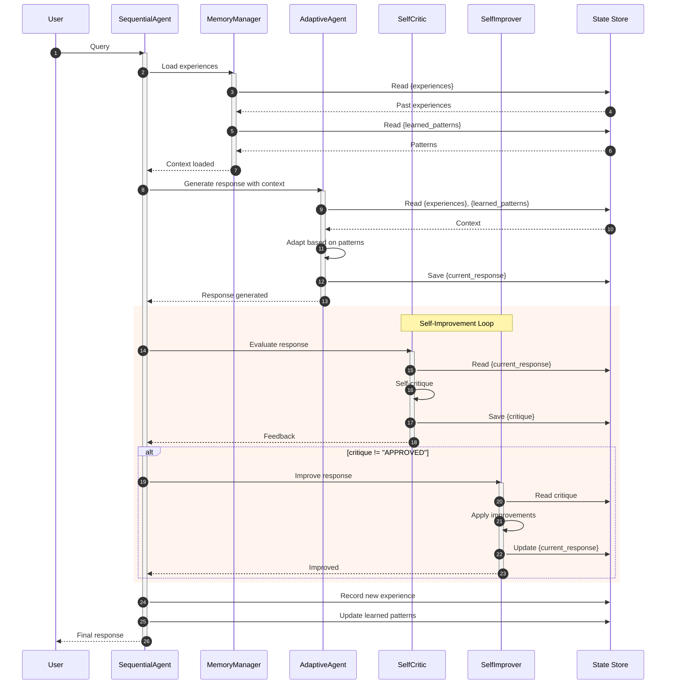

# Hướng dẫn Thực hành: Learning and Adaptation với ADK-Go

## Mục tiêu

Sau khi hoàn thành bài hướng dẫn này, bạn sẽ:
- Hiểu mẫu Learning and Adaptation (Học Hỏi và Thích Nghi)
- Triển khai Memory-Based Learning với ADK-Go
- Xây dựng Feedback Loop cho Self-Improvement
- Áp dụng Preference Learning từ user feedback
- Hiểu các pattern nâng cao như SICA và AlphaEvolve

---

## Phần 1: Giới thiệu Learning and Adaptation

### 1.1 Learning and Adaptation là gì?

**Learning and Adaptation** là khả năng của agent để cải thiện hiệu suất dựa trên kinh nghiệm và tương tác. Agent không chỉ thực thi mà còn **học từ kết quả** để làm tốt hơn trong tương lai.

### 1.2 Các loại Learning

```
┌─────────────────────────────────────────────────────────────────────────────┐
│                    CÁC PHƯƠNG PHÁP HỌC CỦA AGENT                           │
├─────────────────────────────────────────────────────────────────────────────┤
│                                                                             │
│  1. REINFORCEMENT LEARNING          2. SUPERVISED LEARNING                 │
│  ┌─────────────────────────┐        ┌─────────────────────────┐            │
│  │  Agent ──▶ Action       │        │  Input ──▶ Label        │            │
│  │    ▲          │         │        │         (training)      │            │
│  │    │          ▼         │        │                         │            │
│  │  Reward ◀── Environment │        │  Model learns mapping   │            │
│  └─────────────────────────┘        └─────────────────────────┘            │
│                                                                             │
│  3. MEMORY-BASED LEARNING           4. ONLINE LEARNING                     │
│  ┌─────────────────────────┐        ┌─────────────────────────┐            │
│  │  Past ──▶ Store ──▶ Use │        │  Stream ──▶ Update      │            │
│  │  Experience   Memory    │        │    │          ▲         │            │
│  │                         │        │    ▼          │         │            │
│  │  Recall similar cases   │        │  Predict ──▶ Learn      │            │
│  └─────────────────────────┘        └─────────────────────────┘            │
│                                                                             │
│  5. FEW-SHOT/ZERO-SHOT              6. PREFERENCE LEARNING                 │
│  ┌─────────────────────────┐        ┌─────────────────────────┐            │
│  │  Examples (0-few)       │        │  Response A vs B        │            │
│  │       │                 │        │       │                 │            │
│  │       ▼                 │        │       ▼                 │            │
│  │  LLM generalizes        │        │  User prefers A         │            │
│  │  to new tasks           │        │  → Learn preference     │            │
│  └─────────────────────────┘        └─────────────────────────┘            │
│                                                                             │
└─────────────────────────────────────────────────────────────────────────────┘
```

### 1.3 Adaptation trong ADK-Go

Với ADK-Go, chúng ta có thể triển khai Learning thông qua:

| Phương pháp | Implementation trong ADK-Go |
|-------------|------------------------------|
| Memory-Based | State lưu trữ experiences, instructions đọc từ state |
| Feedback Loop | LoopAgent với critic feedback |
| Preference | User feedback → State → Adjust behavior |
| Few-Shot | Dynamic examples trong instruction |
| Online | Accumulate experiences trong session |

### 1.4 Khi nào cần Learning?

- **Personalization:** Thích ứng với từng user
- **Continuous Improvement:** Cải thiện qua thời gian
- **Novel Situations:** Xử lý tình huống mới
- **Dynamic Environments:** Môi trường thay đổi liên tục

---

## Phần 2: Kiến trúc Learning Agent với ADK-Go

### 2.1 Memory-Based Learning Architecture

```
┌─────────────────────────────────────────────────────────────────┐
│                    MEMORY-BASED LEARNING                        │
│                                                                 │
│  ┌──────────────────────────────────────────────────────────┐  │
│  │                    STATE STORE                            │  │
│  │                                                           │  │
│  │  experiences: [                                           │  │
│  │    {query: "...", response: "...", feedback: "good"},    │  │
│  │    {query: "...", response: "...", feedback: "bad"},     │  │
│  │    ...                                                    │  │
│  │  ]                                                        │  │
│  │                                                           │  │
│  │  learned_patterns: [                                      │  │
│  │    "User prefers concise answers",                        │  │
│  │    "Avoid technical jargon",                              │  │
│  │    ...                                                    │  │
│  │  ]                                                        │  │
│  └──────────────────────────────────────────────────────────┘  │
│                            │                                    │
│                            ▼                                    │
│  ┌──────────────────────────────────────────────────────────┐  │
│  │                   ADAPTIVE AGENT                          │  │
│  │                                                           │  │
│  │  Instruction:                                             │  │
│  │  "Dựa trên experiences: {experiences}                     │  │
│  │   Và learned patterns: {learned_patterns}                 │  │
│  │   Hãy trả lời phù hợp..."                                 │  │
│  │                                                           │  │
│  │  → Agent adapts behavior based on past experiences        │  │
│  └──────────────────────────────────────────────────────────┘  │
└─────────────────────────────────────────────────────────────────┘
```

### 2.2 Self-Improvement Loop Architecture

```
┌─────────────────────────────────────────────────────────────────┐
│                    SELF-IMPROVEMENT LOOP                        │
│                                                                 │
│  ┌────────────────┐                                            │
│  │  Initial       │  Tạo response ban đầu                      │
│  │  Response      │  → {current_response}                      │
│  └───────┬────────┘                                            │
│          ↓                                                      │
│  ┌────────────────────────────────────────────────────────┐    │
│  │              LoopAgent (max=3)                         │    │
│  │                                                        │    │
│  │  ┌─────────────┐     ┌─────────────────────────────┐  │    │
│  │  │   Self      │────▶│   Improver                  │  │    │
│  │  │   Critic    │     │   Agent                     │  │    │
│  │  │             │     │                             │  │    │
│  │  │ Đánh giá    │     │ IF critique="APPROVED":    │  │    │
│  │  │ response    │     │   → exitLoop()             │  │    │
│  │  │ ↓           │     │ ELSE:                      │  │    │
│  │  │ {critique}  │     │   → improve response       │  │    │
│  │  └─────────────┘     └─────────────────────────────┘  │    │
│  │                                                        │    │
│  │  Tools: [exitLoop, record_learning]                   │    │
│  └────────────────────────────────────────────────────────┘    │
│          ↓                                                      │
│  ┌────────────────┐                                            │
│  │  Learning      │  Lưu lại những gì đã học được              │
│  │  Recorder      │  → {learned_patterns}                      │
│  └────────────────┘                                            │
└─────────────────────────────────────────────────────────────────┘
```

### 2.3 Sequence Diagram - Adaptive Agent



---

## Phần 3: Bài tập - Adaptive Assistant

### Mô tả bài tập

Xây dựng một **Adaptive Writing Assistant** có khả năng:

1. **Ghi nhớ experiences** - Lưu lại các tương tác trước
2. **Học từ feedback** - Điều chỉnh dựa trên phản hồi
3. **Tự cải thiện** - Self-critique và improve
4. **Thích ứng** - Thay đổi style dựa trên patterns đã học

### Cấu trúc file

```
cmd/learning/
├── main.go
```

---

## Phần 4: Hướng dẫn từng bước

### Bước 1: Import packages và constants

```go
package main

import (
    "context"
    "encoding/json"
    "fmt"
    "log"
    "os"
    "strings"

    "google.golang.org/adk/agent"
    "google.golang.org/adk/agent/llmagent"
    "google.golang.org/adk/agent/workflowagents/loopagent"
    "google.golang.org/adk/agent/workflowagents/sequentialagent"
    "google.golang.org/adk/cmd/launcher"
    "google.golang.org/adk/cmd/launcher/full"
    "google.golang.org/adk/model"
    "google.golang.org/adk/model/gemini"
    "google.golang.org/adk/tool"
    "google.golang.org/adk/tool/functiontool"
    "google.golang.org/genai"
)

// State keys
const (
    stateExperiences     = "experiences"
    stateLearnedPatterns = "learned_patterns"
    stateCurrentResponse = "current_response"
    stateCritique        = "self_critique"
    stateFinalOutput     = "final_output"
    approvedPhrase       = "RESPONSE_APPROVED"
)

// Experience đại diện cho một tương tác trong quá khứ
type Experience struct {
    Query    string `json:"query"`
    Response string `json:"response"`
    Feedback string `json:"feedback"` // "positive", "negative", "neutral"
    Lesson   string `json:"lesson"`   // Bài học rút ra
}
```

### Bước 2: Tạo Learning Tools

```go
// ============================================================================
// LEARNING TOOLS
// ============================================================================

// RecordExperienceArgs - Ghi lại experience mới
type RecordExperienceArgs struct {
    Query    string `json:"query" description:"Câu hỏi/yêu cầu của user"`
    Response string `json:"response" description:"Response đã đưa ra"`
    Feedback string `json:"feedback" description:"Feedback: positive/negative/neutral"`
    Lesson   string `json:"lesson" description:"Bài học rút ra từ tương tác này"`
}

type RecordExperienceResult struct {
    Recorded bool   `json:"recorded"`
    Message  string `json:"message"`
}

func RecordExperience(ctx tool.Context, input RecordExperienceArgs) (RecordExperienceResult, error) {
    fmt.Println("───────────────────────────────────────────────────────")
    fmt.Printf("[record_experience] Recording new experience\n")
    fmt.Printf("[record_experience] Feedback: %s\n", input.Feedback)
    fmt.Printf("[record_experience] Lesson: %s\n", input.Lesson)
    fmt.Println("───────────────────────────────────────────────────────")

    return RecordExperienceResult{
        Recorded: true,
        Message:  fmt.Sprintf("Experience recorded with lesson: %s", input.Lesson),
    }, nil
}

// UpdatePatternsArgs - Cập nhật patterns đã học
type UpdatePatternsArgs struct {
    NewPattern  string `json:"new_pattern" description:"Pattern mới học được"`
    PatternType string `json:"pattern_type" description:"Loại: style/content/format"`
}

type UpdatePatternsResult struct {
    Updated bool   `json:"updated"`
    Message string `json:"message"`
}

func UpdatePatterns(ctx tool.Context, input UpdatePatternsArgs) (UpdatePatternsResult, error) {
    fmt.Println("───────────────────────────────────────────────────────")
    fmt.Printf("[update_patterns] New pattern: %s\n", input.NewPattern)
    fmt.Printf("[update_patterns] Type: %s\n", input.PatternType)
    fmt.Println("───────────────────────────────────────────────────────")

    return UpdatePatternsResult{
        Updated: true,
        Message: fmt.Sprintf("Pattern '%s' added to %s patterns", input.NewPattern, input.PatternType),
    }, nil
}

// ExitLoopArgs và ExitLoop cho self-improvement loop
type ExitLoopArgs struct{}
type ExitLoopResult struct{}

func ExitLoop(ctx tool.Context, input ExitLoopArgs) (ExitLoopResult, error) {
    fmt.Println("═══════════════════════════════════════════════════════")
    fmt.Println("[exitLoop] Response approved! Exiting improvement loop.")
    fmt.Println("═══════════════════════════════════════════════════════")
    ctx.Actions().Escalate = true
    return ExitLoopResult{}, nil
}

func createLearningTools() (recordTool, patternTool, exitTool tool.Tool, err error) {
    recordTool, err = functiontool.New(
        functiontool.Config{
            Name:        "record_experience",
            Description: "Ghi lại một experience mới với feedback và bài học rút ra",
        },
        RecordExperience,
    )
    if err != nil {
        return nil, nil, nil, err
    }

    patternTool, err = functiontool.New(
        functiontool.Config{
            Name:        "update_patterns",
            Description: "Cập nhật patterns đã học để cải thiện responses trong tương lai",
        },
        UpdatePatterns,
    )
    if err != nil {
        return nil, nil, nil, err
    }

    exitTool, err = functiontool.New(
        functiontool.Config{
            Name:        "exitLoop",
            Description: "Gọi khi response đã được approve và sẵn sàng gửi cho user",
        },
        ExitLoop,
    )
    if err != nil {
        return nil, nil, nil, err
    }

    return recordTool, patternTool, exitTool, nil
}
```

### Bước 3: Tạo Memory Manager Agent

```go
// ============================================================================
// MEMORY MANAGER AGENT
// ============================================================================

func createMemoryManager(m model.LLM) (agent.Agent, error) {
    return llmagent.New(llmagent.Config{
        Name:        "MemoryManager",
        Model:       m,
        Description: "Quản lý và tổ chức experiences và patterns đã học.",
        Instruction: `Bạn là Memory Manager, quản lý bộ nhớ học tập của hệ thống.

**VAI TRÒ:**
Tổ chức và chuẩn bị context từ past experiences cho Adaptive Agent.

**NHIỆM VỤ:**
1. Đọc experiences từ state (nếu có)
2. Đọc learned patterns từ state (nếu có)
3. Tổng hợp thành context hữu ích

**CURRENT EXPERIENCES:**
{experiences}

**LEARNED PATTERNS:**
{learned_patterns}

**OUTPUT:**
Tóm tắt ngắn gọn:
- Số experiences đã có
- Key patterns đã học
- Gợi ý cho response tiếp theo

Nếu chưa có experiences, output: "No prior experiences. Starting fresh."`,
    })
}
```

### Bước 4: Tạo Adaptive Agent

```go
// ============================================================================
// ADAPTIVE AGENT
// ============================================================================

func createAdaptiveAgent(m model.LLM) (agent.Agent, error) {
    return llmagent.New(llmagent.Config{
        Name:        "AdaptiveAgent",
        Model:       m,
        Description: "Agent thích ứng dựa trên experiences và patterns đã học.",
        Instruction: fmt.Sprintf(`Bạn là một Adaptive Writing Assistant có khả năng học hỏi.

**VAI TRÒ:**
Tạo responses thích ứng dựa trên những gì đã học từ tương tác trước.

**PAST EXPERIENCES:**
{%s}

**LEARNED PATTERNS:**
{%s}

**NHIỆM VỤ:**
1. Xem xét experiences và patterns đã học
2. Áp dụng những bài học vào response hiện tại
3. Điều chỉnh:
   - Style: Formal/casual dựa trên feedback trước
   - Length: Chi tiết/ngắn gọn dựa trên preferences
   - Tone: Thân thiện/chuyên nghiệp dựa trên patterns
4. Tạo response phù hợp nhất

**VÍ DỤ ADAPTATION:**
- Nếu past feedback cho thấy user thích ngắn gọn → viết concise
- Nếu pattern ghi "avoid jargon" → dùng từ ngữ đơn giản
- Nếu experience cho thấy user hỏi follow-up → cung cấp thêm context

**QUY TẮC:**
- Luôn cải thiện dựa trên feedback
- Ghi nhớ preferences của user
- Thích ứng nhưng giữ chất lượng`, stateExperiences, stateLearnedPatterns),
        OutputKey: stateCurrentResponse,
    })
}
```

### Bước 5: Tạo Self-Critic Agent

```go
// ============================================================================
// SELF-CRITIC AGENT
// ============================================================================

func createSelfCritic(m model.LLM) (agent.Agent, error) {
    return llmagent.New(llmagent.Config{
        Name:        "SelfCritic",
        Model:       m,
        Description: "Tự đánh giá response và đề xuất cải thiện.",
        Instruction: fmt.Sprintf(`Bạn là Self-Critic, đánh giá chất lượng response.

**VAI TRÒ:**
Đánh giá response hiện tại dựa trên:
- Learned patterns (những gì đã học)
- Quality standards (chất lượng)
- User preferences (từ experiences)

**CURRENT RESPONSE:**
{%s}

**LEARNED PATTERNS:**
{%s}

**PAST EXPERIENCES:**
{%s}

**TIÊU CHÍ ĐÁNH GIÁ:**
1. Có tuân thủ learned patterns không?
2. Có phù hợp với user preferences không?
3. Có clear và helpful không?
4. Có cần cải thiện gì không?

**HÀNH ĐỘNG:**

NẾU response đã tốt và phù hợp với tất cả patterns:
→ Output CHÍNH XÁC: %s
→ KHÔNG thêm text nào khác

NẾU cần cải thiện:
→ Liệt kê 1-2 điểm cụ thể cần sửa
→ Giải thích tại sao (dựa trên patterns/experiences)`, stateCurrentResponse, stateLearnedPatterns, stateExperiences, approvedPhrase),
        OutputKey: stateCritique,
    })
}
```

### Bước 6: Tạo Self-Improver Agent

```go
// ============================================================================
// SELF-IMPROVER AGENT
// ============================================================================

func createSelfImprover(m model.LLM, exitTool, recordTool tool.Tool) (agent.Agent, error) {
    return llmagent.New(llmagent.Config{
        Name:        "SelfImprover",
        Model:       m,
        Description: "Cải thiện response dựa trên self-critique.",
        Instruction: fmt.Sprintf(`Bạn là Self-Improver, cải thiện response dựa trên feedback.

**VAI TRÒ:**
Đọc critique và cải thiện response, hoặc approve nếu đã tốt.

**CURRENT RESPONSE:**
{%s}

**SELF-CRITIQUE:**
{%s}

**HÀNH ĐỘNG:**

1. Đọc critique từ Self-Critic

2. NẾU critique CHÍNH XÁC là "%s":
   → Gọi tool 'exitLoop' ngay lập tức
   → KHÔNG output text

3. NẾU critique chứa gợi ý cải thiện:
   → Áp dụng các gợi ý
   → Gọi tool 'record_experience' để ghi lại bài học
   → Output response đã cải thiện

**QUAN TRỌNG:**
- Mỗi improvement là một cơ hội học hỏi
- Ghi lại pattern nếu phát hiện điều gì hữu ích
- Luôn cải thiện dựa trên feedback cụ thể`, stateCurrentResponse, stateCritique, approvedPhrase),
        Tools:     []tool.Tool{exitTool, recordTool},
        OutputKey: stateCurrentResponse,
    })
}
```

### Bước 7: Tạo Learning Recorder Agent

```go
// ============================================================================
// LEARNING RECORDER AGENT
// ============================================================================

func createLearningRecorder(m model.LLM, recordTool, patternTool tool.Tool) (agent.Agent, error) {
    return llmagent.New(llmagent.Config{
        Name:        "LearningRecorder",
        Model:       m,
        Description: "Ghi lại những gì đã học từ interaction.",
        Instruction: fmt.Sprintf(`Bạn là Learning Recorder, ghi lại bài học từ mỗi interaction.

**VAI TRÒ:**
Phân tích interaction và rút ra bài học để cải thiện tương lai.

**FINAL RESPONSE:**
{%s}

**CRITIQUE HISTORY:**
{%s}

**NHIỆM VỤ:**
1. Phân tích quá trình từ initial response đến final
2. Xác định điều gì đã được cải thiện
3. Rút ra patterns hữu ích

4. Sử dụng tools:
   - record_experience: Ghi lại interaction với feedback và lesson
   - update_patterns: Thêm patterns mới nếu phát hiện

**VÍ DỤ PATTERNS:**
- "User prefers bullet points over paragraphs"
- "Technical explanations should include examples"
- "Keep responses under 200 words"

**OUTPUT:**
Tóm tắt ngắn về những gì đã học được.`, stateCurrentResponse, stateCritique),
        Tools: []tool.Tool{recordTool, patternTool},
    })
}
```

### Bước 8: Tạo Learning Pipeline

```go
// ============================================================================
// LEARNING PIPELINE
// ============================================================================

func createLearningPipeline(m model.LLM) (agent.Agent, error) {
    // Tạo tools
    recordTool, patternTool, exitTool, err := createLearningTools()
    if err != nil {
        return nil, fmt.Errorf("failed to create tools: %w", err)
    }

    // 1. Memory Manager
    memoryManager, err := createMemoryManager(m)
    if err != nil {
        return nil, err
    }

    // 2. Adaptive Agent
    adaptiveAgent, err := createAdaptiveAgent(m)
    if err != nil {
        return nil, err
    }

    // 3. Self-Critic (trong loop)
    selfCritic, err := createSelfCritic(m)
    if err != nil {
        return nil, err
    }

    // 4. Self-Improver (trong loop)
    selfImprover, err := createSelfImprover(m, exitTool, recordTool)
    if err != nil {
        return nil, err
    }

    // 5. Tạo Self-Improvement Loop
    improvementLoop, err := loopagent.New(loopagent.Config{
        MaxIterations: 3,
        AgentConfig: agent.Config{
            Name:        "SelfImprovementLoop",
            Description: "Loop: Self-Critic → Self-Improver → repeat until approved",
            SubAgents:   []agent.Agent{selfCritic, selfImprover},
        },
    })
    if err != nil {
        return nil, err
    }

    // 6. Learning Recorder
    learningRecorder, err := createLearningRecorder(m, recordTool, patternTool)
    if err != nil {
        return nil, err
    }

    // 7. Full Pipeline
    return sequentialagent.New(sequentialagent.Config{
        AgentConfig: agent.Config{
            Name:        "AdaptiveLearningPipeline",
            Description: "Pipeline: Memory → Adaptive → Self-Improve → Record Learning",
            SubAgents: []agent.Agent{
                memoryManager,
                adaptiveAgent,
                improvementLoop,
                learningRecorder,
            },
        },
    })
}
```

### Bước 9: Main function

```go
// ============================================================================
// MAIN
// ============================================================================

func printBanner() {
    fmt.Println("═══════════════════════════════════════════════════════════")
    fmt.Println("  Adaptive Learning Assistant - Learning & Adaptation Demo")
    fmt.Println("═══════════════════════════════════════════════════════════")
    fmt.Println("")
    fmt.Println("  Pipeline:")
    fmt.Println("  ┌─────────────────────────────────────────────────────┐")
    fmt.Println("  │  1. Memory Manager                                  │")
    fmt.Println("  │     - Load past experiences                         │")
    fmt.Println("  │     - Prepare learned patterns                      │")
    fmt.Println("  │                 ↓                                   │")
    fmt.Println("  │  2. Adaptive Agent                                  │")
    fmt.Println("  │     - Generate response using patterns              │")
    fmt.Println("  │                 ↓                                   │")
    fmt.Println("  │  3. Self-Improvement Loop                           │")
    fmt.Println("  │     ┌─────────────────────────────────────┐        │")
    fmt.Println("  │     │ Self-Critic → Self-Improver         │        │")
    fmt.Println("  │     │ (repeat until APPROVED)             │        │")
    fmt.Println("  │     └─────────────────────────────────────┘        │")
    fmt.Println("  │                 ↓                                   │")
    fmt.Println("  │  4. Learning Recorder                               │")
    fmt.Println("  │     - Record experience                             │")
    fmt.Println("  │     - Update patterns                               │")
    fmt.Println("  └─────────────────────────────────────────────────────┘")
    fmt.Println("")
    fmt.Println("  Features:")
    fmt.Println("  • Memory-based adaptation")
    fmt.Println("  • Self-improvement loop")
    fmt.Println("  • Continuous learning")
    fmt.Println("")
    fmt.Println("Khởi động server...")
}

func main() {
    ctx := context.Background()

    apiKey := os.Getenv("GOOGLE_API_KEY")
    if apiKey == "" {
        log.Fatal("Vui lòng set GOOGLE_API_KEY environment variable")
    }

    geminiModel, err := gemini.NewModel(ctx, "gemini-2.5-flash", &genai.ClientConfig{
        APIKey: apiKey,
    })
    if err != nil {
        log.Fatalf("Không thể tạo model: %v", err)
    }

    pipeline, err := createLearningPipeline(geminiModel)
    if err != nil {
        log.Fatal(err)
    }

    config := &launcher.Config{
        AgentLoader: agent.NewSingleLoader(pipeline),
    }

    lch := full.NewLauncher()
    printBanner()

    err = lch.Execute(ctx, config, os.Args[1:])
    if err != nil {
        log.Fatal(err)
    }
}
```

---

## Phần 5: Preference Learning với User Feedback

### 5.1 Thiết kế Feedback System

```
┌─────────────────────────────────────────────────────────────────┐
│                    PREFERENCE LEARNING FLOW                     │
│                                                                 │
│  User: "Viết email cho sếp"                                     │
│         │                                                       │
│         ▼                                                       │
│  ┌──────────────┐                                               │
│  │ Adaptive     │ Response A (formal)                           │
│  │ Agent        │                                               │
│  └──────────────┘                                               │
│         │                                                       │
│         ▼                                                       │
│  User Feedback: "Quá formal, cần casual hơn"                    │
│         │                                                       │
│         ▼                                                       │
│  ┌──────────────┐                                               │
│  │ Learning     │ Record: {                                     │
│  │ Recorder     │   feedback: "negative",                       │
│  │              │   lesson: "User prefers casual tone"          │
│  │              │ }                                             │
│  └──────────────┘                                               │
│         │                                                       │
│         ▼                                                       │
│  Pattern Updated: "Use casual tone for this user"               │
│         │                                                       │
│         ▼                                                       │
│  Next interaction: Agent uses casual tone automatically         │
└─────────────────────────────────────────────────────────────────┘
```

### 5.2 Feedback Collection Tool

```go
// CollectFeedbackArgs - Thu thập feedback từ user
type CollectFeedbackArgs struct {
    ResponseID string `json:"response_id"`
    Rating     int    `json:"rating" description:"1-5 stars"`
    Comment    string `json:"comment" description:"Optional feedback text"`
}

type CollectFeedbackResult struct {
    Processed   bool   `json:"processed"`
    NewPattern  string `json:"new_pattern"`
}

func CollectFeedback(ctx tool.Context, input CollectFeedbackArgs) (CollectFeedbackResult, error) {
    var feedbackType string
    var pattern string

    switch {
    case input.Rating >= 4:
        feedbackType = "positive"
        pattern = "Current approach is working well"
    case input.Rating <= 2:
        feedbackType = "negative"
        if input.Comment != "" {
            pattern = fmt.Sprintf("Adjust based on: %s", input.Comment)
        } else {
            pattern = "Need to improve response quality"
        }
    default:
        feedbackType = "neutral"
        pattern = "Minor adjustments may help"
    }

    fmt.Printf("[feedback] Rating: %d, Type: %s\n", input.Rating, feedbackType)
    fmt.Printf("[feedback] New pattern: %s\n", pattern)

    return CollectFeedbackResult{
        Processed:  true,
        NewPattern: pattern,
    }, nil
}
```

---

## Phần 6: Advanced Pattern - Self-Improving Code Agent (Simplified)

### 6.1 Kiến trúc SICA-like

```
┌─────────────────────────────────────────────────────────────────┐
│                SIMPLIFIED SELF-IMPROVING AGENT                  │
│                                                                 │
│  ┌──────────────────────────────────────────────────────────┐  │
│  │                    VERSION HISTORY                        │  │
│  │                                                           │  │
│  │  Version 1: Basic response generator                      │  │
│  │  Version 2: Added context awareness (learned)             │  │
│  │  Version 3: Improved formatting (learned)                 │  │
│  │  Version 4: Better error handling (learned)               │  │
│  │                                                           │  │
│  │  Best Version: v3 (highest score)                         │  │
│  └──────────────────────────────────────────────────────────┘  │
│                            │                                    │
│                            ▼                                    │
│  ┌──────────────────────────────────────────────────────────┐  │
│  │                  META-IMPROVEMENT LOOP                    │  │
│  │                                                           │  │
│  │  1. Analyze current version performance                   │  │
│  │  2. Identify improvement opportunities                    │  │
│  │  3. Generate improved version                             │  │
│  │  4. Evaluate and compare                                  │  │
│  │  5. Keep better version                                   │  │
│  │                                                           │  │
│  │  → Repeat                                                 │  │
│  └──────────────────────────────────────────────────────────┘  │
└─────────────────────────────────────────────────────────────────┘
```

### 6.2 Strategy Evolution Agent

```go
// StrategyVersion đại diện cho một phiên bản strategy
type StrategyVersion struct {
    Version     int      `json:"version"`
    Strategy    string   `json:"strategy"`
    Score       float64  `json:"score"`
    Improvements []string `json:"improvements"`
}

func createStrategyEvolver(m model.LLM) (agent.Agent, error) {
    return llmagent.New(llmagent.Config{
        Name:        "StrategyEvolver",
        Model:       m,
        Description: "Evolves response strategies based on performance.",
        Instruction: `Bạn là Strategy Evolver, cải thiện chiến lược response.

**CURRENT STRATEGY:**
{current_strategy}

**PERFORMANCE HISTORY:**
{strategy_history}

**NHIỆM VỤ:**
1. Phân tích strategy hiện tại
2. Xem xét performance history
3. Đề xuất improvements:
   - Cải thiện structure
   - Thêm context handling
   - Optimize for user preferences
4. Generate evolved strategy

**OUTPUT:**
{
  "version": [new version number],
  "strategy": "[improved strategy description]",
  "improvements": ["improvement 1", "improvement 2"],
  "rationale": "Why this is better"
}

**QUY TẮC:**
- Mỗi version phải tốt hơn version trước
- Giữ lại những gì hoạt động tốt
- Thử nghiệm cải tiến mới một cách có kiểm soát`,
    })
}
```

---

## Phần 7: State Management cho Learning

### 7.1 Experience Store Structure

```go
// Cấu trúc state cho Learning Agent
/*
state = {
    "experiences": [
        {
            "query": "Viết email cho khách hàng",
            "response": "...",
            "feedback": "positive",
            "lesson": "User likes formal business tone"
        },
        {
            "query": "Tóm tắt báo cáo",
            "response": "...",
            "feedback": "negative",
            "lesson": "Too long, need bullet points"
        }
    ],
    "learned_patterns": [
        "Use formal tone for business emails",
        "Use bullet points for summaries",
        "Keep responses under 300 words"
    ],
    "current_response": "...",
    "self_critique": "...",
    "strategy_version": 3,
    "strategy_history": [...]
}
*/
```

### 7.2 Pattern Accumulation

```
Session 1:
  Query: "Write email"
  Feedback: "Too formal"
  → Pattern: "Use casual tone"

Session 2:
  Query: "Write report"
  Feedback: "Too long"
  → Pattern: "Keep under 300 words"

Session 3:
  Query: "Summarize article"
  Feedback: "Good!"
  → Pattern: "Bullet points work well"

Accumulated Patterns:
  1. Use casual tone (from session 1)
  2. Keep under 300 words (from session 2)
  3. Use bullet points for summaries (from session 3)

Next Session: Agent applies ALL patterns automatically
```

---

## Phần 8: Code Mẫu Đầy Đủ (Solution)

```go
// Package main demonstrates Learning and Adaptation pattern using ADK-Go
//
// Learning and Adaptation cho phép agent cải thiện dựa trên kinh nghiệm.
// Ví dụ này demo:
// 1. Memory-Based Learning: Ghi nhớ past experiences
// 2. Self-Improvement Loop: Tự đánh giá và cải thiện
// 3. Preference Learning: Học từ user feedback
// 4. Pattern Accumulation: Tích lũy và áp dụng patterns
package main

import (
	"context"
	"fmt"
	"log"
	"os"

	"google.golang.org/adk/agent"
	"google.golang.org/adk/agent/llmagent"
	"google.golang.org/adk/agent/workflowagents/loopagent"
	"google.golang.org/adk/agent/workflowagents/sequentialagent"
	"google.golang.org/adk/cmd/launcher"
	"google.golang.org/adk/cmd/launcher/full"
	"google.golang.org/adk/model"
	"google.golang.org/adk/model/gemini"
	"google.golang.org/adk/tool"
	"google.golang.org/adk/tool/functiontool"
	"google.golang.org/genai"
)

// ============================================================================
// STATE KEYS & CONSTANTS
// ============================================================================

const (
	stateExperiences     = "experiences"
	stateLearnedPatterns = "learned_patterns"
	stateCurrentResponse = "current_response"
	stateCritique        = "self_critique"
	approvedPhrase       = "RESPONSE_APPROVED"
)

// ============================================================================
// LEARNING TOOLS
// ============================================================================

type RecordExperienceArgs struct {
	Query    string `json:"query" description:"Câu hỏi/yêu cầu của user"`
	Response string `json:"response" description:"Response đã đưa ra"`
	Feedback string `json:"feedback" description:"Feedback: positive/negative/neutral"`
	Lesson   string `json:"lesson" description:"Bài học rút ra"`
}

type RecordExperienceResult struct {
	Recorded bool   `json:"recorded"`
	Message  string `json:"message"`
}

func RecordExperience(ctx tool.Context, input RecordExperienceArgs) (RecordExperienceResult, error) {
	fmt.Println("───────────────────────────────────────────────────────")
	fmt.Printf("[record_experience] Feedback: %s\n", input.Feedback)
	fmt.Printf("[record_experience] Lesson: %s\n", input.Lesson)
	fmt.Println("───────────────────────────────────────────────────────")
	return RecordExperienceResult{Recorded: true, Message: "Experience recorded"}, nil
}

type UpdatePatternsArgs struct {
	NewPattern  string `json:"new_pattern" description:"Pattern mới"`
	PatternType string `json:"pattern_type" description:"Loại: style/content/format"`
}

type UpdatePatternsResult struct {
	Updated bool   `json:"updated"`
	Message string `json:"message"`
}

func UpdatePatterns(ctx tool.Context, input UpdatePatternsArgs) (UpdatePatternsResult, error) {
	fmt.Println("───────────────────────────────────────────────────────")
	fmt.Printf("[update_patterns] New pattern: %s (%s)\n", input.NewPattern, input.PatternType)
	fmt.Println("───────────────────────────────────────────────────────")
	return UpdatePatternsResult{Updated: true, Message: "Pattern updated"}, nil
}

type ExitLoopArgs struct{}
type ExitLoopResult struct{}

func ExitLoop(ctx tool.Context, input ExitLoopArgs) (ExitLoopResult, error) {
	fmt.Println("═══════════════════════════════════════════════════════")
	fmt.Println("[exitLoop] Response approved!")
	fmt.Println("═══════════════════════════════════════════════════════")
	ctx.Actions().Escalate = true
	return ExitLoopResult{}, nil
}

func createTools() (record, pattern, exit tool.Tool, err error) {
	record, err = functiontool.New(
		functiontool.Config{Name: "record_experience", Description: "Ghi lại experience"},
		RecordExperience,
	)
	if err != nil {
		return nil, nil, nil, err
	}

	pattern, err = functiontool.New(
		functiontool.Config{Name: "update_patterns", Description: "Cập nhật patterns"},
		UpdatePatterns,
	)
	if err != nil {
		return nil, nil, nil, err
	}

	exit, err = functiontool.New(
		functiontool.Config{Name: "exitLoop", Description: "Exit khi approved"},
		ExitLoop,
	)
	if err != nil {
		return nil, nil, nil, err
	}

	return record, pattern, exit, nil
}

// ============================================================================
// AGENTS
// ============================================================================

func createMemoryManager(m model.LLM) (agent.Agent, error) {
	return llmagent.New(llmagent.Config{
		Name:        "MemoryManager",
		Model:       m,
		Description: "Quản lý memory và context.",
		Instruction: `Bạn là Memory Manager.

**NHIỆM VỤ:**
Tổng hợp context từ past experiences và learned patterns.

**EXPERIENCES:** {experiences}
**PATTERNS:** {learned_patterns}

Output tóm tắt ngắn về context có sẵn.
Nếu không có: "Starting fresh - no prior context."`,
	})
}

func createAdaptiveAgent(m model.LLM) (agent.Agent, error) {
	return llmagent.New(llmagent.Config{
		Name:        "AdaptiveAgent",
		Model:       m,
		Description: "Agent thích ứng với context.",
		Instruction: fmt.Sprintf(`Bạn là Adaptive Writing Assistant.

**PAST EXPERIENCES:** {%s}
**LEARNED PATTERNS:** {%s}

Tạo response dựa trên patterns đã học:
- Áp dụng style preferences từ feedback
- Điều chỉnh độ dài theo preferences
- Sử dụng format phù hợp

Output response phù hợp nhất với patterns.`, stateExperiences, stateLearnedPatterns),
		OutputKey: stateCurrentResponse,
	})
}

func createSelfCritic(m model.LLM) (agent.Agent, error) {
	return llmagent.New(llmagent.Config{
		Name:        "SelfCritic",
		Model:       m,
		Description: "Tự đánh giá response.",
		Instruction: fmt.Sprintf(`Bạn là Self-Critic.

**RESPONSE:** {%s}
**PATTERNS:** {%s}

Đánh giá response:
1. Có tuân thủ patterns không?
2. Có clear và helpful không?

NẾU tốt: Output CHÍNH XÁC "%s"
NẾU cần sửa: Liệt kê 1-2 điểm cụ thể`, stateCurrentResponse, stateLearnedPatterns, approvedPhrase),
		OutputKey: stateCritique,
	})
}

func createSelfImprover(m model.LLM, exitTool, recordTool tool.Tool) (agent.Agent, error) {
	return llmagent.New(llmagent.Config{
		Name:        "SelfImprover",
		Model:       m,
		Description: "Cải thiện response.",
		Instruction: fmt.Sprintf(`Bạn là Self-Improver.

**RESPONSE:** {%s}
**CRITIQUE:** {%s}

NẾU critique = "%s": Gọi exitLoop()
NẾU có gợi ý: Cải thiện và output response mới`, stateCurrentResponse, stateCritique, approvedPhrase),
		Tools:     []tool.Tool{exitTool, recordTool},
		OutputKey: stateCurrentResponse,
	})
}

func createLearningRecorder(m model.LLM, recordTool, patternTool tool.Tool) (agent.Agent, error) {
	return llmagent.New(llmagent.Config{
		Name:        "LearningRecorder",
		Model:       m,
		Description: "Ghi lại bài học.",
		Instruction: fmt.Sprintf(`Bạn là Learning Recorder.

**FINAL RESPONSE:** {%s}
**CRITIQUE:** {%s}

1. Phân tích quá trình improvement
2. Rút ra patterns hữu ích
3. Gọi record_experience và update_patterns

Output tóm tắt những gì đã học.`, stateCurrentResponse, stateCritique),
		Tools: []tool.Tool{recordTool, patternTool},
	})
}

// ============================================================================
// PIPELINE
// ============================================================================

func createLearningPipeline(m model.LLM) (agent.Agent, error) {
	recordTool, patternTool, exitTool, err := createTools()
	if err != nil {
		return nil, err
	}

	memory, _ := createMemoryManager(m)
	adaptive, _ := createAdaptiveAgent(m)
	critic, _ := createSelfCritic(m)
	improver, _ := createSelfImprover(m, exitTool, recordTool)
	recorder, _ := createLearningRecorder(m, recordTool, patternTool)

	loop, err := loopagent.New(loopagent.Config{
		MaxIterations: 3,
		AgentConfig: agent.Config{
			Name:        "SelfImprovementLoop",
			Description: "Critic → Improver loop",
			SubAgents:   []agent.Agent{critic, improver},
		},
	})
	if err != nil {
		return nil, err
	}

	return sequentialagent.New(sequentialagent.Config{
		AgentConfig: agent.Config{
			Name:        "AdaptiveLearningPipeline",
			Description: "Memory → Adaptive → Self-Improve → Record",
			SubAgents:   []agent.Agent{memory, adaptive, loop, recorder},
		},
	})
}

// ============================================================================
// MAIN
// ============================================================================

func printBanner() {
	fmt.Println("═══════════════════════════════════════════════════════════")
	fmt.Println("  Adaptive Learning Assistant - Learning & Adaptation")
	fmt.Println("═══════════════════════════════════════════════════════════")
	fmt.Println("")
	fmt.Println("  Pipeline: Memory → Adaptive → Self-Improve → Record")
	fmt.Println("")
	fmt.Println("  Features:")
	fmt.Println("  • Memory-based adaptation")
	fmt.Println("  • Self-improvement loop")
	fmt.Println("  • Continuous learning")
	fmt.Println("")
	fmt.Println("Khởi động server...")
}

func main() {
	ctx := context.Background()

	apiKey := os.Getenv("GOOGLE_API_KEY")
	if apiKey == "" {
		log.Fatal("Vui lòng set GOOGLE_API_KEY")
	}

	geminiModel, err := gemini.NewModel(ctx, "gemini-2.5-flash", &genai.ClientConfig{
		APIKey: apiKey,
	})
	if err != nil {
		log.Fatalf("Không thể tạo model: %v", err)
	}

	pipeline, err := createLearningPipeline(geminiModel)
	if err != nil {
		log.Fatal(err)
	}

	config := &launcher.Config{
		AgentLoader: agent.NewSingleLoader(pipeline),
	}

	lch := full.NewLauncher()
	printBanner()

	err = lch.Execute(ctx, config, os.Args[1:])
	if err != nil {
		log.Fatal(err)
	}
}
```

---

## Phần 9: So sánh với các Pattern khác

| Pattern | Focus | Learning có gì khác |
|---------|-------|---------------------|
| **Reflection** | Cải thiện output | Learning ghi nhớ và áp dụng long-term |
| **Planning** | Tạo kế hoạch | Learning adapts dựa trên experience |
| **Multi-Agent** | Phối hợp agents | Learning cải thiện individual agents |

---

## Phần 10: Best Practices

### 10.1 Experience Design

```go
// ✅ Tốt: Experience có cấu trúc rõ ràng
type Experience struct {
    Query    string    // Input
    Response string    // Output
    Feedback string    // User feedback
    Lesson   string    // Extracted lesson
    Context  string    // Additional context
}

// ❌ Xấu: Experience thiếu thông tin
type Experience struct {
    Text string
}
```

### 10.2 Pattern Extraction

```go
// ✅ Tốt: Patterns cụ thể và actionable
patterns := []string{
    "Use bullet points for lists longer than 3 items",
    "Keep technical explanations under 100 words",
    "Always include a concrete example",
}

// ❌ Xấu: Patterns mơ hồ
patterns := []string{
    "Be better",
    "Write good content",
}
```

### 10.3 Memory Management

```go
// ✅ Tốt: Giới hạn memory size
const maxExperiences = 100

// Khi thêm experience mới
if len(experiences) >= maxExperiences {
    // Remove oldest or lowest-value experiences
    experiences = experiences[1:]
}
experiences = append(experiences, newExperience)
```

---

## Tài liệu tham khảo

1. [ADK-Go Documentation](https://google.github.io/adk-docs/)
2. [Self-Improving Coding Agent (SICA)](https://github.com/MaximeRobeyns/self_improving_coding_agent)
3. [AlphaEvolve Blog](https://deepmind.google/discover/blog/alphaevolve-a-gemini-powered-coding-agent-for-designing-advanced-algorithms/)
4. [OpenEvolve](https://github.com/codelion/openevolve)
5. [Proximal Policy Optimization](https://arxiv.org/abs/1707.06347)
6. [Chapter 9: Learning and Adaptation](../../doc_vi/09_Chapter_9_Learning_and_Adaptation.md)
